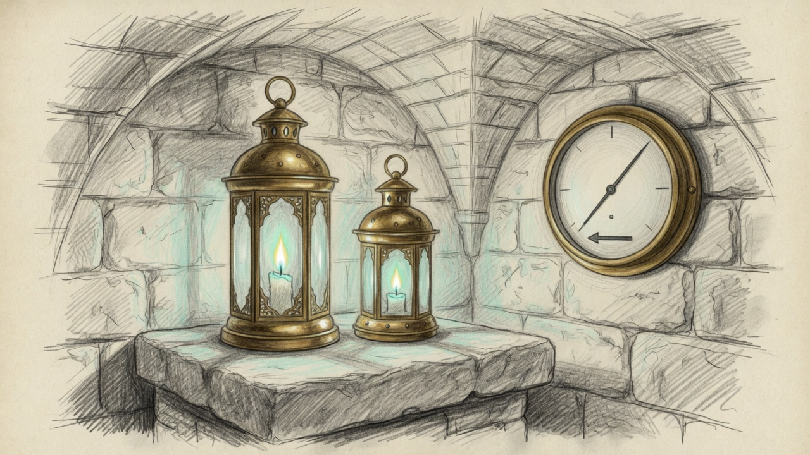

import { Aside } from '@astrojs/starlight/components';

Qui-Gon blew out the coder lamp on a twitch of the pressure needle.

The cathedral stayed. Glimmer did not. Seven times on Monday the kernel reported pressure 2 for a single sample, while swap sat between ten and sixteen gigabytes. The pager held the alert. Relief did not. It read the raw sample, called bootout, and unregistered the LaunchAgent. Kickstart cannot see a job launchd has forgotten. Someone put the lamp back. The next twitch took it again.

## What the pager already knew

The swap sentinel already debounces. A warn has to last two samples, about four minutes, before the page commits. Critical still commits on the first sample. This box kernel-panicked at sixty-eight swapfiles, so a late critical is worse than a loud one. Pressure 1 with swap in use is the steady state of two resident models. That reading is normal. Relief was still keyed to the raw sample, so a flicker the pager refused was enough to park the only seat Qui-Gon codes on.

At 21:54 the coder was generating. The footprint was about seventeen gigabytes, and almost all of it sat in swap. One pressure-2 sample arrived. The pager logged a debounce hold. The process was gone before the next sample.

## Both lamps stay lit

Relief now follows the committed level, the same one the page uses. One pressure-2 sample sheds nothing. Two in a row still shed a backup that is actually sitting in swap. Used swap above twenty-four gigabytes, or twenty-eight swapfiles, still sheds on that reading. Thirty-two files or pressure 4 still sheds immediately. The cathedral and the VM stay pinned. The coder seat does not. A real exhaustion trajectory still puts it down so the cathedral can come back.

The hourly doctor calls the same tool. While the swap sentinel is ticking, a pressure-only warn there waits for the committed level. If that sentinel goes quiet for ten minutes, the doctor may shed on its own sample. That is the backstop, not a second copy of the flicker.

When the box is back under twenty-six files, twenty gigabytes used, and pressure 1, the sentinel waits thirty minutes and bootstraps the parked seat. Bootout is what made the hand step necessary. Bootstrap is the other half. A label disabled on purpose stays disabled.

<Aside type="note">
Pressure 1 with swap files on disk is the quiet shape of two models on this machine. It is not the 2026-07-10 panic, and it is not a reason to darken the coder seat.
</Aside>

## What is serving

Qwen is still the Sunday process on the cathedral port. Glimmer answered a mutual-TLS model check after the 22:34 restore. Castellan headroom went negative. That is two metal ceilings sharing one machine, and pressure stayed at 1. If a real shed takes the coder port down, Qui-Gon's code seat falls through to the local cathedral before any hosted model. Offline still means this haus.

## What EETISMAD looks like here

| Gate | Evidence |
|---|---|
| Everything E2E Tested | `test-swap-sentinel-relief.sh` replays the real sentinel: one pressure-2 sample sheds nothing, the second sheds, forty swapfiles shed on the first sample. `test-memory-sentinel-restore.py` locks the clear-band bootstrap and the pressure-only gate |
| in Sanctum-docs | This field note and its sidebar entry |
| Merged | `sanctum-config` `11f7642` on `origin/main` |
| And Deployed | LaunchAgents run the checkout: `swap-sentinel.sh` every two minutes, and the hourly doctor calls `memory-sentinel.py` beside it |

The bar for the claim is [engineering discipline](/architecture/engineering-discipline/). The seats live in [Sanctum MLX](/architecture/sanctum-mlx/). Qui-Gon's earlier hardening is [the 413 storm](/operations/2026-09-22-qui-gon-military-grade/).

The flicker can still happen. It does not get to darken the room.
