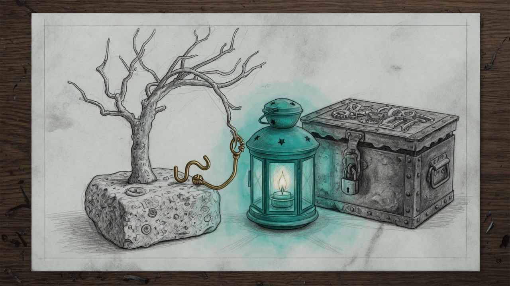

import { Aside } from '@astrojs/starlight/components';

The live engine stayed on the commit it loaded at midnight. The tree did not.

At 12:18 the checkout left the detached deploy, landed on main, and fast-forwarded. Port 4077 kept serving the morning bytes. For nine hours a KeepAlive respawn would have imported a file the running process had never proved. The sentinel had already paged. The page named the cure. Nobody applied it until weekday curfew sat inside the restart margin.

## What the page was looking at

The symlink was intact. Both paths hashed the same file, and that file was the wrong commit. `screen_time.py` on disk was `746c33da`. The manifest and the process still said `101ae697`. A copy over the symlink would look the same from the outside. This was not that. This was `git checkout` plus `git pull --ff-only` in the live tree.

The deploy script was the wrong tool in that window. `--to` kickstarts the engine, and the script refuses a restart inside the curfew margin. `--adopt` re-baselines the manifest only when the process, the tree, and the file already agree. They did not. The repair detached the tree back to `4b729983`, with `--no-overwrite-ignore`, and no kickstart. Loaded-at stayed `2026-09-28T00:11:43`. Liveness stayed ready.

<Aside type="note">
Devices and holidays in that tree are symlinks into the data directory. The checkout flag that preserves ignored files is `--no-overwrite-ignore`. The default would replace them.
</Aside>

## Why a page was not enough

The sentinel compares HEAD, the entry hash, and `/screen/status` to the manifest. It told the truth within five minutes and then left the bad tree up. A warning you can sleep through is not a lock. The next import is the lock that matters, and it reads whatever the checkout holds when the process starts.

So the live tree is no longer a branch you may pull. `screen-time-live-tree-guard.sh` sits on `post-checkout` and `post-merge`. A checkout, a switch, or a fast-forward is put back on the manifest commit before git returns. The allowance is process ancestry: the git command has to be a child of `deploy-screen-time.sh`. An environment variable is not that allowance. A fresh deploy lock is left alone, because the writer is mid-install and the restore must not fight it.

`git reset --hard` has no hook after it finishes. The sentinel's heal covers that one, and it covers a checkout that disabled hooks. Default is on. The drill turns heal off so the old drift cases still page. A heal pages `tree-restored` as a warning and does not restart the engine. If the heal does not stick, the critical drift page still fires.

You develop in a worktree. The live checkout moves when `deploy-screen-time.sh` moves it.

## What is running, and what is not

The process is still `4b729983`, source `101ae697`, loaded at 00:11. `origin/main` is two commits ahead. One narrows a stranger pause so a label match does not stop the speakers and the phones. The other mirrors a phonebook. Neither is loaded. A pull will not sneak them in. They wait for `deploy-screen-time.sh --to` outside a curfew edge. The haus kept enforcing the morning build the whole time.

## What EETISMAD looks like here

| Gate | Evidence |
|---|---|
| Everything E2E Tested | `test-screen-time-live-tree-guard.sh` 18/18. `drill-screen-time-sentinel.sh` 136/136, including the heal cases, with the old drift pages still firing |
| in Sanctum-docs | This field note and its sidebar entry |
| Merged | `sanctum-config` `86e146d` on `origin/main` |
| And Deployed | `core.hooksPath` is `~/.sanctum/git-hooks`. The sentinel reads `~/.sanctum/scripts/screen-time-sentinel.sh`. The engine was not restarted |

The bar for the claim is [engineering discipline](/architecture/engineering-discipline/). The engine those hooks protect is [Haus-Control](/architecture/screen-time/). The older note that said pull-then-restart is [the restore that never rang](/operations/2026-08-05-the-restore-that-never-rang/), and that pull is no longer how this tree moves. Closed-loop blocks still live in [screen-time enforcement](/operations/screen-time-enforcement/).

The checkout can wander. It does not get to stay there.
