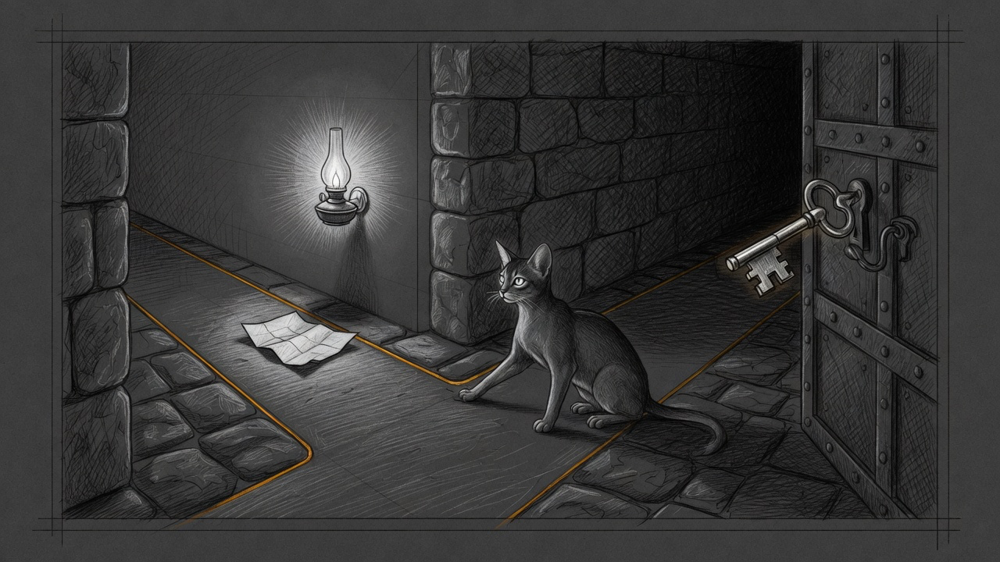

import { Aside } from '@astrojs/starlight/components';

Yoda took five minutes to add two hours of television.

The grant went through. The wait did not. `effort: max` held a fresh Claude process open until the bridge killed it at five minutes. The ladder then paid a hosted model to think out loud. That is the wrong price for a den-room timer.

## Ask, then sit

sanctum-reflex already lives on this Mac. It names a lane in a few dozen milliseconds. It does not answer the person.

`council-max-thinking` asks it once, on turns that opt in. Three answers matter.

A short greeting that is clearly quick skips the bridge. "Hi Yoda, how are you today?" scored quick at 0.88. The local seat answered in 3.7 seconds. Claude never started.

A house command stays with Fable, and it stays at low effort. "Add two hours to the den TV" still scores house at 0.51. That sentence was not sent onward. A status question in the same lane was, and Fable answered in 27 seconds. It did not grant more time.

A clear strategy turn stays with Fable too. It may think at medium. It does not return to max. A plan for checking a cathedral restart scored strategy at 0.51 and came back in 73 seconds, still on the subscription, cost zero.

A near-tie leaves the turn where it was named. Reflex down does the same. Low effort is the floor.

## What the local seat is not

The fast seat is the local Qwen on the cathedral. It is fast because the prompt is short. A long transcript stays on Fable: thirty thousand tokens of history is a slow prefill, so a quick lane also has to fit in twenty thousand characters of message text. Tool schemas do not count toward that budget.

The subscription seat is still the one that can touch the house. OpenClaw's tools stay attached. The local model is not that seat. A wrong "quick" on a real command would answer from Qwen and stop. The thresholds are why the television sentence does not take that path.

<Aside type="note">
Greetings inside a long Signal thread stay on Fable. The shortcut is for a short transcript, not for the hundredth turn of the same chat.
</Aside>

## What EETISMAD looks like here

| Gate | Evidence |
|---|---|
| Everything E2E Tested | `reflex` unit tests, 6 passed. Live greeting seated `council-agents` in 3.7s (quick 0.88). House status stayed on `claude-fable-5` at low effort, 27s (house 0.65). Strategy stayed on `claude-fable-5` at medium, 73s (strategy 0.51). The television sentence classified house at 0.51 and was not forwarded. |
| in Sanctum-docs | This field note and its sidebar entry |
| Merged | `sanctum-rs` `e85333d` on `origin/main`. `sanctum-config` `d7fc394` (seat) and `f4618d6` (deploy manifest) on `origin/main` |
| And Deployed | `proxyd` pid 33002 serving `e85333d2c574`. `/health` reports that sha |

The bar for the claim is [engineering discipline](/architecture/engineering-discipline/). The seat that must not be skipped for a name is [the name comes back](/operations/2026-09-22-the-name-comes-back/). The classifier Yoda now asks is the one in [the three-gigabyte reflex](/operations/2026-09-22-the-three-gigabyte-reflex/).

Yoda asks which kind of turn this is, and only the short ones skip the bridge.
