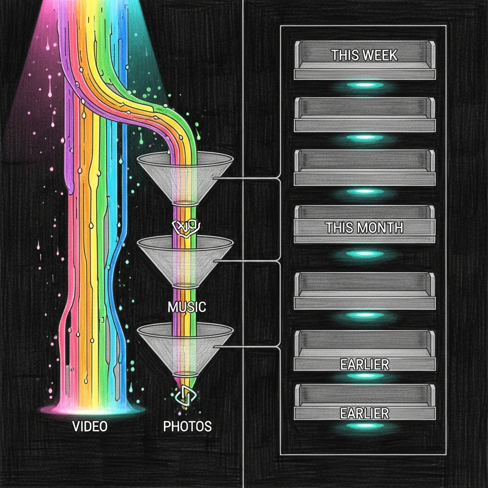

import { Aside, Card, CardGrid, Steps, Tabs, TabItem } from '@astrojs/starlight/components';



A screen-time system that can tell you a kid has been on the network for four hours but not _what_ they've been doing for four hours is only half of a screen-time system. Force Flow now has the other half. Its first job — because we are not building a generic SaaS, we are building something that has to notice when Albert puts Crunchyroll on the TV and plays Fortnite on his phone at the same time — is divided-attention detection.

## Why this exists

The parent request was compact and specific: _"it would be nice to know how many hours of YouTube, Crunchyroll, or anything else so we can sway him to another activity when he's binging."_ That's not a dashboard; that's an intervention trigger. The system has to count minutes per category per kid, notice patterns, and hand Force Flow enough signal to do something gentle about it — a Sonos nudge, an override, a parent notification — before anyone has to raise a voice.

Doing that right meant _not_ committing to a Firewalla model. The haus runs a Purple today, a Gold Pro tomorrow, and something else three years from now when Firewalla ships a device that runs Doom. The library sits above the hardware.

## Architecture — three layers, one protocol

<CardGrid>
  <Card title="Category map" icon="setting">
    Domain → service → group classification. Suffix-matched on dotted
    boundaries; longer matches win. `m.youtube.com` and
    `r2---sn-n4v7.googlevideo.com` both resolve to `youtube`, which rolls
    up to `video_streaming`.
  </Card>
  <Card title="Connector protocol" icon="puzzle">
    `ActivityConnector` is a Protocol with one async method: `observe()`.
    Any data source — Firewalla P2P, MSP API, DNS log tail, SNI sniff —
    satisfies the contract by emitting `ActivityObservation` tuples.
  </Card>
  <Card title="Aggregator + thresholds" icon="approve-check">
    SQLite upsert-safe by minute-bucket. Seconds cap at 60 per bucket so
    retry re-emits don't double-count. Thresholds evaluate per-group
    limits and return `OK`/`NUDGE`/`HARD_STOP`/`DIVIDED_ATTENTION` —
    pure decisions, no side effects.
  </Card>
</CardGrid>

The whole thing is 964 lines of Python, 42 pytest cases, and zero async dependency if you import only the aggregator. The connector is the only async piece, and it's the only piece that knows which Firewalla is in the rack.

### The three layers, stacked

```
┌─────────────────────────────────────────────────────────┐
│  Force Flow  :4077   /screen/activity                   │
├─────────────────────────────────────────────────────────┤
│  aggregator + thresholds    (pure, SQLite-backed)       │
├─────────────────────────────────────────────────────────┤
│  ActivityConnector protocol                             │
│   ├── NullConnector          (tests, no-hardware envs)  │
│   ├── FirewallaBridgeConnector (byte-delta, all models) │
│   └── [Gold Pro FlowConnector to come]                  │
├─────────────────────────────────────────────────────────┤
│  Firewalla bridge :1984  /hosts, /host/:mac, /flows     │
└─────────────────────────────────────────────────────────┘
```

Each arrow is one direction of data. The aggregator never calls the connector; the Force Flow loop pulls observations every 60 seconds and records them. The thresholds never call the aggregator; the HTTP handler composes both when a caller asks.

## The endpoint

```http
GET /screen/activity?member=albert&window=86400&by=group
```

Response:

```json
{
  "member": "albert",
  "window_seconds": 86400,
  "total_minutes": 92,
  "by": "group",
  "categories": { "video_streaming": 65, "gaming": 22, "social": 5 },
  "divided_attention_now": true,
  "active_entertainment_groups_now": ["gaming", "video_streaming"]
}
```

`by=category` drops the grouping and returns `{"youtube": 40, "crunchyroll": 25, …}` instead. The `divided_attention_now` boolean flips true when a kid has two or more entertainment groups (video streaming, gaming, social) active across their devices in the last five minutes. That's the signal we wanted.

## Thresholds and nudges

Per-kid limits live in `~/.sanctum/screen-time/devices.yaml`:

```yaml
family:
  albert:
    role: child
    phone_mac: FA:CE:DE:CA:CA:01
    activity_limits:
      video_streaming:
        daily_minutes: 180
        nudge_at: [60, 120]
        hard_stop_at: 180
      gaming:
        daily_minutes: 120
        nudge_at: [60, 90]
        hard_stop_at: 120
      social:
        daily_minutes: 60
        nudge_at: [30, 45]
        hard_stop_at: 60
      divided_attention:
        min_minutes_simultaneous: 30
        daily_warn_after_events: 2
```

`evaluate_thresholds()` takes the limits dict and the current minute counts, and returns a list of `ThresholdDecision` objects. The caller — Force Flow — decides what to do with each decision. A `NUDGE` becomes a Sonos announcement; a `HARD_STOP` becomes a Force Flow override; a `DIVIDED_ATTENTION` past the warn threshold pings the parents. Nudge marks don't re-fire: once the system tells Albert "you've done an hour of YouTube," it doesn't repeat that line every 30 seconds, which would make both of us hate the Sonos.

<Aside type="tip">
The threshold evaluator is a pure function. It gets unit-tested without
a single mock. Everything that touches real infrastructure lives in the
Force Flow wiring and can be swapped without changing the decision rules.
</Aside>

## Which Firewalla?

This is the product question, and it has a direct answer: the library doesn't care. A connector is ~100 lines of Python that implements `observe()`. We ship the generic one today.

| Connector | Status | Fidelity | Notes |
|---|---|---|---|
| `NullConnector` | Ships | Zero | Tests and no-hardware installs. `observe()` returns `[]`. |
| `FirewallaBridgeConnector` | Ships | **Per-MAC activity only** — can't tell YouTube from Crunchyroll | Polls `/hosts` flowsummary; works on every Firewalla model the bridge speaks to |
| `FirewallaFlowConnector` | Planned | Per-destination, DPI-classified | Requires the Gold Pro's richer P2P endpoint or the MSP cloud API |
| `DnsTailConnector` | Backlog | Per-domain | Tails the Firewalla's dnsmasq log via SSH; useful when flow data isn't exposed |
| `SniSnifferConnector` | Backlog | Per-hostname for TLS | Passive pcap on the Mini's LAN interface; last resort |

The Holocron panel, the Sonos nudge logic, the parent-notification path — none of them change when the connector changes. The category-map, aggregator, and thresholds are the stable contract.

<Aside type="caution">
The Purple returns `flowsummary: {inbytes: 0, outbytes: 0}` for every
host via the current P2P path. The byte-delta connector is code-correct
but data-dry on that model. The pipeline was verified end-to-end with a
synthetic observation inject; real data will start flowing when the Gold
Pro arrives, which is on a truck.
</Aside>

## Storage

One SQLite table, minute-bucketed, upsert-safe:

```sql
CREATE TABLE category_activity (
  minute_bucket INTEGER NOT NULL,      -- floor(unix_ts / 60)
  mac           TEXT    NOT NULL,
  category      TEXT    NOT NULL,
  seconds       INTEGER NOT NULL DEFAULT 60,
  bytes_in      INTEGER DEFAULT 0,
  bytes_out     INTEGER DEFAULT 0,
  source        TEXT,                  -- connector id
  PRIMARY KEY (minute_bucket, mac, category)
);
```

Seconds clamp to `[0, 60]` per bucket; bytes accumulate. Re-emit the same minute five times in a row and it still counts as at most one minute. Counter resets on the Firewalla — which happen more often than we'd like — are detected as "last value greater than current value" and silently skipped rather than emitted as 4 TB of YouTube.

## Tests

42 pytest cases, 0.05s wall clock, one SQLite file in-memory:

| Suite | Cases | What it covers |
|---|---|---|
| `test_activity.py` | 31 | `classify()` edge cases, upsert math, window filtering, divided-attention union logic, nudge sequencing, hard-stop precedence, `NullConnector` one-shot semantics |
| `test_firewalla_bridge_connector.py` | 11 | First-poll baseline (no emit), delta detection, below-threshold suppression, counter-reset skip, MAC filter, both flowsummary shapes, bridge unreachable, empty response, `connector_id` stamping, Protocol satisfaction |

Running the suite is the gate. A new connector lands with its own file; the existing tests do not change. That's the abstraction's whole job.

```bash
# From the sanctum-screen-time repo root
pytest tests/ -v
```

## Where this lives

| Artefact | Path |
|---|---|
| Library | `~/Projects/sanctum-screen-time/activity/` |
| Force Flow wiring | `~/Projects/sanctum-screen-time/screen_time.py` (`_poll_activity_once`, `handle_screen_activity`) |
| Deployed on manoir | `/Users/neo/.sanctum/screen-time/activity/` |
| Endpoint | `POST /screen/activity` on Force Flow `:4077` |
| Storage | `/Users/neo/.sanctum/screen-time/usage.db` table `category_activity` |
| Bridge endpoint | Firewalla bridge `:1984` `/hosts` (now returns `flowsummary`) |
| Tests | `sanctum-screen-time/tests/test_activity.py`, `test_firewalla_bridge_connector.py` |

## What comes next

<Steps>

1. **Gold Pro arrival.** Probe the new SDK. If the P2P channel exposes real `flowsummary` or a per-host flow endpoint, the `FirewallaBridgeConnector` starts producing data without code changes. If it exposes richer per-destination data, we ship the `FirewallaFlowConnector`.

2. **Holocron panel.** Per-kid activity cards with stacked-bar charts for the day. Today's minutes by group, with a "divided attention: active" banner when the flag is flipped.

3. **Sonos + override wiring.** `ThresholdDecision` objects get routed: NUDGE → gentle TTS announcement, HARD_STOP → Force Flow override on the offending MAC set, DIVIDED_ATTENTION past the cap → parent notification.

4. **Retire `network_active`.** Once a real classifying connector is emitting, the synthetic `network_active` category stops being useful. It gets left in the map as a last-resort bucket for traffic we can't classify.

</Steps>

## Rollback

Observational code only. Removing the loop tick and the endpoint registration disables tracking without affecting presence, curfew, wind-down, or God Mode overrides. The `category_activity` table sits idle; drop it when you're sure you're done.

```bash
# Stop recording new activity (edit the loop tick)
# Comment out: if tick_count % 2 == 0: await _poll_activity_once()
# kickstart force-flow and the rest of the stack carries on unchanged.
sqlite3 ~/.sanctum/screen-time/usage.db 'DROP TABLE category_activity;'
```

Every layer is independently reversible, because every layer was independently built. That's the point of having three of them.
