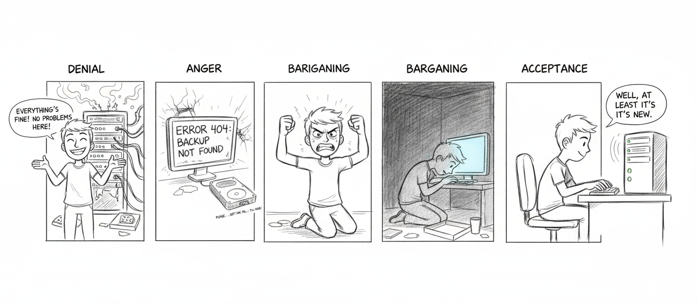

import { Aside } from '@astrojs/starlight/components';



If you're reading this calmly, on a Tuesday afternoon, with a cup of coffee — good. You're doing this right.

If you're reading this at 3 AM because a disk just made a sound disks should never make — we're sorry. But this is exactly why this page exists, and past-you was smart enough to set up backups. Unless past-you didn't, in which case present-you has our deepest condolences.

## Daily Backup

Runs automatically at 4:15am via cron — an hour when nothing good or bad is happening, which is precisely the hour you want for the thing standing between you and oblivion.

```bash
# Manual run
bash ~/Backups/sanctum-backup.sh
```

### What Gets Backed Up

- OpenClaw config (`~/.openclaw/`)
- Sanctum config (`~/.sanctum/`)
- All LaunchAgent plists
- SSH keys and config
- 6 project directories
- TTS models and voice files
- Crontab, Homebrew package lists
- Docker container state and tool versions

<Aside type="tip">
If it took you more than a weekend to configure, it gets backed up. That's the rule. Weekday-afternoon work is expendable. Weekend work is sacred.
</Aside>

### Backup Location

```
iCloud/Backups/daily/YYYY-MM-DD/mac/
```

7-day retention (older backups auto-pruned). Seven days. One week. Enough time to notice something is wrong, but not so much that you're hoarding digital ghosts. After a week, the universe has moved on. So should your backups.

### Encryption

Sensitive files (SSH keys, secrets) are encrypted with AES-256-CBC using a key stored in macOS Keychain (`sanctum-backup`).

<Aside type="danger">
If you lose the Keychain and the 1Password backup simultaneously, those encrypted files become the world's most meticulously organized collection of random bytes. Don't let this happen.
</Aside>

## VM Snapshot

Weekly automated snapshot (Sundays 3am):

```bash
bash ~/Backups/vm-snapshot.sh
```

Creates compressed copies of the VM disk image and EFI vars:
- `iCloud/Backups/VM/qcow2.zst`
- `iCloud/Backups/VM/efi_vars.fd.zst`

Uses live copy (no VM suspend) with SSH `sync` before snapshot. The VM keeps running. It doesn't even know it's being photographed.

## Restore

Seven phases. Like grief, but more useful.

1. **Homebrew** — Restore package list, `brew install`
2. **Dotfiles & SSH** — Restore keys, shell config
3. **App configs** — OpenClaw, Sanctum, HA
4. **Projects** — Restore git repos
5. **LM Studio** — Re-download models (not backed up due to size)
6. **Docker** — Restore container configs
7. **LaunchAgents** — Restore plists, bootstrap services

```bash
bash ~/Backups/sanctum-restore.sh
```

<Aside type="note">
Phase 5 is a re-download, not a restore. Multi-gigabyte model files don't back up well to iCloud, and Apple would prefer you not try. Budget an hour and a good internet connection.
</Aside>

## Backup Scripts

| Script | Purpose |
|--------|---------|
| `sanctum-backup.sh` | Full daily Mac backup |
| `sanctum-restore.sh` | Multi-phase restore |
| `vm-snapshot.sh` | Weekly VM disk snapshot |
| `rotate-secrets.sh` | Monthly secret rotation |

Four scripts between you and starting from scratch. Treat them with the respect you'd give a fire extinguisher — boring until the day they're the only thing that matters.
