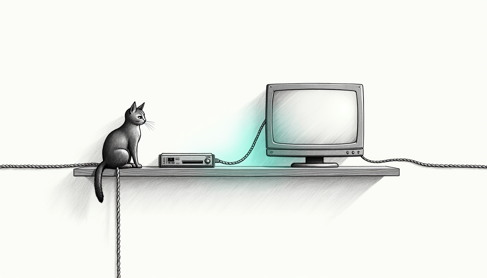

import { Aside } from '@astrojs/starlight/components';



Annex to **[Device Identity](/operations/device-identity/)**. That page covers
identity that follows a *name*. This one covers the hardware a haus shares that
has no name to follow.

## One device, two network cards

Every console — and most TVs and AV receivers — ships **two NICs**, Wi-Fi and
Ethernet, with adjacent factory MACs. Only the card carrying traffic takes a
DHCP lease, so only that card has a hostname. The idle one advertises nothing:
`hostname_patterns` cannot match it and columbo cannot pin it.

So it was auto-filed into `shared_devices` — a *different enforcement target on
a different schedule*. Flipping the console from Wi-Fi to Ethernet changed which
curfew governed it.

The fix is **NIC-sibling adoption**: a MAC sharing an enrolled screen's OUI and
landing within a few addresses of it is the same physical box, and is enrolled
into **that screen**, inheriting its schedule, holds and wake.

Deliberately *not* gated on the classifier's verdict. The sibling case is
exactly where the classifier has least to work with, and a nameless Apple TV
second card would otherwise fall through to the guest-quarantine backstop and be
blocked as a presumed friend's phone. Locally-administered (randomized) MACs are
excluded: adjacency between two random addresses means nothing.

A sibling that appears **mid-curfew** is blocked on the spot rather than at the
next onset — that window is precisely when a kid switches cable.

<Aside type="caution" title="A MAC belongs to exactly one target">
A console MAC listed under **both** `screens` and `shared_devices` is not
harmless redundancy. The two schedules differ, both sides block and wake
independently, and on 2026-07-18 the shared 09:00 wake opened the PS5 while the
`ps5` screen's curfew ran to 10:00.

Worse, it is silently self-reinforcing: columbo's `protected_macs()` refuses to
pin any MAC listed under `shared_devices`, so the duplicate **disabled that
console's rotation-following pin entirely**. Verified 2026-07-25 — the phonebook
held no `ps5` entry at all while the console broadcast `PS5-FE3A2A` on every
lease renewal.

The engine now reconciles this at config load (screens win, because they are the
more specific target and own a real schedule), and a screen's own MAC can no
longer protect itself out of its own pin.
</Aside>

## Nameless hardware

`unknown` is not a neutral verdict. An unrecognised device seen during curfew is
MAC-paused as a presumed friend's phone — so a family TV advertising no name got
blocked, with a critical alert to a parent, every night.

Identity therefore falls back to the **vendor string**, which unlike a hostname
is present on every device. Audited against this haus:

| Device | Reported as | Was | Now, and by what |
|---|---|---|---|
| PS5 | `PS5-FE3A2A` | Review | Console — `ps5` was missing from the token list |
| Xbox 2nd NIC | *(nothing)* | Review | Console — by OUI, the only signal it emits |
| Apple TV | `Playroom TV`, vendor Apple | unknown | TV — by **name** |
| Marantz AVR | `Marantz NR1609`, vendor D&M | unknown | TV — by vendor |
| Sonos | *(nothing)*, vendor Sonos | unknown | Speaker — by vendor |
| Brother MFC | vendor `CLOUD NETWORK TECHNOLOGY` | unknown | Printer — by name |

The Brother is the instructive one: its vendor string is the **Wi-Fi module
maker**, not the brand. Vendor is a strong signal, never a sufficient one.

## Two ordering rules

**Hardware beats a person-name scan.** "Albert's PS5" is a Console, not an
Albert phone — grouping it as a person would put a shared living-room box under
one kid's personal enforcement. This is also what rescues contaminated names:
the Xbox's main NIC currently reports the redis bname *"Lise Phenix's iPhone"*,
and only the vendor/OUI check keeps it a console.

**Except for what people carry.** A headset is not furniture. `Alberts-Quest`
must stay in Albert's group or it lifts out of his curfew with it. Personal-capable
classes use hardware identity only as a *fallback*, when no owner is advertised.

Apple is deliberately **not** a vendor signal: it ships the shared screen and
every phone, laptop and watch in the haus. Apple hardware is separated by OUI
and by hostname, never by vendor.

## Verifying it works

```bash
# Every shared device should resolve to a group — none in Review
python3 ~/.sanctum/bin/columbo/columbo-groups.py | grep -E 'Console|TV|Tools'

# A screen's enforce set must contain BOTH cards of a dual-NIC console
curl -s -H "Authorization: Bearer $(cat ~/.sanctum/secrets/screen-control-token)" \
  http://127.0.0.1:4077/screen/status | jq '.screens[] | select(.key=="xbox_one")'

# No MAC may appear in both targets
python3 -c "
import yaml; c=yaml.safe_load(open('$HOME/.sanctum/screen-time/devices.yaml'))
s={d['mac'].upper() for d in (c.get('shared_devices') or {}).values()}
n={m.upper() for v in (c.get('screens') or {}).values() for m in (v.get('macs') or [])}
print('overlap:', s & n or 'none')"
```

The regression suite lives in `tests/test_console_nic_siblings.py` (rules in
isolation) and `tests/test_e2e_shared_device_lifecycle.py`, which drives the
whole path — join, classify, enrol, curfew tick — and asserts on what reached
the box, because every bug here lived in the seam between those steps rather
than inside any one of them.
