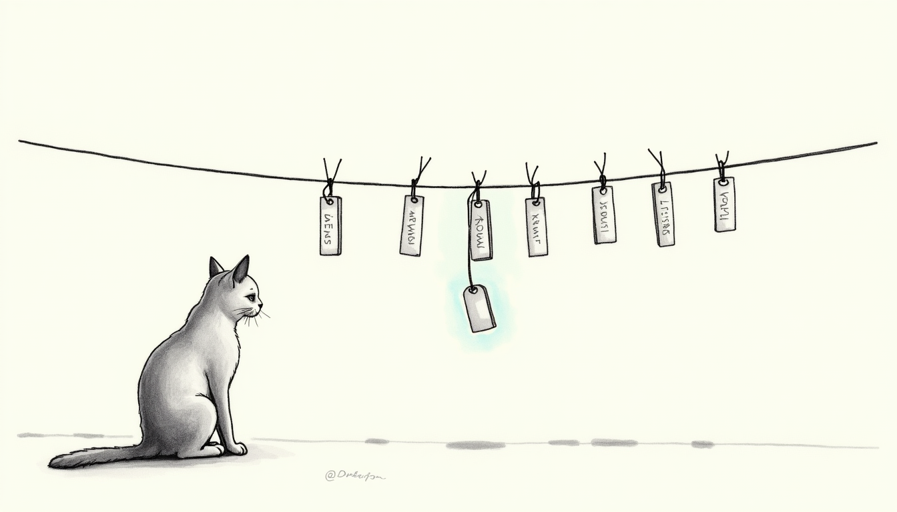

import { Aside } from '@astrojs/starlight/components';



A curfew rule is a promise attached to a MAC address. Both halves of that
sentence rot. iOS and SteamOS rotate MACs by design. Mesh extenders re-translate
them on every reconnect. And the labels every dashboard shows were copied from
whichever system guessed first. On 2026-07-18 we found out how far the rot had
gone — and rebuilt identity handling so it cannot recur silently.

## The discovery: enforcement theater

The consoles' enrolled MACs — PS5, Switch — were absent from the Firewalla's
**entire post-April host history**. 184 devices. Zero matches. Every console
"block" since the network migration had been a valid policy applied to an
address nothing wears: the closed loop verified the *rule*, never the *device*.
Meanwhile a live Xbox One sat ungoverned at `10.0.0.147`, mislabeled as a
parent's iPhone. Two TCL smart-TV panels streamed nightly past the 23:00
curfew — because the "TV" screens enforced an ESP32 sensor and a lawn sprinkler.
The rule fired. Nobody was home at the address.

<Aside type="caution" title="The lesson">
Closed-loop verification must close the loop on the **device**, not the rule.
A policy can be perfectly applied to a ghost. The fix is identity that follows
the hardware: names and pins derived from what the device *broadcasts*, not
what a dashboard once guessed.
</Aside>

## Columbo screen pinning

Consoles don't advertise mDNS device-info. But their DHCP lease hostnames are
stable identities: `XboxOne`, `PS5-*`, `steamdeck`. Columbo
(`~/.sanctum/bin/columbo/phonebook.py`, launchd every 120 s) already pinned
family phones via Bonjour. Now it also reads the box's dnsmasq leases. Each
screen's hostname → current MAC gets pinned into `phonebook.json` under
`_screens`, with a rolling 14-day history of previous MACs.

The engine enforces **static config ∪ live pins** at every site — curfew loop,
holds, wake, reconciler ground truth, drift repair, daily reaper, and the
parent-facing Block Now / override / homework handlers. Worst-case latency from
a mid-curfew rotation to re-block: ~4 minutes (columbo pass ≤120 s + 60 s
phonebook TTL + one reconciler tick). A **never-seen console joining
mid-curfew** is faster. Discovery fires an immediate columbo pass — the
"nudge" — and busts the phonebook TTL. The pin lands, and the normal curfew
path blocks it in **~60–90 seconds**.

Hardening that survived a 30-agent adversarial panel (25 confirmed findings,
3 critical, all fixed pre-deploy):

- **Last-known-good reads** — a corrupt/missing phonebook serves stale pins,
  never `{}`; columbo aborts its pass rather than save emptiness over pins.
- **Collision guard** — a pin may never claim a family phone or static device
  MAC (hostname spoofing, extender aliasing). Refused + alerted.
- **Stability under multi-lease** — the current pin holds while its lease is
  live; extra matching MACs merge quietly into history. Notifications throttle
  to one per (screen, MAC) per 6 h.
- **DHCPv6 IAID lines are skipped** — field 2 must parse as a MAC.

## One device, two network cards

Pinning follows a *name*. And half the hardware a haus shares has none to
follow — a console's idle second NIC advertises nothing at all. That case, the
single-target rule it broke, and how nameless TVs, receivers, speakers and
printers stopped being treated as strangers are covered in
**[Shared Hardware Identity](/operations/device-identity-shared-hardware/)**.

## The paused-MAC ledger

Firewalla pauses have **no expiry**. Before the ledger, a MAC that rotated away
while blocked could stay paused forever, with no code path left to release it.
Now every pause the engine applies is recorded in `paused_macs` and cleared
only on verified unpause. A per-tick sweep releases any ledger MAC that no
active enforcement state still claims. The ledger only ever contains Sanctum's
own pauses. So the sweep can never release a block a parent set in the
Firewalla app.

## The naming audit

A 6-judge + adversarial-verify panel audited all 181 devices across every
naming surface. Thirteen Firewalla renames landed. Three `devices.yaml`
structural defects were fixed: an Apple TV slot collision, an Amazon Echo
masquerading as an Apple TV, a phantom Orbi-alias device. The classifier
gained a family-device catalog — console/streamer/TV OUIs plus hostname hints,
with a new `tv` category so smart-TV panels auto-enroll like consoles instead
of streaming silently.

**Trust order for device identity** (highest first):

1. **OUI vendor** — authoritative for manufacturer, never for role.
2. **DHCP lease hostname** — self-reported, strong (`XboxOne`,
   `bhyve-bh1-*`), but spoofable: never let it *unlock* anything.
3. **Live mDNS / port fingerprints** — Cast 8009/8443, AirPlay 7000/62078,
   Roku 8060, Echo 55443+4070.
4. **HA registry** — good for integrated devices.
5. **Firewalla user name** — now corrected; keep it corrected.
6. **Firewalla auto-bname** — junk. Historically the source of every impostor:
   the Xbox as "Lise's iPhone", the Lutron bridge as "Albert's iPhone", a
   Nuheat floor thermostat as "Bert's Mac Mini M4 Pro".

The Orbi holds no independent names — it mirrors DHCP. Its toolkit registry
(`orbi-registry.sh`) is now seeded with the canonical identities. Access the
Orbi **only** through the Network Control API (`localhost:4007` on the Mini).
The admin refuses SOAP in AP mode, and direct scraping is what created stale
copies in the first place.

## The evasion ladder

Windu, who holds the security seat, models this as an adversary who wants one
more hour of *Fortnite*. Every way a device can present itself lands on a
blocking path, ordered here from most to least cooperative:

1. **Enrolled MAC** — blocked directly by static config at curfew.
2. **Rotated MAC, recognizable hostname** — columbo pin follows it;
   first-join gets the nudge (~60–90 s), mid-curfew rotation ≤4 min.
3. **Any MAC, recognizable vendor OUI** — auto-assigned to shared devices,
   reconciler blocks within ~2 min. If the MAC is a **NIC sibling** of an
   already-enrolled screen it joins that screen instead, inheriting its
   schedule; appearing mid-curfew, it is blocked on the spot rather than at the
   next onset — that window is exactly when a kid switches cable.
4. **Spoofed MAC and renamed hostname, joining during curfew** — the
   unknown-device backstop pauses it at the iptables level in ~30 s.
5. **Spoofed, renamed, and parked online *before* curfew** — the
   curfew-start sweep catches it: at the rising edge of any child curfew,
   every present-but-never-reviewed unknown device gets the same guest
   pause (auto-released at wake, exempted by Holocron approval). This
   closed the last hole: Xbox's manual "Alternate MAC address" setting plus
   a console rename plus patience used to survive the night.

The sweep is edge-triggered. A parent's manual mid-curfew unpause is
respected until the next curfew start. Devices that join during the *day*
still sit un-paused in the review queue until curfew — a deliberate
operator decision (2026-05-24: review-before-bed, not phone-buzzing). But
curfew now catches them even when nobody reviewed.

<Aside type="note" title="Xbox and MAC randomization">
Xbox OS has **no automatic MAC randomization** — the pinned console wears
its real Microsoft hardware OUI. The threat model is the manual "Alternate
MAC address" setting: rung 4 and 5 exist because any teenager can type a
MAC. iOS/Android private addresses and SteamOS randomization are rung 2.
</Aside>

## Display-name renames cannot drop curfew

Renaming a device in the Firewalla app, on AirPlay, or via DHCP hostname
changes **labels**, not identity. Enforcement keys on the **MAC** (static
config ∪ columbo pins). A kid who renames `Living Room Apple TV` to
`Den Room` — or anything else — keeps the same enforce set.

What the engine does on every discovery tick when a known MAC presents a
new name:

1. **Remember aliases** — old and new labels land in `device_aliases`
   (SQLite) so rotation matching still finds the device under either name.
2. **Soft-update the in-memory display name** — Holocron / status stay
   truthful without rewriting `devices.yaml` mid-flight.
3. **Never remove the MAC** from known or enforce sets.

Config can also list durable former names under `also_known_as` on a
screen or personal device. Hostname matching (columbo-style rotation,
owner re-pin after Private Wi-Fi Address shuffle) uses, in order:

- `hostname_patterns` globs
- the screen/device `name`
- `also_known_as`
- remembered `device_aliases` for that MAC

```yaml
# devices.yaml (illustrative — real registry is gitignored haus config)
screens:
  den_room_appletv:
    name: Den Room Apple TV
    also_known_as:
      - Living Room Apple TV
      - First Floor Apple TV
    macs:
      - "FA:CE:DE:CA:CA:01"   # identity — rename-proof
    schedule:
      holiday: { curfew: "23:00", wake: "10:00" }
```

<Aside type="caution" title="Rename is not a loophole; ghost MAC still is">
If the *hardware address* changes and no pin/alias path follows it, that
is a rotation problem (rungs 2–5 above), not a rename problem. Renaming
alone never clears a curfew. Treating the Firewalla display name as the
enrollment key was the bug class this closes.
</Aside>

### Unknown OUI is not automatically an intruder

Private Wi-Fi Address and some classifiers report a **new MAC with no
recognizable OUI**. If that host still advertises an enrolled screen's name
(or matches `hostname_patterns` / `also_known_as`), the engine **pins the
MAC and does not guest-pause**. Only true strangers hit the
unknown-during-curfew quarantine. Vacation TVs (shared devices on a
satellite Purple) stay media, not intruders.

## Verifying it works

```bash
# Columbo pins (should show every powered-on console)
python3 ~/.sanctum/bin/columbo/phonebook.py report | jq ._screens

# A screen's live enforce set = static ∪ pins
curl -s -H "Authorization: Bearer $(cat ~/.sanctum/secrets/screen-control-token)" \
  http://127.0.0.1:4077/screen/status | jq '.screens[] | select(.key=="xbox_one")'

# Ledger should be empty when nothing is intentionally blocked
sqlite3 ~/.sanctum/screen-time/usage.db 'SELECT * FROM paused_macs'

# Rename aliases remembered for a MAC (after a live rename tick)
sqlite3 ~/.sanctum/screen-time/usage.db \
  "SELECT alias FROM device_aliases WHERE mac='FA:CE:DE:CA:CA:01'"
```

Live E2E on ship day: block → box shows the pinned MAC paused → ledger row →
expiry → verified release → ledger clear, in under 15 seconds — run on the
Xbox and the TCL Google TV, on the deployed binary.

Rename-resilience E2E (2026-07-23): enrolled Apple TV renamed on the Gold Pro
while curfew was active — Force Flow still reported blocked, the box kept
streaming DNS blocks on the same MAC, and hostname match still resolved both
the old and new labels to the same screen key.

The promise still lives at a MAC address. The difference now is that the MAC
can't quietly walk away from it.
