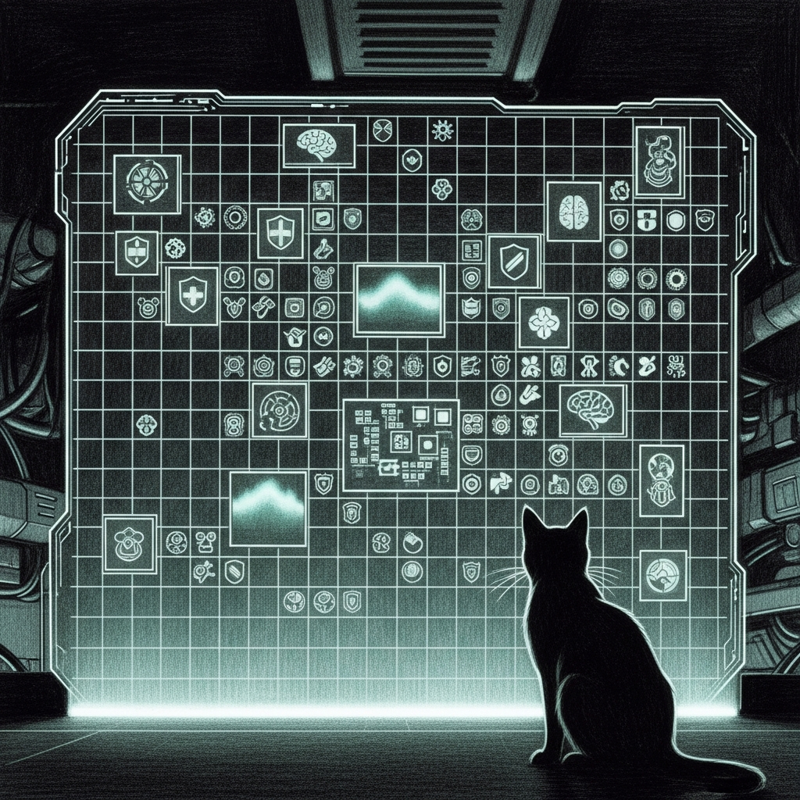

import { Aside } from '@astrojs/starlight/components';

This page is the blunt version of the architecture story. Every major Living Force feature gets one of three labels:

- `implemented` means this audit verified real code or runtime wiring on the machine
- `partial` means meaningful implementation exists, but the doctrine still overstates how consolidated or complete it is
- `documented only` means the idea is in the docs, but this pass did not verify a concrete local implementation

The point is not to embarrass the architecture. The point is to stop the architecture and the current machine from being mistaken for the same thing.

## Status Summary

- `implemented`: 12
- `partial`: 0
- `documented only`: 0

## Matrix

| Feature | Status | What was verified |
|---------|--------|-------------------|
| Service Graph | `implemented` | `service-graph.py` exists, runtime manifests render into `~/.sanctum/services`, and the checked-in audits prove graph edges such as `xtts -> voice-agent`. |
| Immune System | `implemented` | The Rust watchdog, anomaly detector, remediation budget, incident-learning hook, and runtime graph now have an end-to-end harness that proves both self-heal and failed-escalation paths through the real watchdog API. |
| Code Forge | `implemented` | The real shared-skill scripts now have end-to-end proof for proposal creation, permission checks, validation, deploy, rollback, review, list, and audit logging. The live runtime also has a canonical `agent-capabilities.yaml` synced into place, so the permission model is no longer optional. |
| Tech Lookout | `implemented` | The real tech-lookout skill now has an end-to-end harness proving scan, briefing, and council dispatch from a dated report without depending on a hidden runtime. |
| Chaos Forge | `implemented` | Scenario scripts, preflight checks, verification tooling, and fire-drill orchestration all exist in the shared skills layer. |
| Evolution Loop | `implemented` | The real `incident-learn.sh`, `perf-review.sh`, and `evolution-report.sh` scripts now have an end-to-end harness that proves weekly synthesis, memory artifacts, and audit logging as one loop. |
| Genetic Health | `implemented` | `genome-mcp` now has a local proof path: the checked-in virtualenv runs all ten panels over synthetic 23andMe-style input, and the exported health profile on disk matches the same surface. |
| Centralized Calibration | `implemented` | The major generated artifacts now reconcile mechanically to their canonical inputs: workspace manifests, runtime manifests, agent capabilities, the `instance.json` cache, and the template-managed LaunchAgents all have explicit calibration checks instead of hopeful prose. |
| Navigator Sidecar | `implemented` | The workspace sidecar serves aggregate status, scrubs obvious secrets, and is covered by end-to-end tests. |
| Runtime Catalog | `implemented` | Live runtime manifests now render from `instance.yaml` plus the checked-in runtime catalog, and the audit enforces key dependency edges. |
| Kitchen Loop | `implemented` | The workspace now has a checked-in spec surface, canary suite, tribunal model, six-phase runner, and an end-to-end harness proving both a healthy cycle and a pause gate on canary escape. |
| Model Scout | `implemented` | `model_scout.py` proxy intelligence subsystem exists, natively hits OpenRouter and Google APIs, rates LLMs, commits findings to Memory Vault, and escalates adoption prompts directly to Qui-Gon via `council-router`. |

<Aside type="tip">
The useful distinction here is not between success and failure. It is between things you can rerun mechanically, things you can mostly trust but still need context for, and things that are still architecture promises wearing runtime clothes.
</Aside>

## Main Gap

The major Living Force feature set is now mechanically proven end to end. The remaining gaps are no longer feature claims; they are portability and packaging questions about how much of Sanctum should stay machine-local versus becoming productized.

- `~/Documents/Claude_Code`
- `~/.sanctum`
- `~/Projects/openclaw-skills`

That split is survivable, but it means every architectural claim needs a scope. Without scope, the prose sounds more consolidated than the machine actually is.

## Related Pages

- [Implementation Audit](/operations/implementation-audit/)
- [Runtime Drift Audit](/operations/runtime-drift-audit/)
- [Operational State](/operations/operational-state/)
