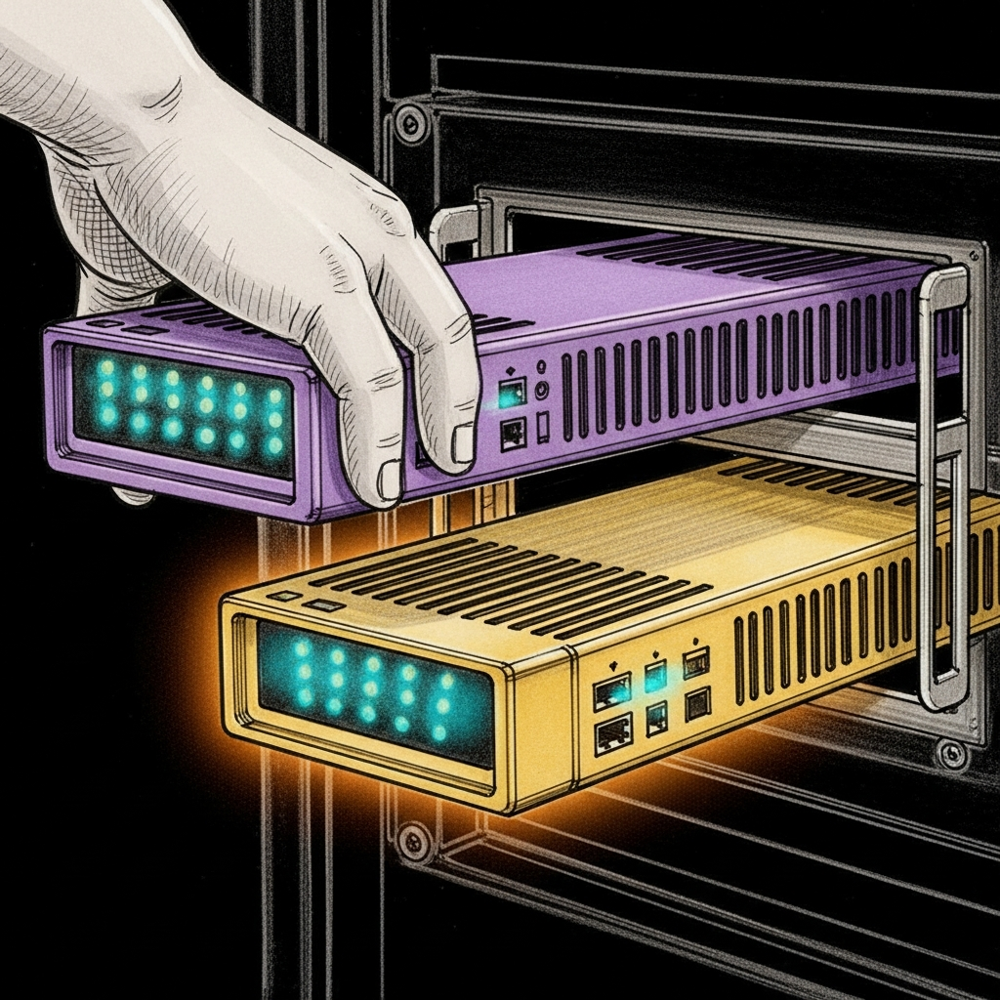

import { Aside, Card, CardGrid, Steps, Tabs, TabItem } from '@astrojs/starlight/components';



The Purple has been under the desk for a year and a half. It paused kid phones, blocked curfew-hour YouTube, and ran every screen-time rule we asked of it. It's also been dropping `flowsummary` bytes for months and forcing us to build an ARP fallback and a drift sentinel to compensate. The Gold Pro shows up tomorrow with ten times the CPU, four times the RAM, and — if the SDK cooperates — actual per-host flow data. This is the runbook for swapping it in without losing Albert's bedtime.

## Before the box arrives

Run the capability probe against the current Purple so we have a baseline to diff against:

```bash
tools/firewalla-probe/firewalla-sdk-probe.sh neo@100.0.0.25 \
  > tools/firewalla-probe/capabilities-purple-baseline.json
```

The baseline lives in the repo (`capabilities-purple-baseline.json`) and is the answer key. Tomorrow's Gold Pro run writes `capabilities-gold-pro.json`; `diff` tells us which new connectors to build.

Also export the live policy state so nothing hand-configured in the Firewalla app gets lost:

```bash
tools/firewalla-export.sh
# Writes ./firewalla-export/$(date +%Y-%m-%d)/ with hosts.json, policies.json,
# dns.json, keys.tar.gz, screen-time.db, and the full bridge config.
```

## The swap

<Steps>

1. **Unbox + physical install.** Gold Pro in the same spot the Purple lives, same WAN + LAN ports. Don't power it yet.

2. **Back up the current bridge keys.** The SDK authenticates against the box by key pair; the Gold Pro gets a new pair and the old one becomes a paperweight.

   ```bash
   ssh neo@100.0.0.25 'tar czf ~/Backups/firewalla-keys-purple-$(date +%Y%m%d).tgz -C ~/.openclaw firewalla/keys'
   ```

3. **Power the Gold Pro.** Wait for the Firewalla mobile app to discover it. Pair it (same cloud account, new device). Walk through the firmware update if prompted.

4. **Transfer the rule set.** The mobile app has a "Transfer from another Firewalla" flow. Use it. Migration preserves host names, device groups, ACLs, DNS policies, and most screen-time rules. Verify by scrolling the device list — 107-ish known MACs should all be there with their existing names.

5. **Pull the Gold Pro's new keys.** The bridge needs the new box's `etp.public.pem`, `etp.private.pem`, and `group.json`. Copy them off the new box via the Firewalla app's "Export to Developer SDK" flow:

   ```bash
   # On the MacBook, then push to the Mini
   scp ~/Downloads/gold-pro-keys/etp.*.pem neo@100.0.0.25:~/.openclaw/firewalla/keys/
   scp ~/Downloads/gold-pro-keys/group.json neo@100.0.0.25:~/.openclaw/firewalla/keys/
   ```

6. **Update the bridge's local IP if it changed.** Gold Pro often takes `192.168.1.1`; if your old Purple used a different one, update the `local_ip` key in `group.json`.

7. **Restart the bridge.**

   ```bash
   ssh neo@100.0.0.25 'launchctl kickstart -k gui/$(id -u)/com.sanctum.firewalla'
   ```

   Watch for "SDK initialized successfully" in `~/.openclaw/logs/firewalla-bridge.log`. If it errors on auth, re-check the key files and `group.json` paths.

8. **Probe.**

   ```bash
   tools/firewalla-probe/firewalla-sdk-probe.sh neo@100.0.0.25 \
     > tools/firewalla-probe/capabilities-gold-pro.json
   diff tools/firewalla-probe/capabilities-purple-baseline.json \
        tools/firewalla-probe/capabilities-gold-pro.json
   ```

   The diff is the answer to "which connector do we ship next?" See the decision tree below.

9. **Run the existing regression gates.**

   ```bash
   tests/test-screen-time-enforcement.sh  # 18 PASS
   tests/test-drift-sentinel.sh           # 10 PASS
   tests/test-activity-tracking.sh        # 10 PASS
   ```

   If any gate fails, rollback (below) and investigate before proceeding.

</Steps>

## What to hope for

| Probe finding | What it means | What we do next |
|---|---|---|
| `/hosts` flowsummary has non-zero bytes | `FirewallaBridgeConnector` (byte-delta) finally produces data | Enable it; Albert's daily minutes start accumulating immediately |
| `/flows` returns records | Per-destination data is available | Ship `FirewallaFlowConnector` — minutes bucket into YouTube / Crunchyroll / Roblox automatically |
| `/live-stats` returns `{throughput, activeConn}` | Real-time data for the panels | Optional upgrade for the Holocron dashboard's live view |
| No change vs Purple | SDK is the same on both models | Fall back to DNS-tail or MSP cloud connector |

## Rollback

The Purple is still in the box and still has keys. Restoring is three commands:

```bash
# Plug the Purple back in, restore the old keys, restart the bridge
ssh neo@100.0.0.25 '
  tar xzf ~/Backups/firewalla-keys-purple-20260420.tgz -C ~/.openclaw/
  launchctl kickstart -k gui/$(id -u)/com.sanctum.firewalla
'
tools/firewalla-probe/firewalla-sdk-probe.sh neo@100.0.0.25  # should match the baseline
```

Screen-time, drift-sentinel, and activity tracking all keep working on the Purple — this isn't a one-way door.

<Aside type="caution">
If the Gold Pro migration wipes the Purple's device groups (has happened
on older firmware), the app-assisted transfer will land them as "new"
devices. The drift-sentinel will notice and fire. The fix is manual:
re-assign the groups in the Firewalla app. Takes five minutes and is
the only known sharp edge in the transfer flow.
</Aside>

## Why we bothered

The Purple did everything we asked of it for the enforcement side — the silent-success bug, the ARP fallback, the drift sentinel all exist because the Purple works exactly well enough to fail in interesting ways. The Gold Pro upgrade isn't about reliability (we fixed that in software); it's about the data plane. A screen-time system that can tell you a kid has been on the network for four hours is half of a system. The Gold Pro's promise is the other half: knowing, per minute, which of those four hours was Crunchyroll and which was Roblox. Whether it keeps that promise is an empirical question, and the probe is the experiment.
