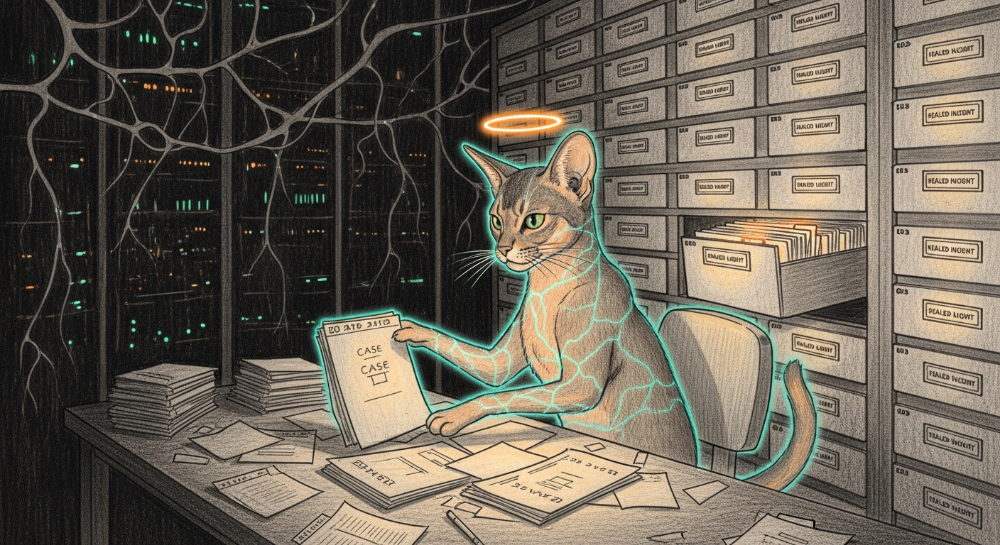

import { Aside } from '@astrojs/starlight/components';

[The Living Force](/architecture/living-force/) keeps the doctrine. This page keeps the receipts.

The Ten Principles on the parent page read clean because they were paid for in ugly nights — a kernel panic at midnight, a daemon that killed the service it was built to protect, a bridge that returned `success: false` on HTTP 200 while five kids kept streaming. What follows is where the lessons were actually earned: the immune system doing real work, the four case files that turned into principles, and the journal the organism keeps of its own education.

## The HA Self-Healer

The Immune System phase sounds elegant in the abstract — anomaly detection, remediation ladders, quarantine protocols. In practice it means Qui-Gon stares at Home Assistant every thirty minutes and asks whether the lights still talk to us. How about the cameras. The thermostat. The thing that knows whether the doors are locked.

The answer, with alarming regularity, is no.

Home Assistant manages 55 Tuya smart lights (cloud API), 4 Ecobee sensors (HomeKit Controller), 4 Ring cameras, 10 Sonos speakers, Alarmo, and 24 automations. Each integration has its own failure mode, its own opinion about reconnection, and its own way of dying silently while the dashboard stays green.

The `ha-self-healer` skill at `~/Projects/openclaw-skills/ha-self-healer/` is Phase 2's concrete implementation — a five-stage pipeline:

1. **Diagnose** (`ha-diagnose.sh`) — queries the HA API for every integration, entity, and automation. Severity 0 (healthy) through 4 (critical).
2. **API Heal** (`ha-heal-api.sh`) — reloads integrations, restarts the container, re-enables tripped automations. The settings-page fixes, at 3 AM, without waking anyone.
3. **UI Heal** (`ha-heal-ui.js`) — headless Playwright, for problems only fixable by clicking through a browser. Tuya OAuth re-authentication is the prime offender.
4. **Verify** (`ha-verify.sh`) — runs the diagnostic again. Severity dropped, declare victory. If not, escalate.
5. **Escalate** — pings Yoda. Something is structurally wrong and a higher-tier model needs to look.

<Aside type="note">
The healer respects a cooldown: 60 minutes between Tuya integration reloads, tracked by a `tuya-reload-cooldown` timestamp file. A flapping integration would otherwise trigger an infinite reload loop. The Playwright re-auth stage gates on `needs_reauth` rather than its own clock — a per-session Playwright cooldown is the next gap to close.
</Aside>

Two incidents show the difference between monitoring and understanding. **The Ecobee Incident:** four sensors went offline; the healer traced it to a stale HomeKit Controller config entry, deleted it, and HA auto-rediscovered within minutes. No human, no 4 AM underwear. **The Great Tuya Blackout:** 48 lights failed at the same timestamp; the healer read that synchronicity as a cloud drop, not a software fault, declined to reload 48 times, logged it, and waited. The cloud returned twenty minutes later and the lights with it. A dumb retry loop would have hit rate limits and made recovery slower.

## Case Files

Four incidents that taught the system something the diagrams couldn't. Each is a paragraph, because the lesson is the point.

**The Metal Crash.** On April 1, 2026, `sanctum-server` spawned `mlx_lm.server`, which called `abort()` fifteen seconds later on a Metal command-buffer error. The gateway kept polling a dead child for two minutes before returning a timeout. Readiness-checking without process-death-checking is a bouncer carding patrons at a building that already burned down. The fix: `try_wait()` on every poll tick, stderr captured and pattern-matched, three retries with exponential backoff, and an E2E phase that kills the backend during startup on purpose.

**The Phantom Heal Loop.** On April 6, 2026, the Living Force performed 28 heals in four hours on three services that weren't broken. `model-scout`, `post-boot`, and `vm` were one-shot scripts declared as persistent services; the watchdog kept "fixing" them by restarting jobs that had finished. The bug wasn't in the watchdog — it was in the contract. When a manifest promises a persistent process and the service delivers a one-shot, perfect execution of the contract makes things worse.

**The Enforcement That Said Yes.** On April 18, 2026, Force Flow logged `BLOCKED` seven times while five of seven devices kept streaming Netflix. The Firewalla bridge returned `{"success": false, "errors": [{}]}` on HTTP 200, and `if result:` is truthy for any non-empty dict — including one that says the command did not land. The fix was a two-line guard and a new rule: every write to an external control plane is followed by a read, and the two must agree. See [Screen Time enforcement](/operations/screen-time-enforcement/).

**The Apple Mail Healer.** On April 15, 2026, the Living Force extended into user-space. Several desktop apps keep a local SQLite database that only syncs while the app runs, so an app that quietly dies stops syncing while looking fine. `check-apple-mail.sh` does a `pgrep -x Mail`; `heal-apple-mail.sh` parses the last 15 minutes of `Mail-*.ips` crash logs and, on the `NSCalendarDate` signature, clears the corrupted `Envelope Index` before reopening with `open -a Mail`. Generalizing the same pgrep-and-reopen reflex to Messages, WhatsApp, Signal, and Telegram is the obvious next move.

## Field Notes — the Spring

The Living Force keeps a journal. Every dated entry is a moment the architecture learned something — a kernel panic, a failover drill, a daemon that killed the thing it was meant to protect. The [principles](/architecture/living-force/) are the distilled lessons; these are the evenings they were earned.

- **2026-04-30 — [The Gates Held](/operations/2026-04-30-the-gates-held/)** — pristine pass on the council self-heal; schema-mismatch caught, six drills run live, three real assertion-shape bugs found by actually running them, Force Flow's loopback guard shipped.
- **2026-04-29 — [First Breath](/operations/2026-04-29-first-breath/)** — the council living-force self-heal lands; five plists bootstrapped in safety order, the body half-wired, breathing, in `Healing` posture.
- **2026-04-26 — [Wisdom Informs Reflex](/operations/2026-04-26-wisdom-informs-reflex/)** — chitti grows mood, samskara, attention, and the five koshas; the watchdog learns to rotate actions when the primary fails confidently.
- **2026-04-24 — [Five Locks on the Voice Door](/operations/2026-04-24-sanctum-tts-hardening/)** — sanctum-tts adapter on `:8007` with mTLS, bearer ACL, clip pinning, Ed25519 signing, hashed audit log.
- **2026-04-24 — [Every Jedi Answers to Their Name](/operations/2026-04-24-council-roll-call/)** — coder-14b gets a memory-gated auto-load and an hourly council roll-call — the probe that surfaced the chitti gap in the same breath.
- **2026-04-21 — [The mTLS Day](/operations/2026-04-21-mtls-migration/)** — five probes migrated by morning, the router shipped late-night, the full failover matrix proven overnight on the MBP shadow.
- **2026-04-20 — [The Pressure Valve Trilogy](/operations/2026-04-20-the-pressure-valve-trilogy/)** — a kernel panic at midnight, a Rust daemon shipped before lunch, the same daemon killing the service it protected by dinner. Five corrections and a dry-run window.
- **2026-04-20 — [The A+ Roadmap Closes](/operations/2026-04-20-aplus-roadmap-closes/)** — Principle 1 becomes a 5-minute LaunchAgent, streaming metrics land, HA failover exercised under real failure.

## Field Notes — and After

- **2026-04-19 — [The Reasoner That Went Quiet](/operations/2026-04-19-council-mlx-silence/)** — 25 hours of green probes, then the service answered a real question with nothing at all. Telemetry caught what probes couldn't.
- **2026-04-18 — [The Off-Catalogue Audit](/operations/2026-04-18-off-catalogue-audit/)** — five services found running that no manifest knew about; watchdog goes 33/33 → 38/38 healthy.
- **2026-04-17 — [The Full-Stack Health Sweep](/operations/2026-04-17-health-sweep/)** — a narrow CLI fix turns into a four-hour diagnostic across nine components.
- **2026-04-15 — [Living Force Manifest Deployment](/operations/2026-04-15-living-force-deployment/)** — seven YAML manifests, 148,181 errors categorized, one broken symlink restored.
- **2026-04-07 — [Provider Overhaul](/operations/2026-04-07-provider-overhaul/)** — five independent provider paths, self-healing fallbacks, Signal migrated off Docker, the quiet death of fnm.

*Earlier entries → [operational history](/operations/operational-history/).*

The journal never really closes. Tommy would appreciate that — the Abyssinian understood better than anyone that the watch continues whether or not anyone is keeping score, that a warm flagstone at dusk is worth more than a green dashboard. The principles are finished. The education is not.
