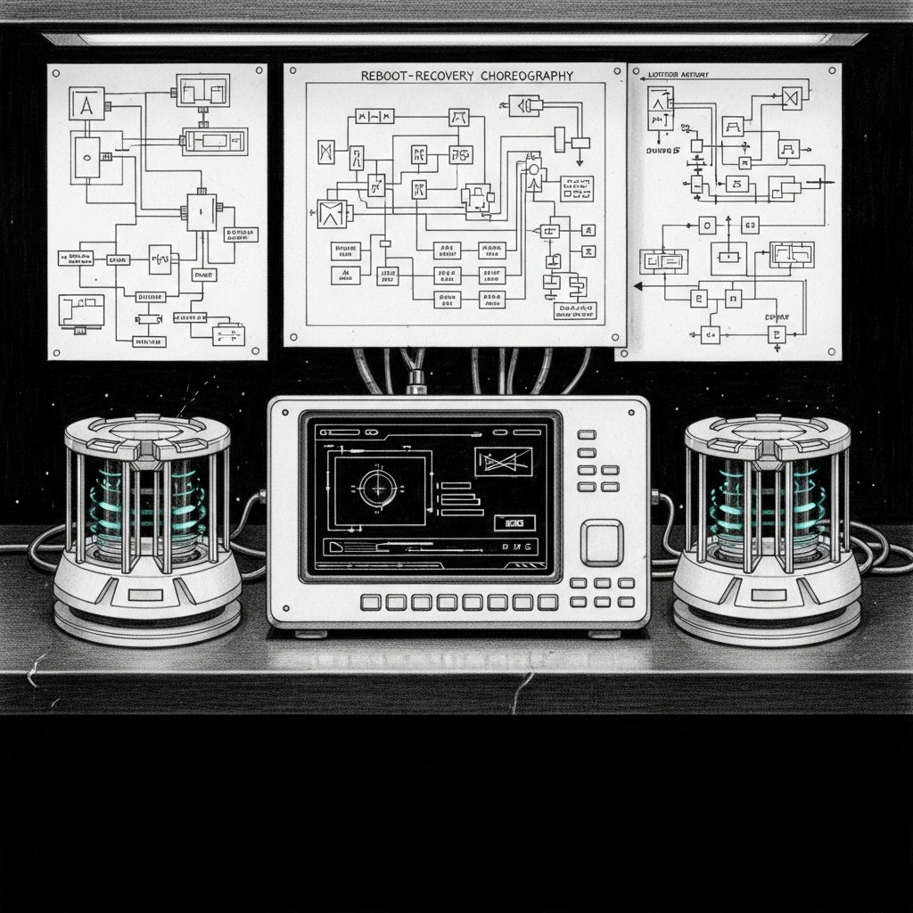

import { Aside, Steps } from '@astrojs/starlight/components';

The MacBook Pro runs the Sanctum shadow — the MBP's `sanctum-mlx` on `:8902` (plain + bearer) and `:8903` (mTLS) serves as the high-availability fallback when the Mac Mini's `:1337/:1338` goes dark. It also runs two off-box watchers that probe the Mini over Tailscale, because if the Mini panics nothing Mini-local can tell anyone.



None of this requires a human after a reboot — every agent is `RunAtLoad=true` or `StartInterval`-scheduled. This page is the five-minute sanity check you run if you want to confirm the environment actually came back the way it was supposed to.

## What starts on login, automatically

| Agent | Binds / schedule | Role |
|---|---|---|
| `com.sanctum.shadow-mlx` | `:8902` (plain+bearer) and `:8903` (mTLS) | The MBP's Rust sanctum-mlx serving as HA fallback for the Mini |
| `com.sanctum.council-canary-offbox` | 10 min `StartInterval` | Probes the Mini's council over Tailscale with a chat request |
| `com.sanctum.council-drift-offbox` | 1 h `StartInterval` | Runs `deploy-sanctum-mlx.sh verify` against the Mini |
| `com.sanctum.agent-markdown-sync` | `RunAtLoad=true` | Syncs agent docs between repos |

The shadow plist carries `LimitLoadToSessionType = Aqua`, so it waits for the user session before binding Metal. Expect 60–70 seconds from login to the first successful probe — the 27 billion parameters still need to load.

## Five-minute sanity check

<Steps>

1. **Agents are loaded.**

   ```bash
   launchctl list | grep com.sanctum
   ```

   The four agents above should appear. `shadow-mlx` should have a numeric PID in column 1; the others run on intervals and show `-` when idle.

2. **Shadow listeners are up.**

   ```bash
   lsof -nP -i :8902,8903 | grep sanctum-m
   ```

   Two lines, both with the same sanctum-mlx PID. One on `*:8902`, one on `*:8903`.

3. **mTLS path works.**

   ```bash
   curl -sf --cacert ~/.sanctum/certs/ca.crt \
            --cert ~/.sanctum/certs/clients/sanctum-server.crt \
            --key  ~/.sanctum/certs/clients/sanctum-server.key \
            https://127.0.0.1:8903/v1/models | head -c 100
   ```

   Returns a JSON `{"data":[{...}]}`. If it hangs, the model is still loading; wait 30 seconds and retry.

4. **Off-box canary has started probing.**

   ```bash
   tail -3 ~/.openclaw/logs/council-canary-offbox.log
   ```

   Expect `event:"canary_ok"` with `transport:"mtls"` within 10 minutes of login. The first probe on a cold start often logs a single `canary_fail` if the Mini is simultaneously cold — this is benign and auto-recovers on the next tick.

5. **Off-box drift is clean.**

   ```bash
   tail -3 ~/.openclaw/logs/council-drift-offbox.log
   ```

   Expect `event:"drift_ok"` on the most recent hourly run. A single `drift_detected` immediately after a reboot is normal (the Mini's model may still be loading); look for recovery on the next tick.

</Steps>

## If something didn't come back

<Aside type="note">
All recovery paths are idempotent. Running them twice does nothing bad.
</Aside>

### Shadow didn't bind

```bash
launchctl bootout  gui/$(id -u)/com.sanctum.shadow-mlx 2>/dev/null
launchctl bootstrap gui/$(id -u) ~/Library/LaunchAgents/com.sanctum.shadow-mlx.plist
launchctl kickstart -k gui/$(id -u)/com.sanctum.shadow-mlx
```

If `bootstrap` returns `Input/output error`, the label is still bootstrapped from a previous session. `bootout` always runs first; never retry `bootstrap` in a loop. (This is an actual, documented launchd gotcha — see the 2026-04-20 Living Force entry.)

### Off-box watchers disappeared

```bash
for a in council-canary-offbox council-drift-offbox; do
  launchctl bootout  gui/$(id -u)/com.sanctum.$a 2>/dev/null
  launchctl bootstrap gui/$(id -u) ~/Library/LaunchAgents/com.sanctum.$a.plist
done
```

They'll fire on their own cadence afterward (every 10 min and every 1 h respectively).

### mTLS probe hangs or fails handshake

Either the Mini is unreachable over Tailscale (the common case — check `tailscale status`) or the cert files moved. The cert bundle lives at `~/.sanctum/certs/` and the auto-detect in every probe script looks for exactly these paths:

```
~/.sanctum/certs/ca.crt
~/.sanctum/certs/clients/<probe-name>.crt
~/.sanctum/certs/clients/<probe-name>.key
```

If the files are gone, the probes all fall back to bearer over `:1337` with no code change — the token at `~/.sanctum/secrets/council-mlx.token` is the failsafe. If the files are present and TLS still fails, the certs expired (check with `openssl x509 -in <file> -noout -dates`) — see the cert-rotation roadmap item.

## What's in /tmp

Nothing important. Every test script I've run today wrote to `/tmp/sanctum-mtls-test/` and was cleaned up before this page was written. A reboot clears `/tmp` anyway; if you see anything sanctum-related in there after a reboot, file a bug against the script that put it there.

## What survives the reboot

- **Keychain unlocked state.** Does not survive — a reboot locks the login keychain. If you need to codesign on the Mini over SSH after the reboot, you'll need to unlock it again (`security unlock-keychain`).
- **notarytool credentials.** Stored in the keychain; survive the reboot but require the keychain to be unlocked when used.
- **Launch agent state.** Re-bootstraps from the plists on disk. Any manual `launchctl disable` will persist.
- **sanctum-mlx's Metal model cache.** Does not survive — cold-start load is ~60 s after every reboot. Same for the MBP shadow and the Mini's primary.
- **Bearer tokens, certs, the .p8 for notarization.** All live in `~/.sanctum/` or `~/.appstoreconnect/`, persist.
- **Prometheus metrics counters.** Do not survive; they restart at zero per process lifetime. Current values are at `http://127.0.0.1:1337/metrics` while the process lives.

## One thing the reboot can't fix

(Resolved 2026-05-03.) The Mini's `:1337` was, for a stretch, served by a non-canonical `sanctum-mlx` invocation without TLS args. The signed `com.sanctum.mlx` LaunchAgent is now the only thing binding `:1337`, mTLS-only, with the signed manifest gate in place. The MBP shadow on `:8903` is symmetric (signed, notarized, mTLS) and is wired into `sanctum-server`'s `council-secure` fallback chain. Reboots no longer change the trust topology — the plist on disk is the only source.
