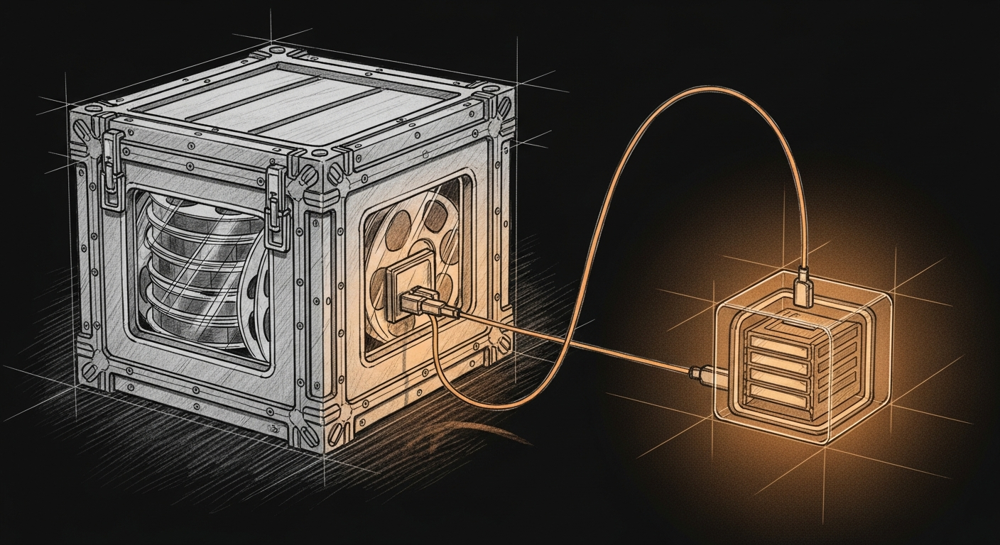

import { Aside } from '@astrojs/starlight/components';



**Hot on SSD. Cold on the Ark.** That is the whole policy.

Always-on agents and daemons must not depend on a drive you can unplug. Multi-tens-of-GB video packs must not fill the MBP boot volume. Creative session weights live on removable media and are **symlinked** into ComfyUI when the volume is mounted.

Canonical lab copy (scripts + longer rationale): [`comfy-lab/MODEL_STORAGE_POLICY.md`](https://github.com/Ogilthorp3/comfy-lab/blob/main/MODEL_STORAGE_POLICY.md).

## Tiers

| Tier | Criteria | Store on | Path pattern |
|---|---|---|---|
| **Hot** | Loaded most sessions; LaunchAgents / cathedral / always-on tools | Internal SSD | Real files under `~/…` (e.g. agent MLX/TTS paths) |
| **Cold** | Session work: video gen, large DiTs, research quants | Transcend, 4 TB Ark, SD card | `/Volumes/<Drive>/ai-models/<pack>/` → symlink into ComfyUI |

### Hot examples
- Sanctum-MLX / cathedral council weights
- TTS / STT / small embeddings used by daemons
- Anything that must work after reboot with no external disk

### Cold examples
- **MiniMax H3** (FL2VA, Ref2VA, Heretic TE, VAEs) — see [MiniMax H3 video lab](/operations/minimax-h3-video/)
- Other large ComfyUI video/image packs (≥ ~10 GB, occasional)

## Why

| Concern | Hot (SSD) | Cold (external) |
|---|---|---|
| Cold **load** | Fast | Slower (USB/SD sequential; often 2–5×) |
| **Inference** after load | RAM | RAM (same once in unified memory) |
| Internal free space | Protected | Offloaded |
| Travel | Always present | **Bring the drive** |

## Layout

```
# Cold — external (when mounted)
/Volumes/Transcend/ai-models/
/Volumes/Ark/ai-models/          # 4TB Ark when present
/Volumes/<Other>/ai-models/
  MiniMax-H3/
    diffusion_models/
    text_encoders/
    vae/

# ComfyUI Desktop model root (hot-facing)
~/Documents/ComfyUI/models/
  # cold packs appear as symlinks into the volume above
```

Link helper (does not destroy a complete multi-GB local file):

```bash
cd ~/Projects/comfy-lab
./scripts/link-minimax-h3-models.sh
# override volume:
# MINIMAX_H3_ROOT=/Volumes/Ark/ai-models/MiniMax-H3 ./scripts/link-minimax-h3-models.sh
```

## Decision checklist

1. Daemon or every-session tool without a plugged drive? → **Hot**.
2. ≥ ~10 GB and only for creative/video sessions? → **Cold**.
3. Internal free under ~50 GB? → Prefer cold; free SSD first.
4. Traveling? Pack Transcend/Ark if cold models are required offline.

## Anti-patterns

- Filling the boot SSD with multi-tens-of-GB video packs “for convenience.”
- Replacing a complete local multi-GB file with a symlink to a **partial** external copy.
- Putting always-on cathedral/TTS weights only on a volume that unmounts.

<Aside type="tip">
After weights are resident in the M4 Max’s unified memory, generation is not I/O-bound on the USB drive. Budget external media only for cold start and model switches.
</Aside>
