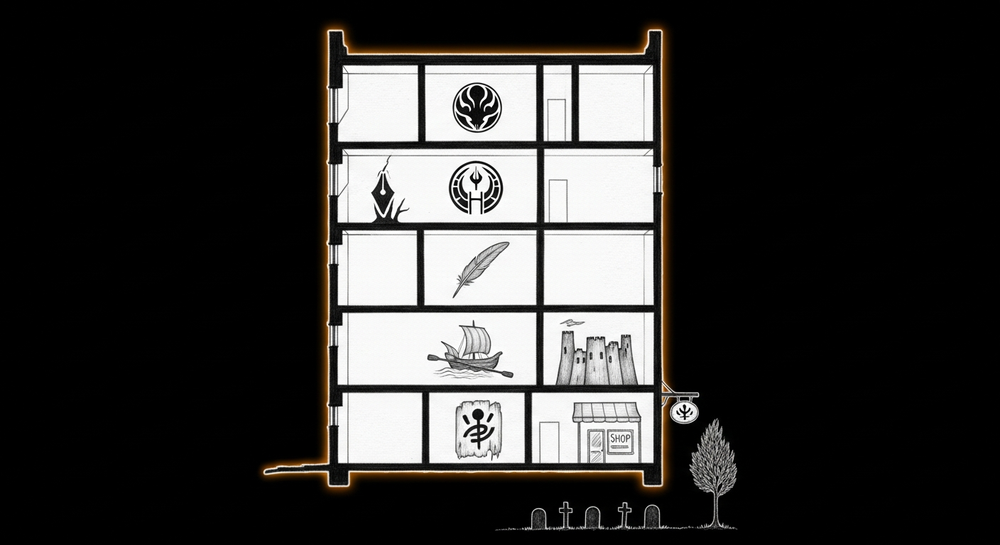

import { Aside } from '@astrojs/starlight/components';

Steve Jobs would circle a Sanctum codebase, see *Yoda + Cilghal + Holocron + Sanctum + Manoir + Cathedral + Living Force + DenchClaw + OpenClaw + Force Flow + Bunker + Haus*, and ask which mythology. The honest answer used to be "all of them." This page is the honest answer now.

## The rule

**One metaphor per layer.** No layer borrows from another.

| Layer | Metaphor | Examples |
|---|---|---|
| Software & repositories | "Sanctum" — a fortified sanctuary | `sanctum-config`, `sanctum-cli`, `sanctum-rs`, `sanctum-screen-time`, `sanctum-docs` |
| Physical locations | French manor / Anglo place names | `manoir` (Mac Mini server), `chalet` (off-site), `satellite` (MacBook Pro) |
| User-facing voice & copy | Plain Germanic English | "haus" in the briefings, "the family network", "morning briefing" |
| AI agents | Jedi Council | Yoda, Windu, Cilghal, Qui-Gon, Ki-Adi-Mundi, Jocasta |
| UI surfaces | Star Wars artefacts | Holocron (dashboard), Force Flow (notifications), Sanctum Bridge (Mac↔VM RPC) |
| Project codenames (one-off) | Anything memorable | `OBLITERATUS`, `CL4R1T4S`, `TED_Talk`, `T9-vault` — each its own subrepo, never mixed into the metaphor stack |

The rule is not "fewer names" — the rule is **no name does two jobs**. *manoir* never refers to the software. *Sanctum* never names a physical place. *Yoda* is an agent, not a server.

## The agent roster

Five Jedi + one Mac-side handler. Each has a single domain. If a request spans two, route it.

| Agent | Domain | Lives on |
|---|---|---|
| **Yoda** | Conversation, planning, council convener | VM `yoda` (10.10.10.10) |
| **Windu** | Security: Firewalla, auth logs, perimeter, screen-time enforcement | VM sandbox |
| **Cilghal** | Health: Apple Watch, sleep, HRV, environmental sensors | VM sandbox |
| **Qui-Gon** | Infrastructure: Docker, disk, gateways, backups, optimization | VM sandbox |
| **Ki-Adi-Mundi** ("Mundi") | Finance: fund metrics, deal flow, RRSP/TFSA/FBAR | VM sandbox |
| **Jocasta** | Mac-side librarian: iMessage, Calendar (EventKit), Contacts, Mail | Mac (`SanctumBridge.app` + jocasta-mcp) |

There are no others. Adding a seventh requires the same justification as adding a new layer to the metaphor stack: a domain none of the existing agents own.

## Retired terms ledger

Every name we've outgrown, with what replaced it. If you find a retired term in active code, either delete it or open a PR retiring it for real.

| Retired term | Status | Replacement |
|---|---|---|
| **DenchClaw** (gateway port `:1977`) | Retired 2026-04-23 cathedral cleanup | `SanctumBridge.app` (launchd-managed, no TCP port) — see `~/.sanctum/SECURITY-EXCEPTIONS.md` |
| **Cathedral** (as a brand for the system) | Retired — only the *cleanup event* of 2026-04-24 keeps the name historically | "Sanctum" |
| **Living Force** (as a doctrine pillar) | Retired 2026-04-24 | The `~/.sanctum/exceptions.yaml` + per-agent USER.md doctrine. The phrase survives only in commit history and one operations log. |
| **OpenClaw** (as a public-facing brand) | Internal-only | The agent runtime that powers the Council. Not a user-facing surface; never market it. Repos that depend on it stay namespaced (`openclaw-skills`, `openclaw-config`). |
| **Bunker** | Replaced by `T9-vault/` (the disaster-recovery resource bundle) | "T9-vault" |
| **Sanctum Watchdog** (as a Python service name) | Retired with the Rust rewrite | `sanctum-rs/sanctum-watchdog` (Rust crate) — see [sanctum language maturity doctrine](../architecture/services/) |
| **Lmstudio Proxy** | Retired with the council-mlx migration | `council-mlx` (mTLS endpoint at `:1337`) |

<Aside type="tip">
Adding a term to the retired ledger is a commit on its own. It signals "we considered this name carefully and chose to drop it" — much stronger than letting the name fade into stale grep results.
</Aside>

## Rules going forward

1. **Before introducing a new name, ask which layer it belongs to.** If the answer is "two of them," reuse an existing name. If the answer is "none," check whether the layer needs to exist at all.

2. **Before retiring a name, write its row in the ledger.** A retirement isn't real until the replacement is named.

3. **Avoid Greek/Roman/Norse mythology.** They rhyme with the Jedi metaphor and create the *"which mythology?"* problem this page exists to prevent.

4. **No internal codenames in user-facing copy.** The morning briefing says "Sanctum is healthy" or "the family network is up," not "Living Force OK." If a parent reads it and has to ask what the word means, it's the wrong word.

5. **Project subrepos can have any codename they like** (`OBLITERATUS`, `CL4R1T4S`) — they are sealed under their own metaphor. Sanctum's metaphor stops at the submodule boundary.

6. **The Council never expands.** Five Jedi + Jocasta. If a domain is unowned, give it to the closest existing agent before inventing a seventh.

## Why this matters

The Sanctum architecture is doctrine-first. A doctrine layer that contradicts itself in its own vocabulary doesn't survive contact with a tired operator at 2am. The fastest way to lose trust in a system is to ask it for *the gateway* and watch it wonder which gateway you mean.

Pick one metaphor per layer, write down which is which, and stop the next argument before it starts.
