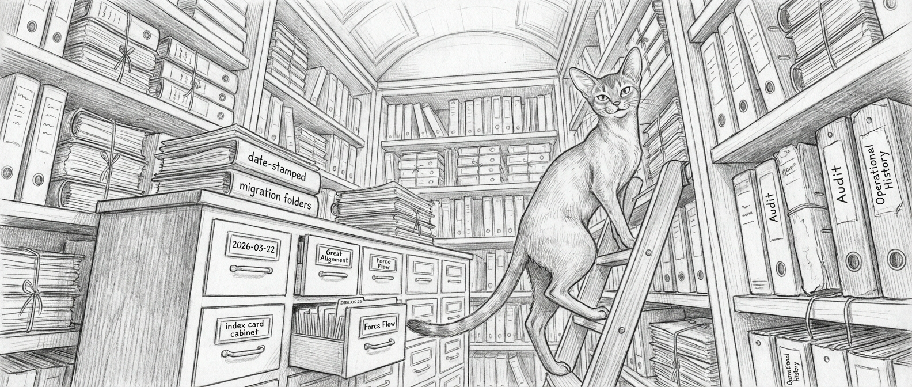

import { Aside } from '@astrojs/starlight/components';

This page exists for one reason: architecture docs rot when they try to be architecture, changelog, postmortem, and victory lap at the same time. Sanctum had started doing that. This is the drawer where the dated material goes so the doctrine pages can stay readable.

## Key Milestones

| Date | Event | Why it mattered |
|------|-------|-----------------|
| 2026-03-22 | Living Force redesign after the bridge100 cascade | Dependency-aware healing, quarantine, and graph-based reasoning became first-class concepts |
| 2026-03-28 | Great Alignment | Service manifest validity and cross-system naming improved materially |
| 2026-03-30 | Bootstrap and Force Flow push | Notification routing, boot reliability, and test fixes moved from theory into operations |
| 2026-04-03 | Workspace and runtime audit consolidation | Canonical workspace catalog, runtime drift remediation, and audit pages landed |
| 2026-04-07 | [Model routing overhaul and provider hardening](/operations/2026-04-07-provider-overhaul/) | Five independent provider paths, self-healing fallbacks, Signal migration to native, fnm removal, vision/multimodal enablement, and OpenClaw 2026.4.5 |
| 2026-04-08 | DenchClaw updated to 2026.4.8 | Mac-side CRM gateway (Jocasta) updated from 2026.4.5 to latest. Three-day turnaround from the April 7 OpenClaw update. |
| 2026-04-08 | Backup retention policy implemented | Daily backups kept 14 days, then bi-weekly archives, everything else purged. Script at `~/.sanctum/scripts/backup-retention.sh`, runs weekly via automated job. Initial cleanup freed ~23 GB from iCloud. |
| 2026-04-08 | Qui-Gon promoted to version watchdog | `version-check.sh` deployed to track OpenClaw, DenchClaw, DuckDB, signal-cli, Node.js, and sanctum-proxy across npm and Homebrew. Weekly Monday 7 AM LaunchAgent with Signal alerting. Born from the April 7 version drift incident where fnm-vs-Homebrew OpenClaw installs and a three-patch-behind DenchClaw caused confusion. |
| 2026-04-10 | Holocron release pipeline hardened | The Electron shell moved from "works on this machine if you squint" to explicit Developer ID signing, notarization, stapling, and release-safe installed-app validation. The extra App Store Connect cleanup key was revoked, because credential archaeology is not a growth industry. |
| 2026-04-13 | Military-Grade Omnichannel ETL Pipeline | Jocasta's 5-channel (Email, iMessage, WhatsApp, Signal, Telegram) CRM sync completely overhauled. Added file locking, Force Flow dead-man alerts, timezone hardening, Keychain-based Telethon integration, and DB snapshots. |
| 2026-04-14 | Sanctum-wide pnpm migration | All Mac and VM core runtimes and workspaces migrated from npm-global/npm-local to workspace-owned pnpm. Eradicated `package-lock.json` files and legacy `node_modules` drift. Upgraded all systems to OpenClaw 2026.4.14. |
| 2026-04-17 | [Full-Stack Health Sweep](/operations/2026-04-17-health-sweep/) | A narrow CLI fix surfaced four hours of drift across nine components; several "healthy" services were not. |
| 2026-04-18 | [Off-Catalogue Audit](/operations/2026-04-18-off-catalogue-audit/) | Five services found running outside the manifest, five registered, the catalogue-sync-check guardrail born. |
| 2026-04-19 | [The Reasoner That Went Quiet](/operations/2026-04-19-council-mlx-silence/) | Twenty-five hours of green probes, then silence on a real question — telemetry caught what probes could not. |
| 2026-04-20 | [The A+ Roadmap Closes](/operations/2026-04-20-aplus-roadmap-closes/) | Principles 1–6 all finished becoming code in a single day; HA failover finally tested in anger. |
| 2026-04-20 | [Pressure Valve Trilogy](/operations/2026-04-20-the-pressure-valve-trilogy/) | A kernel panic, a Rust daemon shipped before lunch, and the same daemon killing the service it was meant to protect by dinner. |
| 2026-04-21 | [The mTLS Day](/operations/2026-04-21-mtls-migration/) | Morning brings five probes onto certs; late-night ships the sanctum-server router's code; overnight proves the full failover matrix on the MBP shadow. |
| 2026-04-24 | [Every Jedi Answers to Their Name](/operations/2026-04-24-council-roll-call/) | LM Studio coder-14b and the eight Jedi Council system prompts get a Living Force roll-call — memory-gated auto-load plus an hourly self-identification probe. |
| 2026-04-24 | [Five Locks on the Voice Door](/operations/2026-04-24-sanctum-tts-hardening/) | sanctum-xtts becomes sanctum-tts. Adapter dispatcher on `:8007` with five independent defense layers — mTLS, bearer-token ACL, reference-clip pinning, Ed25519-signed WAVs, hashed audit log. |

## Recurring Lessons

1. A green test suite is useless if it is testing the wrong world.
2. LaunchAgents drift quietly until someone looks at the target path instead of the plist name.
3. Hardcoded coordinates always feel harmless right before they become archaeology.
4. Dated migration notes do not belong in stable architecture prose.

## Historical Documents

The original long-form narrative remains available as [`living-force.md`](https://github.com/Ogilthorp3/sanctum-docs/blob/main/living-force.md) for archival context. It is useful as history and incident narrative. It is not the best single source for the current system shape.

<Aside type="caution">
If you are trying to understand how Sanctum works today, start with the current architecture and operations pages. History is where you go to understand how it got this weird.
</Aside>

## Related Pages

- [The Living Force](/architecture/living-force/)
- [Operational State](/operations/operational-state/)
- [Roadmap](/operations/roadmap/)
