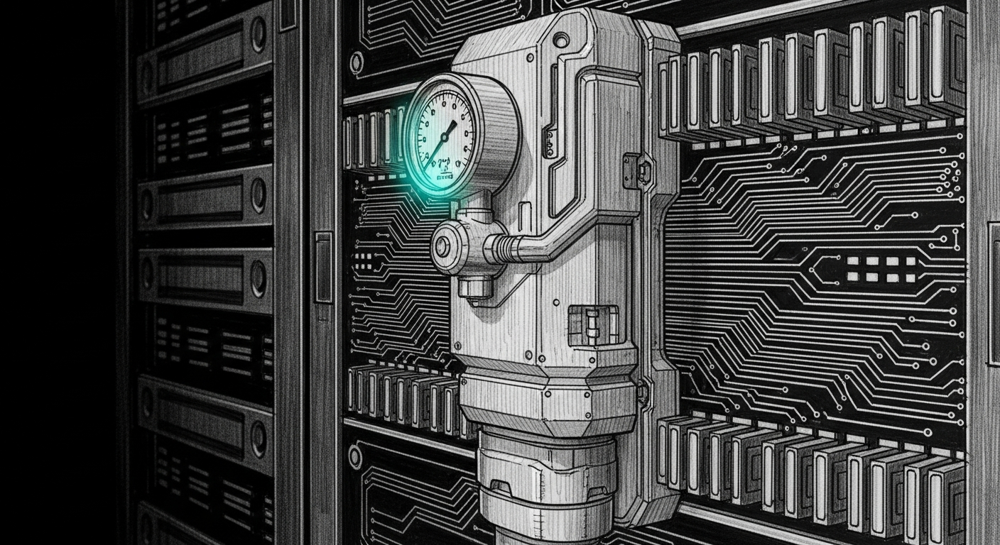

import { Aside, Steps } from '@astrojs/starlight/components';



On 2026-04-19 at 23:58:12 EDT the Mac Mini panicked. `sanctum-mlx` had drifted to **65,813 MB RSS** on a 64 GB machine, swap was 97% full, the compressor was saturated, and the kernel made the only call it had left. The Mini rebooted. The then-live Claude session supervising the incident evaporated. The Mini does not remember its own death; that's what this page is for.

The pressure valve is the watchdog that would have SIGSTOPped `sanctum-mlx` before the kernel needed to. It polls the same three signals macOS itself uses — `kern.memorystatus_vm_pressure_level`, `vm.swapusage`, and `vm_stat` — classifies the system into four levels, and acts on a tightly-scoped allowlist of large processes with well-understood failure modes. Nothing else is touchable. `sshd`, `WindowServer`, `launchd` are in the denylist; you could not pick them if you tried.

## What starts automatically

| Agent | Binary | Role |
|---|---|---|
| `com.sanctum.pressure-valve` | `sanctum-rs/target/release/sanctum-pressure-valve` | 5-second polling watchdog; classifier → picker → planner → actor |

`KeepAlive=true`, `RunAtLoad=true`, `ProcessType=Interactive`. Bound to the user session so it sees the same processes the user does.

## The four levels

Level is `max(kernel-derived, threshold-derived)` — whichever signal is worse wins. A kernel WARN promotes to at least YELLOW even if thresholds say otherwise; a threshold RED promotes even if the kernel is still reporting NORMAL (it often lags).

| Level | Avail MB | Swap % | Kernel enum | Action |
|---|---|---|---|---|
| GREEN | > 8192 | < 70 | NORMAL (1) | nothing |
| YELLOW | ≤ 8192 | ≥ 70 | WARN (2) | observe; log elevated score |
| ORANGE | ≤ 4096 | ≥ 85 | URGENT (3) | SIGSTOP worst allowlisted candidate |
| RED | ≤ 2048 | ≥ 95 | CRITICAL (4) | Kill (if `KillAllowed` and RSS ≥ min_kill) else SIGSTOP |

One extra promotion rule: if we're already ORANGE and the compressor is growing faster than `compressor_leak_mbps` (default 100 MB/s — nothing legitimate does this sustained), we go straight to RED. Load-bursts look like spikes; leaks look like ramps. The valve can tell the difference.

<Aside type="note">
Thresholds are calibrated for a 64 GB Mac Mini M4 Pro. On the 128 GB MacBook Pro the same defaults are conservative — room to spare. If you port this to a 32 GB box you'll want to halve everything in `Thresholds::default()`.
</Aside>

## The policy matrix

Every process the valve will consider lives in `ALLOWLIST` inside `services/sanctum-pressure-valve/src/action.rs`. Nothing else. The list is ordered; the first pattern match wins, so specific entries go above generic ones.

| Process | Policy | min_stop (MB) | min_kill (MB) | Why |
|---|---|---|---|---|
| `sanctum-mlx` | SigstopOnly | 20,000 | — | Holds `:1337`/`:1338` and has child procs; SIGKILL corrupts KV cache. Freeze it, don't kill it. |
| `LM Studio (helpers)` | SigstopOnly | 2,000 | — | Killing mid-download leaves the GUI in a frozen-connected state. |
| `LM Studio node shim` | SigstopOnly | 2,000 | — | The 8.6 GB node process at `/Users/neo/.lmstudio/.internal/utils/node` — the one the v0.1.0 valve missed because its matcher looked for the string "LM Studio". |
| `qemu-vm` | KillAllowed | 4,000 | 8,000 | QEMU allocates `-m` at boot; launchd restarts it; disk images are crash-consistent. |
| `apple-vz-vm` | KillAllowed | 1,500 | 4,000 | Apple Virtualization XPC — restarts cleanly. |
| `docker-vz` | KillAllowed | 1,500 | 4,000 | Docker virtualization shim — same. |
| `ollama` | KillAllowed | 2,000 | 6,000 | Stateless runner; killing costs nothing. |
| `metal-shader-compiler` | KillAllowed | 200 | 500 | Leaked `metal -x metal` processes from a cargo build (we had four at panic time). |

**SigstopOnly** is the "freeze it, call a human" tier. SIGSTOP pauses the process — sockets stay open, memory stays resident but no longer grows, children survive. A human can `kill -CONT <pid>` to resume or `kill -9` to evict. The valve itself will never SIGKILL these.

**KillAllowed** is the "restart-safe" tier. At RED, if the target's RSS is ≥ `min_kill`, the valve SIGKILLs. Below that it falls back to SIGSTOP — small leaks get frozen, not whacked, to preserve diagnosability.

## Phase-4: shed-effectiveness gating

A SHED action that succeeds but doesn't move `swap_used_mb` is a no-op the valve mistakes for progress. Phase-4 (shipped 2026-04-27) closes that loop:

- When a SHED fires, the valve records `pre_swap_mb` and the cooldown deadline.
- Every tick after the deadline, the valve compares current `swap_used_mb` to `pre_swap_mb`. A drop of less than 100 MB counts as ineffective.
- After two consecutive ineffective sheds for the same label, the planner skips that label for 30 minutes; iteration falls through to the next TIER candidate or `Noop`.
- The marker decays after the window so the label is reconsidered fresh.

Heartbeat at `~/.openclaw/state/sanctum-pressure-valve.json` gains an `ineffective_targets: [(label, secs_remaining)]` field, only serialized when non-empty. Operators can see exactly which sheds are skipped and for how long.

The mechanism is the same shape as the 2026-04-26 `T`-state-skip fix in the picker, one layer up. The doctrine: a remediation should be observable in the signal it tries to relieve. If it isn't, escalate or stop.

## The absolute denylist

`DENYLIST` substrings match against both `comm` and `cmd`. A hit here ends the evaluation immediately — no allowlist entry can override it. You cannot freeze `sshd` even if a bug renames its binary to "sanctum-mlx".

```
sshd, launchd, WindowServer, loginwindow, SystemUIServer, Finder, Dock,
kernel_task, coreaudiod, cfprefsd, diskarbitrationd, securityd, syslogd,
notifyd, opendirectoryd, watchdogd
```

## The panic replay regression

The tests in `services/sanctum-pressure-valve/tests/panic_replay_test.rs` reconstruct the exact process table from the `JetsamEvent-2026-04-20-001136.ips` report — the file macOS generated 13 minutes after the panic, listing the top-RSS processes at kill time — and drive the full classifier → picker → planner pipeline against it.

All 10 tests must be green before a release:

| Test | Invariant under test |
|---|---|
| `panic_conditions_classify_red` | The 2026-04-19 23:58 snapshot (1.2 GB avail, 97% swap, kernel CRITICAL) classifies as RED. |
| `picks_sanctum_mlx_as_worst_candidate` | Given the panic process table, the worst pick is `sanctum-mlx` at 65,813 MB. |
| `red_action_for_sanctum_mlx_is_stop_never_kill` | The action for RED-tier `sanctum-mlx` is `Stop`, never `Kill` (SigstopOnly policy holds even at RED). |
| `without_sanctum_mlx_the_picker_finds_the_lmstudio_shim` | Fix for the v0.1.0 miss: the `\.lmstudio/` regex now matches the node shim's path. |
| `without_llm_workloads_qemu_is_kill_allowed` | Sanity: `qemu-vm` at >8 GB → `Kill`, not `Stop`. |
| `huge_sshd_is_never_picked` | A 100 GB `sshd` → `None`. The denylist works. |
| `huge_windowserver_is_never_picked` | A 100 GB `WindowServer` → `None`. Ditto. |
| `legitimate_load_burst_under_floor_is_ignored_by_picker` | A small `sanctum-mlx` below `min_stop_rss_mb` → `None`. No panicky action on loading spikes. |
| `mlx_above_floor_is_sigstop_never_kill` | Any `sanctum-mlx` ≥ floor → `Stop`, regardless of RSS magnitude. |
| `load_burst_snapshot_with_no_leak_still_classifies_red` | Available-starvation alone (no leak, flat compressor) still reads RED — the available-MB path isn't swallowed by the leak-promotion path. |

Run them:

```bash
cd ~/Projects/sanctum-rs/services/sanctum-pressure-valve
cargo test --release
```

Expected: `test result: ok. 10 passed` in the `panic_replay_test` binary, plus three integration tests and two unit tests elsewhere.

## Configuration

All tunables are environment variables, read by the daemon at startup:

| Var | Default | Meaning |
|---|---|---|
| `PRESSURE_VALVE_TICK` | 5 | Poll interval in seconds. The sampler is cheap — five seconds is fine. |
| `PRESSURE_VALVE_DEBOUNCE` | 2 | Consecutive ticks at the same level required before acting. Prevents spurious single-sample jitter. |
| `PRESSURE_VALVE_COOLDOWN` | 120 | Seconds before the valve will act on the same `(pid, action)` pair again. |
| `PRESSURE_VALVE_DRY_RUN` | 1 | When `1`, the valve logs "would have done X" but does not send signals. Currently enabled — see note below. |
| `RUST_LOG` | info | Log level. `debug` spams the classifier, `info` covers all actual decisions. |

<Aside type="caution">
`PRESSURE_VALVE_DRY_RUN=1` is live right now. This is deliberate: after the 2026-04-20 mis-kill incident the valve was frozen into observer mode until the log shows a solid week of sane would-have-done decisions. Flip to `0` only after review.
</Aside>

## Live verification

<Steps>

1. **Daemon is loaded.**

   ```bash
   launchctl list | grep pressure-valve
   ```

   One line with a numeric PID in the first column.

2. **Daemon is sampling.**

   ```bash
   tail -5 ~/.openclaw/logs/sanctum-pressure-valve.log
   ```

   You want a recent `level=green` or `level=yellow` tick — the sampler fires every `PRESSURE_VALVE_TICK` seconds, so nothing older than ~15 s should be tail-most on a healthy box.

3. **Classifier sees what you see.**

   ```bash
   # What the valve thinks
   grep "score=" ~/.openclaw/logs/sanctum-pressure-valve.log | tail -1

   # What the kernel thinks
   sysctl kern.memorystatus_vm_pressure_level
   sysctl vm.swapusage
   ```

   The log's `kernel_pressure=N` should match `kern.memorystatus_vm_pressure_level: N`. If they disagree by more than one tick, the daemon is stale.

4. **Allowlist compiles.**

   ```bash
   grep "allowlist regex compile failed" ~/.openclaw/logs/sanctum-pressure-valve.log
   ```

   Empty output. If not empty, someone edited a pattern that isn't a valid regex — fix in `src/action.rs` and rebuild.

5. **Dry-run state is known.**

   ```bash
   launchctl print gui/$(id -u)/com.sanctum.pressure-valve \
     | grep PRESSURE_VALVE_DRY_RUN
   ```

   Either `= 1` (observer) or `= 0` (armed). If missing entirely the default is `0` — the daemon defaults to armed, the plist is where dry-run gets overridden.

</Steps>

## If something's wrong

<Aside type="note">
All recovery paths are idempotent. Running any of them twice does nothing bad.
</Aside>

### Daemon isn't loaded

```bash
launchctl load ~/Library/LaunchAgents/com.sanctum.pressure-valve.plist
```

If `launchctl list` still doesn't show it, check the plist's `ProgramArguments` path actually exists — a `cargo build` may have been skipped.

### Daemon loaded but not sampling

```bash
tail -20 ~/.openclaw/logs/sanctum-pressure-valve.err
```

Most common cause: `vm_stat` or `sysctl` parse error on a macOS minor version that reformatted their output. The daemon logs and continues rather than dying, but if every tick is a parse error the log is silent.

### Regex pattern won't compile

The allowlist is compiled at tick time, not startup, so a bad pattern doesn't crash the daemon — it warns and continues with the remaining entries. Find it:

```bash
grep "allowlist regex compile failed" ~/.openclaw/logs/sanctum-pressure-valve.log | tail -5
```

Fix in `services/sanctum-pressure-valve/src/action.rs`, rebuild with `cargo build --release -p sanctum-pressure-valve`, then `launchctl kickstart -k gui/$(id -u)/com.sanctum.pressure-valve`.

### You want to flip out of dry-run

Edit the plist, change `PRESSURE_VALVE_DRY_RUN` value to `0`, then:

```bash
launchctl unload ~/Library/LaunchAgents/com.sanctum.pressure-valve.plist
launchctl load   ~/Library/LaunchAgents/com.sanctum.pressure-valve.plist
```

`kickstart -k` does NOT re-read env vars from the plist; you have to unload+load.

### Rollback — take the valve off the air

Same two commands in reverse:

```bash
launchctl unload ~/Library/LaunchAgents/com.sanctum.pressure-valve.plist
```

The daemon stops sampling. The kernel is still watching — you're just back to the pre-valve world where Jetsam is the only line of defense. Which is the state that produced the 2026-04-19 panic, so unload with intent.

## Related

- `services/sanctum-pressure-valve/src/action.rs` — `ALLOWLIST`, `DENYLIST`, `pick_candidate_from_rows`, `action_for_red`
- `services/sanctum-pressure-valve/src/pressure.rs` — `Level`, `Snapshot`, `Thresholds::default()`, classifier
- `services/sanctum-pressure-valve/tests/panic_replay_test.rs` — the regression suite that asserts the valve would have saved 2026-04-19

The Force Flow bell rings twice when an action fires, so you can hear the valve work from the next room. If it never rings, that's a good night.
