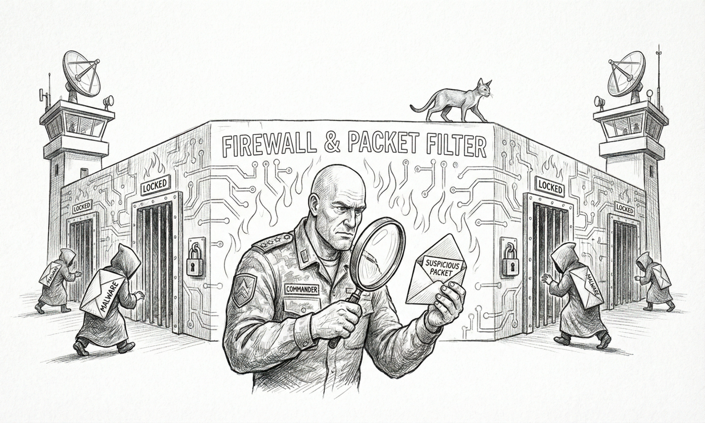

import { Aside } from '@astrojs/starlight/components';

Sanctum is opinionated about your data: as much of it as possible stays on hardware you own. This page is the operator's honest accounting of what crosses the threshold, where it goes, who can read it.

## TL;DR

| Category | Where it lives | Who can read it |
|---|---|---|
| Sanctum's own audit logs, agent memory, R2D2 history | `~/.sanctum/` on your Mac | You. Period. |
| LLM inference (Claude / Gemini / local) | Local cathedrals when configured; otherwise via the API of the model vendor you chose | Vendor, per their terms. Local stays local. |
| Backup snapshots | The cloud bucket you configured (Cloudflare R2 / Backblaze B2 / Google Drive) | You + the cloud vendor + anyone you give the encryption key to. **Backups are encrypted with a key only you control.** |
| Telemetry from sanctum-cli itself | Nothing. There is no phone-home. | — |
| Install analytics | Nothing. The old installer had an opt-in pixel; we removed it. | — |

## What sanctum-cli sends, and to where

**Nothing**, unless you explicitly configure it. The CLI has no analytics pixel, no anonymous-usage telemetry, no opt-out backdoor that's actually opt-out-after-an-error-once. The `~/.sanctum/telemetry/cli.jsonl` file mentioned in the source is a *local* command-log — it stays on your Mac and is gitignored.

When you DO configure things:

- **Cloud backup** — your sanctum data is encrypted on your Mac with restic (AES-256, your operator-chosen passphrase) and uploaded to whichever bucket you set up during `sanctum onboard`. Cloudflare R2 / Backblaze B2 / Google Drive can see the ciphertext blobs. None of them can read the contents without your passphrase.
- **LLM providers** — if you chat with Claude / Gemini, those prompts go to Anthropic / Google per their terms. Local cathedrals (Yoda 35B on `:1337`, Coder-14B on `:1338`) keep the prompt and the reply on your Mac.

## Credentials we ask you for, and what they grant

All credentials live in macOS Keychain (`security find-generic-password -s sanctum/...`). The bundle is mode 600. None of these are sent anywhere by Sanctum itself — they're stored locally so the CLI can use them when you ask it to.

| Credential | What it grants Sanctum | What it would grant someone who stole it |
|---|---|---|
| `sanctum/openrouter-api-key` | Routing through OpenRouter for council members | The credit-limited budget you set on the OpenRouter dashboard |
| `sanctum/anthropic-api-key` | `sanctum chat` via Anthropic API | Same — capped by your Anthropic console |
| `sanctum/gemini-api-key` | `sanctum chat` via Google AI | Same |
| `sanctum/r2-*` / `b2-*` | Read/write your backup bucket | Access to your encrypted backups (still ciphertext) |
| `sanctum/firewalla-bridge-token` | Local Firewalla MSP API access | LAN-scoped; useless outside your network |

If your Mac is compromised, you should `sanctum keys backup` immediately to a separate device, then rotate these on the respective vendor dashboards. The `sanctum keys backup` bundle is AES-256-CBC + PBKDF2 with a passphrase you choose — keep that passphrase somewhere safe (your password manager).

## What we explicitly do not do

- **No analytics.** Not anonymous, not aggregate, not "to improve product." Nothing.
- **No third-party crash reporting.** Crashes land in `~/.sanctum/logs/`. We don't see them unless you paste them in a bug report.
- **No central account.** You don't sign in to Sanctum. There's no "Sanctum login" anywhere.
- **No recovery path through us.** If you lose your encryption keys + the `sanctum keys backup` bundle, the data is gone. There is no `sanctum forgot-password` because there is no party who could reset something.
- **No Apple data leaking through us.** The two TCC anchors ([Node.js Foundation + Bertrand Nepveu's Developer ID](/architecture/tcc-identity-anchors/)) are how Sanctum reads iMessage / Calendar / Contacts databases for SanctumBridge. Those reads happen entirely on your Mac.

## What we collect when you file a bug

The [bug-report template](https://github.com/Ogilthorp3/sanctum-cli/issues/new/choose) asks for:

- sanctum-cli version (e.g. `v0.9.0`)
- macOS version + chip
- The output of `sanctum doctor` and `sanctum self-test` (which list service names, port numbers, log file sizes — not contents)
- Optional log excerpts (you choose which)

The form has a mandatory checkbox: **"I have NOT pasted credentials."** When in doubt, redact. We'd rather have a partial report than your API keys.

## The doctrine

Sanctum's first family-facing service made an honesty mistake in April 2026 — an API claimed success when the underlying enforcement had silently failed. The fix (sanctum-screen-time Layer 1) became a doctrine: family-facing services must be **honest, bounded, defense-in-depth, no silent failures**. Privacy is a subset of that. We won't claim "no data sent" when there's an analytics pixel; we won't claim "encrypted" when only the transport is encrypted; we won't claim "you have control" when there's a "reset everything" link on a vendor's web console.

If you find a privacy claim on this page that doesn't match what Sanctum actually does, file an issue. We'll either fix the code or fix the claim — but the page and the code stay matched.

<Aside type="note">
The signing chain that protects the binaries you install ([TCC Identity Anchors](/architecture/tcc-identity-anchors/)) is the technical backbone behind these claims. Apple Root CA → Developer ID Application: Node.js Foundation `HX7739G8FX` for `/usr/local/bin/node`; Apple Root CA → Developer ID Application: Bertrand Nepveu `GJ994MN2YF` for SanctumBridge.app. Stable for years; tamperable only by Apple revoking the cert or by you running unsigned binaries on top.
</Aside>
