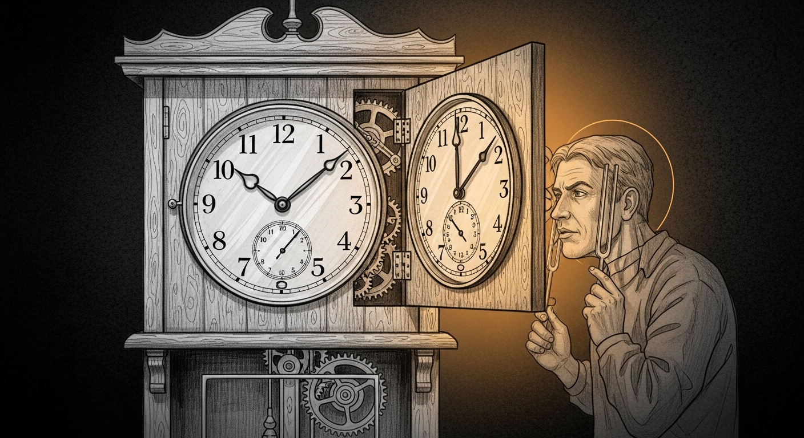

import { Aside } from '@astrojs/starlight/components';




# Screen Time Enforcement — Closed-Loop Edition

**Date:** 2026-04-18
**Status:** Live on manoir, E2E-tested, regression-gated

A screen-time system that says "blocked" but streams Netflix is worse than one that admits it's broken. This page documents what went wrong on April 16–18, 2026 and the closed-loop contract that now governs every enforcement action.

## What broke

Force Flow's `_block_mac()` called the Firewalla bridge and logged `BLOCKED <mac> — curfew` based on whether the response was truthy:

```python
# Before
async def _block_mac(session, mac, reason="curfew"):
    result = await _bridge_post(session, f"/host/{mac}/pause")
    if result:
        log.info(f"BLOCKED {mac} — {reason}")
    return result
```

The Firewalla SDK, when it got into a certain stale-policy state, would answer HTTP 200 with `{"success": false, "errors": [{}]}`. That's a non-empty dict. `if result:` is truthy. `BLOCKED` got logged. The Firewalla did nothing.

The first night this happened (April 16), five of seven curfewed MACs stayed online. Log said they were blocked. They weren't. Nobody noticed because everyone was asleep, which was what the curfew was supposed to guarantee.

The second night (April 17), same five MACs, same silent pass. The parents noticed because streaming was happening during "quiet hours."

## Two traps, stacked

Debugging the incident surfaced a second trap that amplified the confusion:

<Aside type="caution" title="Firewalla ACL semantics are inverted">
`policy.acl: false` means the device is **blocked** (ACL enforced, traffic dropped). `policy.acl: true` means the device is **allowed** (no ACL restriction). This is opposite to the "ACL = rule enforced = blocked" intuition most people start with. The pause endpoint literally runs `sendSet("policy", { acl: false }, mac)`. Read the bridge code before you write the runbook.
</Aside>

Combined effect: while diagnosing live, the first pass of verification **reported the wrong conclusion** — said devices were blocked when they were passing. Which is how we ended up telling the parent "RED tout est bloqué" when the opposite was true. (The parent, to their credit, asked "es-tu certain que ya plus rien qui passe?" and the cross-check caught it.)

## The fix — closed-loop contract

Every write to the Firewalla now goes through a three-step contract. No exceptions.

```python
async def _verify_acl(session, mac, expected):
    await asyncio.sleep(1.0)
    current = await _bridge_get(session, f"/host/{mac}")
    acl = (current or {}).get("policy", {}).get("acl")
    return acl is expected


async def _block_mac(session, mac, reason="curfew"):
    result = await _bridge_post(session, f"/host/{mac}/pause")

    # 1. Require explicit success, not truthy non-empty dict
    if not result or not result.get("success"):
        log.error(f"BLOCK FAILED {mac} — {reason}: bridge returned {result}")
        return None

    # 2. Verify the side effect landed on the control plane
    if not await _verify_acl(session, mac, expected=False):
        log.warning(f"BLOCK DRIFT {mac} — {reason}: bridge ok but acl stayed true; retrying once")
        # 3. Retry once, then escalate
        retry = await _bridge_post(session, f"/host/{mac}/pause")
        if not retry or not retry.get("success") or not await _verify_acl(session, mac, expected=False):
            log.error(f"BLOCK ESCALATION {mac} — {reason}: retry did not stick; Firewalla drift")
            return None

    log.info(f"BLOCKED {mac} — {reason}")
    return result
```

Same shape for `_unblock_mac` — asserts `acl == True` after the call, retries on drift, escalates to `UNBLOCK ESCALATION` on failure.

### Why "closed-loop" and not just "check the response"

The bridge's `success` field is a partial signal. The Firewalla SDK can accept the command, return `success: true`, and still not propagate the change to the enforcement tier (happened to us with the metallib-stalled SDK state). The only authoritative signal is re-reading the target's policy on the Firewalla itself. **If the observed state doesn't match the intended state, the action didn't happen, regardless of what any intermediary said.**

This is Living Force principle 12: *commands can't lie either*.

## The log grammar

The new enforcement path emits exactly four terminal states per MAC, and nothing else can produce a `BLOCKED` line:

| Log line | Meaning | Action |
|---|---|---|
| `BLOCKED <mac> — <reason>` | Success: bridge said `success: true` AND `policy.acl == false` confirmed | None — working |
| `BLOCK FAILED <mac> — <reason>: bridge returned <dict>` | Bridge said failure explicitly | Dispatch to Living Force queue; surface the bridge dict |
| `BLOCK DRIFT <mac> — <reason>: bridge ok but acl stayed true; retrying once` | Bridge succeeded but state didn't change | Self-retry fires immediately |
| `BLOCK ESCALATION <mac> — <reason>: retry did not stick; Firewalla drift` | Retry failed too | Operator attention — Firewalla SDK may need a bridge restart |

Unblock has mirror lines (`UNBLOCKED`, `UNBLOCK FAILED`, `UNBLOCK DRIFT`, `UNBLOCK ESCALATION`).

## The E2E regression gate

`tests/test-screen-time-enforcement.sh` exercises the full closed-loop in under 30 seconds:

- Endpoint + bridge token reachability
- `/screen/block` → observe `acl=False` on the bridge
- Log assertions: `BLOCKED` present, no `FAIL`/`DRIFT`/`ESCALATION`
- `/screen/unblock` → observe `acl=True` restored
- 12h auto-override cleanup (the override `/screen/unblock` creates would otherwise suppress the next curfew)
- Nintendo's standalone 22:30 schedule (moved out of `shared_devices` so it doesn't inherit Albert's 23:00 phone curfew)
- God Mode parent-override path for both consoles
- Self-cleaning final state

Currently **18 pass / 0 fail**. Any regression to truthy-check silent-success will fail L3 ("no FAIL/DRIFT/ESCALATION") loudly.

## God Mode — the parent override

Parents can override both consoles (VRVANA PC + Nintendo Switch) from the Holocron dashboard. The button is styled after Doom's `IDDQD` cheat, red palette, three duration presets:

| Button | Effect |
|---|---|
| **+30 MIN** | Override `vrvana_pc` and `nintendo_switch` for 30 minutes |
| **+60 MIN** | Same, 60 minutes |
| **+120 MIN** | Same, 120 minutes (the backend max from `override_max_minutes`) |
| **STOP** | Clear both overrides immediately (`minutes: 0`) |

Album's phone curfew is unaffected — the phone keeps its 23:00 weekend bedtime so he can read or play chess while falling asleep. Only the consoles get bumped.

## STUDY MODE — per-child curfew override

When a kid hits an end-of-school study crunch and needs an earlier
cutoff than the regular weekday schedule, the cleanest path is the
`study_mode` block at the top of that child's `schedule` in
`devices.yaml`:

```yaml
family:
  albert:
    schedule:
      study_mode:
        enabled: true
        curfew: '20:00'
        wake: '07:00'
        until: '2026-06-25'   # last day of school year
      weekday: { curfew: '21:30', wake: '07:00' }
      weekend: { curfew: '23:00', wake: '09:00' }
```

Precedence is `study_mode > holiday > weekend > weekday` in
`_get_effective_schedule()`. When `enabled: true` and today is
`<= until`, the study curfew wins every other layer — weekday,
weekend, and holiday alike. Set `enabled: false` (or delete the
block) to revert; no daemon restart needed beyond the standard
`launchctl kickstart -k gui/$UID/com.sanctum.force-flow` after
editing the yaml. Force Flow's `GET /screen/status` reports
`schedule_type: study` while it's active so the Lovelace card and
the morning briefing both surface the override.

**Scope of the cut.** `study_mode` on the child profile is what
`shared_devices` (PS5) reads via the `any_child_curfew_active`
loop, so the PS5 is automatically cut when the kid's study window
starts. The child's `personal_devices` (iPhone, iPad) are
intentionally NOT blocked by the daemon — Apple Screen Time
already enforces those, and double-blocking would create
diagnosis ambiguity. For every other screen the kid uses to
not-study (PC, Apple TVs, Nintendo Switch, Steam Deck), mirror
the same `study_mode` block at `screens.<name>.schedule.study_mode`
so each fires at the same boundary. Apple TVs in legacy
flat-curfew format need to be migrated to the nested `schedule:`
dict before `study_mode` can attach.

## Editing from the Holocron app

As of 2026-05-25 the operator can edit every screen-time setting
from the Holocron parent app — no more direct `devices.yaml`
editing required for routine changes. Three new sub-components in
`ScreenTimePanel.tsx` call three matching Force Flow write
endpoints:

| UI | Endpoint | Body |
|---|---|---|
| Mode étude card | `POST /screen/study-mode/<child>` | `{enabled, curfew, wake, until, screens?}` |
| Schedule editor | `POST /screen/schedule/<target>` | `{layer, curfew, wake}` |
| MAC editor | `POST /screen/screens/<screen>/macs` | `{add\|remove\|set: [mac]}` |

Every write goes through `_apply_devices_yaml_change()` in
`force_flow.py` which: snapshots `devices.yaml.bak-<op>-<ts>`
beside the file, validates the parsed result via `ruamel.yaml`
round-trip (preserves comments + quoting), atomic-writes via
tmpfile rename, audits to `~/.sanctum/logs/devices-yaml-changes.jsonl`,
then threaded-kickstarts Force Flow with a 500 ms delay so the
HTTP response flushes before the daemon respawns. Validation
failures (bad MAC format, unknown target, bad HH:MM) return 400
without snapshotting or kickstarting. The op log is the audit
trail; the snapshot is the rollback path.

## Rollback

Layer by layer. Each step is reversible in one command.

```bash
# Revert the closed-loop code fix only (keep docs/tests)
ssh neo@100.0.0.25 'cp /Users/neo/.sanctum/screen-time/screen_time.py.bak-20260418-152105 \
                           /Users/neo/.sanctum/screen-time/screen_time.py && \
                         launchctl kickstart -k gui/$(id -u)/com.sanctum.force-flow'

# Full restore from the weekly snapshot
shasum -a 256 -c ~/Backups/sanctum-mini/sanctum-mini-20260418-*.tgz.sha256
```

<Aside type="note">
The Nintendo was moved from `shared_devices` to `screens` in the same session so it could carry its own 22:30 weekend/holiday schedule. That's a yaml change, not a code change — reverting `devices.yaml` from the backup puts it back under "shared inherits from Albert."
</Aside>
