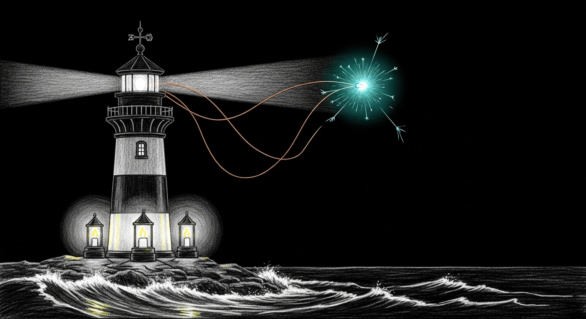

import { Aside } from '@astrojs/starlight/components';



The Signal stack is three different services wearing the word "signal" in their name on three different ports speaking three different protocols, all fighting over the same account. That's not a configuration problem — it's an architectural inheritance from a company that did not expect anyone to run their CLI alongside their Electron app alongside a Docker wrapper of their own daemon. Three recurring failure modes emerge from the collision. This annex collects them so the main [Troubleshooting](/operations/troubleshooting/) page can stay short.

## Signal CLI REST API Returns 404

**Symptom:** `curl http://127.0.0.1:8080/v1/about` returns `404 Not Found` with `No context found for request`. All REST-style paths (`/v1/about`, `/api/v1/accounts`, `/v2/send`) return 404.

**Root cause:** You're hitting port 8080, which runs the **native signal-cli `--http` mode**. The native mode only speaks JSON-RPC at a single endpoint (`POST /api/v1/rpc`). It does not serve REST endpoints at all. Those live on the Docker wrapper containers on ports 18081 and 18082.

This is not a misconfiguration. It is three different services that all have "signal-cli" in their name but serve different protocols on different ports. See the [Signal CLI API Reference](/reference/signal-cli-api/) for the full breakdown.

**Quick fix:**

```bash
# If you want REST endpoints, use port 18081 or 18082
curl -s http://127.0.0.1:18081/v1/about

# If you want to use port 8080, speak JSON-RPC
curl -s -X POST -H "Content-Type: application/json" \
  -d '{"jsonrpc":"2.0","method":"version","id":1}' \
  http://127.0.0.1:8080/api/v1/rpc
```

**If the Docker containers are down:**

```bash
# Check container status
docker ps --filter name=signal --format '{{.Names}} {{.Status}}'

# Restart both containers
cd ~/.openclaw/signal-cli && docker compose up -d
```

<Aside type="note">
OpenClaw/Yoda messaging does not use any HTTP API — it shells out to `/opt/homebrew/bin/signal-cli` directly. So Signal messaging can work perfectly while every HTTP endpoint returns 404. The HTTP interfaces are for tooling, not the primary message path.
</Aside>

## signal-yoda Container Won't Start (Docker Compose Stale Reference)

**Symptom:** `docker compose up -d` fails with `Error response from daemon: No such container: <hash>`. The `signal-yoda` container shows as "Created" but with a mangled name like `8ad7a58e84ff_signal-yoda`.

**Root cause:** Docker Compose v5 has a bug where it caches a reference to a previous container ID in its project state. When that container gets removed outside of compose (crash, manual `docker rm`, system restart), compose tries to "Recreate" a container that no longer exists and enters an unrecoverable loop.

**Fix:**

```bash
# 1. Stop and remove all signal containers manually
docker stop $(docker ps -q --filter name=signal) 2>/dev/null
docker rm $(docker ps -aq --filter name=signal) 2>/dev/null
docker rm $(docker ps -aq --filter name=yoda) 2>/dev/null

# 2. Recreate the rest-api container via compose (this one usually works)
cd ~/.openclaw/signal-cli
docker compose up -d signal-cli-rest-api

# 3. Create the yoda container manually with correct name
docker run -d \
  --name signal-yoda \
  --restart unless-stopped \
  -e MODE=json-rpc \
  -p 127.0.0.1:18082:8080 \
  -p 127.0.0.1:6002:6001 \
  -v ~/.openclaw/signal-cli/data-yoda:/home/.local/share/signal-cli \
  bbernhard/signal-cli-rest-api:latest

# 4. Verify both are healthy
sleep 15 && docker ps --filter name=signal --format '{{.Names}} {{.Status}}'
```

<Aside type="caution">
The regression test (`test-connections.sh`) checks for containers named exactly `signal-cli-rest-api` and `signal-yoda`. A mangled name like `8ad7a58e84ff_signal-yoda` will fail the test even if the container is running and healthy. The `docker run` approach above ensures the correct name.
</Aside>

## Signal Desktop Stealing WebSocket (ConnectedElsewhereException)

**Symptom:** Yoda stops receiving Signal messages. signal-cli logs show `ConnectedElsewhereException` in an infinite reconnection loop. Messages sent to +15555550100 are delivered to Signal Desktop instead of signal-cli/OpenClaw.

**Root cause:** Signal only allows one active WebSocket connection per account. Signal Desktop (the Electron app) and signal-cli both try to maintain a persistent WebSocket to Signal's servers for +15555550100. When Signal Desktop is running, it wins the connection race and signal-cli gets kicked off with `ConnectedElsewhereException` every time it tries to reconnect. This creates an infinite loop: connect → kicked → reconnect → kicked.

OpenClaw spawns signal-cli as a child process and will auto-restart it on crash, but each restart hits the same wall because Signal Desktop is still holding the connection.

**Diagnosis:**

```bash
# Check if Signal Desktop is running (this is your culprit)
pgrep -f '/Applications/Signal.app/Contents/MacOS/Signal'

# Confirm signal-cli is in a reconnect loop
# (OpenClaw logs or signal-cli stderr will show ConnectedElsewhereException)
ps aux | grep signal-cli | grep -v grep

# The health check now detects this automatically
~/.sanctum/scripts/signal-health.sh
```

**Fix:**

```bash
# 1. Quit Signal Desktop gracefully
osascript -e 'tell application "Signal" to quit'

# 2. If signal-cli is stuck, kill it — OpenClaw will auto-restart cleanly
kill $(pgrep -f 'signal-cli.*daemon.*8080') 2>/dev/null

# 3. Wait for Signal's servers to release the connection (~5 seconds)
sleep 5

# 4. OpenClaw auto-restarts signal-cli. Verify it's healthy:
curl -s -X POST http://127.0.0.1:8080/api/v1/rpc \
  -H 'Content-Type: application/json' \
  -d '{"jsonrpc":"2.0","method":"version","id":1}'

# 5. Confirm it's actively receiving (this error is actually good — means daemon is listening)
curl -s -X POST http://127.0.0.1:8080/api/v1/rpc \
  -H 'Content-Type: application/json' \
  -d '{"jsonrpc":"2.0","method":"receive","id":2,"params":{"timeout":1}}'
# Expected: "Receive command cannot be used if messages are already being received."
```

**Or use the health check with auto-fix:**

```bash
~/.sanctum/scripts/signal-health.sh --fix
```

The health check runs the Signal Desktop conflict detection first, before any other checks. If `--fix` is passed and Signal Desktop is found, it kills it automatically.

<Aside type="danger">
Do not run Signal Desktop on this machine. It is not compatible with signal-cli for the same account. They cannot coexist — Signal's server enforces one WebSocket per account number, period. If you need to check Signal messages visually, use Signal on your phone or a different device.
</Aside>

<Aside type="note">
**Key detail:** OpenClaw (PID for `openclaw-gateway`) is the parent process of signal-cli. You do not need to manually restart signal-cli after killing it — OpenClaw detects the child exit and spawns a new instance automatically. Just make sure Signal Desktop is dead first, otherwise the new instance will hit the same ConnectedElsewhereException wall.
</Aside>
