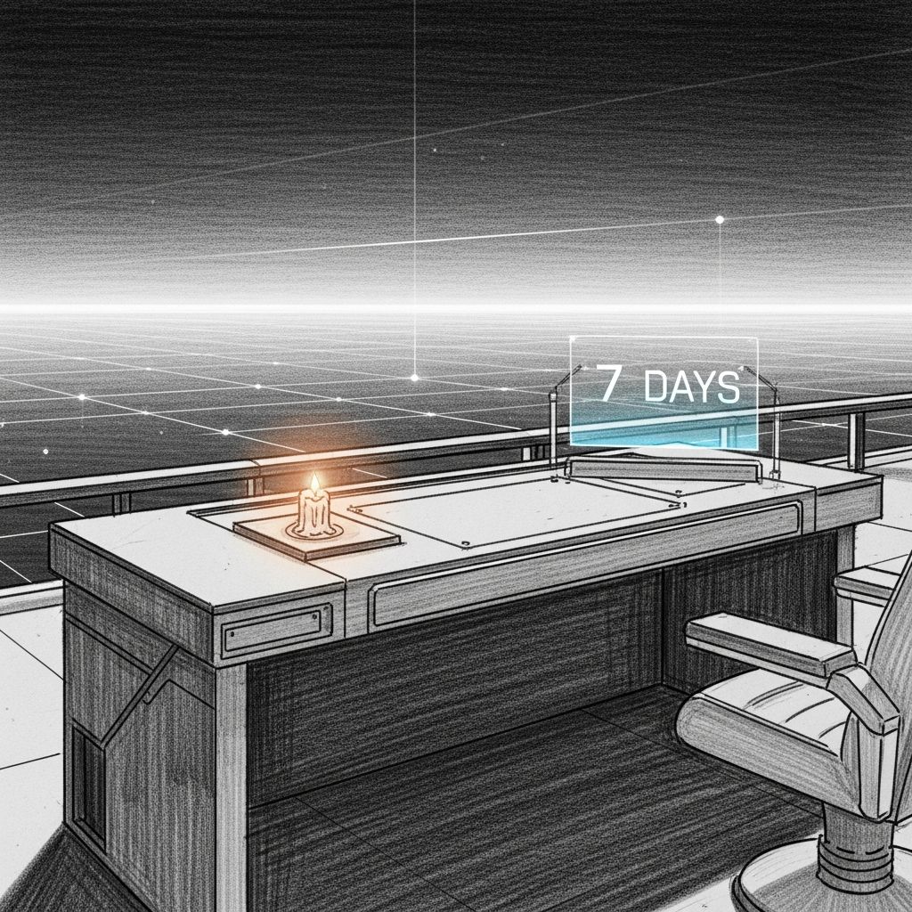

import { Aside, Steps } from '@astrojs/starlight/components';



Before Sanctum becomes more portable, it needs to prove it can sit still.

The audit phase is complete enough that the next mistake would be obvious: rushing into productization while the local system is still metabolizing all the cleanup work. The right move is a bounded soak period. Seven calm days. No heroic rewrites. No shiny new subsystems. Just the system doing its job without inventing fresh drama.

## The Rule

Phase 2 does not begin until the stabilization window has matured and the exit gate passes.

The policy is checked into the workspace at:

```sh
/Users/neo/Documents/Claude_Code/sanctum/stability_window.yaml
```

The operator surface for it lives in:

```sh
python3 /Users/neo/Documents/Claude_Code/tools/sanctumctl.py stability start
python3 /Users/neo/Documents/Claude_Code/tools/sanctumctl.py stability status
python3 /Users/neo/Documents/Claude_Code/tools/sanctumctl.py stability check
```

## What The Gate Requires

- seven full calendar days since the window began
- `sanctumctl doctor --quick` still clean
- `sanctumctl verify` still clean
- `sanctum-docs` still builds cleanly

That is intentionally boring. Boring is the product requirement. If the system cannot survive a week of boredom, it has not earned a stranger's trust.

## Operator Flow

<Steps>
1. Start the window with `sanctumctl.py stability start`.
2. Let the normal audit wall and runtime checks keep running during the week.
3. Inspect progress with `sanctumctl.py stability status`.
4. At the end of the week, run `sanctumctl.py stability check`.
5. Only after that passes does the roadmap move back to Phase 2 productization.
</Steps>

## Why This Exists

Sanctum just came through a large consolidation pass: runtime cleanup, canonical rendering, Kitchen Loop implementation, feature proof, and tooling hardening. That kind of work produces two dangerous illusions:

- that a green test wall today means the system is calm
- that the next right move is immediately making it more ambitious

Neither is true. A strong local system should be able to remain unchanged for a week without surprise drift, fresh runtime contradictions, or docs falling out of sync with reality.

<Aside type="tip">
This is the rare case where "do less" is the more disciplined engineering move. Sanctum does not need another revelation this week. It needs composure.
</Aside>
