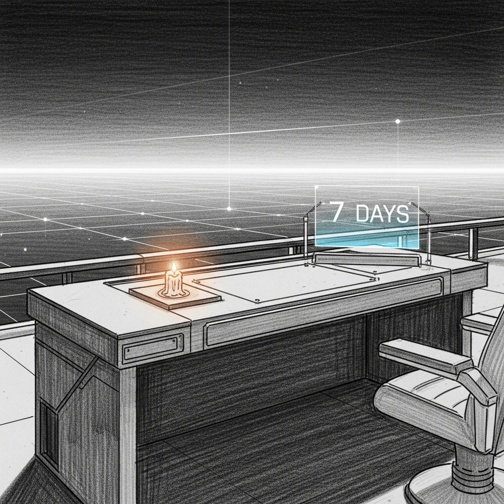

import { Aside, Steps } from '@astrojs/starlight/components';



Tommy, the haus's late Abyssinian, proved a point most engineers never learn. The hardest thing a system can do is sit still. Before Sanctum earns a stranger's trust, it has to pass the same test he passed every afternoon on the flagstone. Not run faster. Not grow. Just stay.

The audit phase is done enough that the next mistake would be an obvious one — rushing into productization while the local system is still metabolizing all the cleanup. So we hold. Seven calm days. No heroic rewrites, no shiny new subsystems, just the system doing its job without inventing fresh drama.

## The Rule

Phase 2 does not begin until the stabilization window has matured and the exit gate passes. That is the whole rule, and it is deliberately hard to argue with.

The policy is checked into the workspace:

```sh
/Users/neo/Documents/Claude_Code/sanctum/stability_window.yaml
```

The operator surface lives one directory over:

```sh
python3 /Users/neo/Documents/Claude_Code/tools/sanctumctl.py stability start
python3 /Users/neo/Documents/Claude_Code/tools/sanctumctl.py stability status
python3 /Users/neo/Documents/Claude_Code/tools/sanctumctl.py stability check
```

## What The Gate Requires

Four conditions, all of them boring on purpose:

- seven full calendar days since the window began
- `sanctumctl doctor --quick` still clean
- `sanctumctl verify` still clean — the same [verify wall](/operations/verify/) that guards every release
- `sanctum-docs` still builds cleanly

Boring is the product requirement. If the system cannot survive a week of boredom, it has not earned a stranger's trust, and no amount of green on a fresh test wall changes that.

## Operator Flow

You run three commands over seven days, and mostly you leave the machine alone.

<Steps>
1. Start the window with `sanctumctl.py stability start`.
2. Let the normal audit wall and runtime checks keep running through the week.
3. Inspect progress with `sanctumctl.py stability status`.
4. At the end of the week, run `sanctumctl.py stability check`.
5. Only after that passes does the roadmap move back to Phase 2 productization.
</Steps>

## Why This Exists

Sanctum just came through a large consolidation pass: runtime cleanup, canonical rendering, [Kitchen Loop](/architecture/kitchen-loop/) implementation, feature proof, and tooling hardening. Work like that produces two dangerous illusions:

- that a green test wall today means the system is calm
- that the next right move is immediately making it more ambitious

Neither is true. A strong local system should be able to sit unchanged for a week — no surprise drift, no fresh runtime contradictions, no docs quietly falling out of sync with reality. The window is how we find out whether the calm is real or just recent.

<Aside type="tip">
This is the rare case where "do less" is the more disciplined engineering move. Sanctum does not need another revelation this week. It needs composure — the thing Tommy had, that the seasons have, that no cron job can fake.
</Aside>

The window closes the way it opened: with nothing happening, on purpose. If nobody has anything to report by day seven, the gate opens and Phase 2 begins. That silence is not the absence of work. It is the proof.
