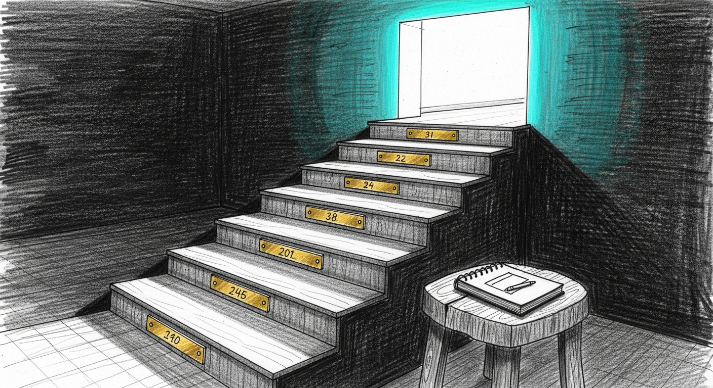

import { Aside, Steps } from '@astrojs/starlight/components';




Sanctum upgrades should be boring. The system is now strong enough that upgrades should look like a bounded operator procedure, not a spiritual trial.

## The Rule

Do not upgrade on top of known drift.

Before touching anything, run:

```bash
python3 tools/sanctumctl.py doctor --quick
```

If that fails, fix the drift first. Upgrading a machine that is already lying to you is how one problem becomes three.

## Standard Upgrade Flow

<Steps>
1. Pull the checked-in changes.
2. Run `python3 tools/sanctumctl.py render` to sync generated surfaces.
3. Run `python3 tools/sanctumctl.py doctor --quick`.
4. Run `python3 tools/sanctumctl.py verify`.
5. If docs changed, run `pnpm build` in `sanctum-docs`.
6. Only then consider the upgrade complete.
</Steps>

Minimal command sequence:

```bash
git pull
python3 tools/sanctumctl.py render
python3 tools/sanctumctl.py doctor --quick
python3 tools/sanctumctl.py verify
cd sanctum-docs && pnpm build
```

Five commands, in order. If any one of them goes red, stop. An upgrade rolled on top of a lie just produces a more elaborate lie, and the truth still has to be paid for eventually — usually at 3 AM, usually on a Sunday.

## What `render` Actually Syncs

`python3 tools/sanctumctl.py render` reconciles the generated surfaces that most often drift during upgrades:

- checked-in workspace manifests
- runtime manifests in `~/.sanctum/services`
- synced agent capabilities
- agent markdown
- runtime calibration artifacts

This is the line between "new code exists in git" and "the running machine is using the new shape."

## If The Upgrade Touches Runtime Services

Pay extra attention when changes affect:

- `sanctum/runtime_catalog.yaml`
- `tools/render_runtime_services.py`
- launchagent templates
- health or remediation scripts

Those changes alter the machine contract, not just repo logic. Treat them as operational changes, not cosmetic ones.

## Rollback Posture

Sanctum does not currently have one universal rollback command. The practical rollback posture is:

- keep upgrades small
- keep generated surfaces reproducible
- re-run `render` to restore canonical generated state
- use subsystem-specific recovery paths from [Troubleshooting](/operations/troubleshooting/)
- rely on existing backup and restore guidance in [Backup & Restore](/operations/backup-restore/)

That is not yet perfect product-grade rollback. It is, however, explicit.

<Aside type="caution">
If an upgrade changes both repo code and machine-owned runtime artifacts, verify both layers. A green git diff means very little if `~/.sanctum` still reflects yesterday's assumptions.
</Aside>

## When To Delay An Upgrade

Delay the upgrade if any of these are true:

- the stability window is active and you are measuring calm runtime behavior
- `doctor --quick` is already failing
- the machine has unresolved runtime drift
- the docs build is already red

The right time to upgrade is when the current state is legible. Upgrades are not a substitute for diagnosis.
