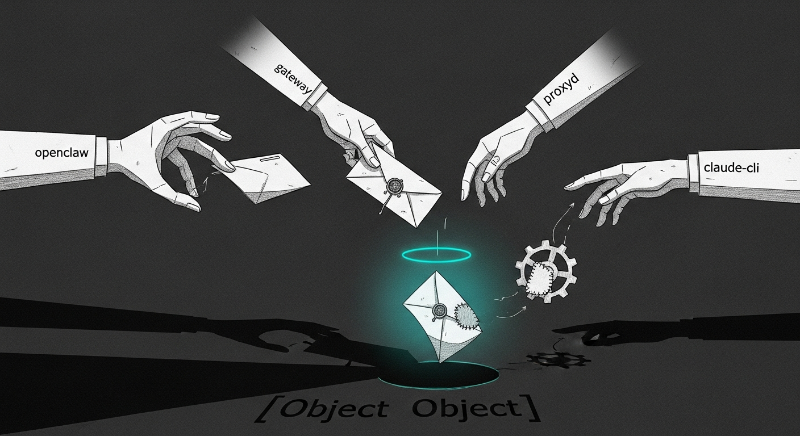

import { Aside } from "@astrojs/starlight/components";



Yoda is the Haus assistant Bert texts on Signal at his fictional-block
demo number (real number redacted; pretend it is `+15555550100`). The
chain from operator to LLM and back is openclaw, then a yoda-chat
consumer, then the openclaw gateway, then the council-tiered proxyd,
then claude-max-api-proxy, then the Claude CLI subprocess, then back
out through signal-cli. Six hops, three independent silent-failure
classes, one bug that masked another for ten hours. This page is the
incident record + the three-layer defense that came out of it.

<Aside type="note" title="Apple-like + military-grade">
Every layer here was shipped because a previous attempt failed at the
boundary it owned. Read top-to-bottom for the chronology, or skip to
"Layer 3" for the actual root-cause fix.
</Aside>

## The symptom

Every text Bert sent to Yoda came back as one of three patterns,
depending on which layer you blamed at the time:

1. **Silence.** The default openclaw harness emits `NO_REPLY` for any
   message that doesn't need a tool call. Signal showed nothing back.
2. **A canned acknowledgement.** Once a wrapper trapped `NO_REPLY` and
   substituted a warm canned text, the reply landed but felt scripted
   (`ack`, `present`, `received`).
3. **The model insisting your message was corrupted.** "Your message
   came through as `[object Object]` — what did you mean to send?"
   Even though `finalPromptText` in the JSON dump showed the operator
   text intact.

The fix turned out to need three independent layers. Each layer is
worth keeping, even now, because each layer's failure mode is
different.

## Layer 1 (retired) — patch openclaw's silent-reply rewrite array

openclaw 2026.5.24 shipped a `silentReplyRewrite` feature that
substituted a canned text for any agent reply of `NO_REPLY`. The
default canned texts were robotic (`Standing by.`, `Nothing to add
right now.`). The first attempt patched that dist file with warm
franglais entries.

This approach died when openclaw was pinned to 2026.5.20 — that
version doesn't have the rewrite feature at all. Lesson: patching a
vendor's `node_modules/<pkg>/dist/` works until the next pin or update
rewrites the path it lives at. **Retired 2026-05-24** — the
`heal-yoda-warmth` recipe is gone from `r2d2/recipes.yaml`; the patch
script lives at `~/.sanctum/scripts/yoda-warmth-patch.sh.retired-*`
for reference.

## Layer 2 — consumer-side wrapper in our repo

`yoda_chat/agent.py` (in our repo at
`sanctum/yoda-chat/yoda_chat/agent.py`) now owns delivery. It calls
openclaw with `--json` and no `--deliver`, parses the agent's reply,
substitutes a warm canned text via `warmth.pick_warm()` if the reply
is `NO_REPLY` or empty, and sends the final text via the signal-cli
JSON-RPC `send` method itself.

The wrapper is version-agnostic — it only uses openclaw's public
`--json` flag and signal-cli's documented JSON-RPC API. Any openclaw
pin, bump, or downgrade leaves it intact. The R2D2 recipe
`heal-yoda-warmth-wrapper` redeploys `warmth.py` + `agent.py` from
the repo if the VM copy ever goes missing.

Three relevant files:

| Path | Purpose |
|---|---|
| `sanctum/yoda-chat/yoda_chat/warmth.py` | `WARM_TEXTS` array + `pick_warm(seed)` deterministic picker + `is_silent_reply(text)` |
| `sanctum/yoda-chat/yoda_chat/agent.py` | `dispatch_signal_reply()` — owns the openclaw call, the parse, the substitution, the signal-cli send |
| `sanctum/yoda-chat/tests/test_warmth.py` | 7 unit tests — determinism, distribution, silent-reply detection |

This layer was good — but operator feedback was that he wanted real
LLM-generated answers, not canned acknowledgements. The canned path
should be the Zeroth Rule floor, not the everyday case. Which led to
Layer 3.

## Layer 3 — the actual root cause

Even with Layer 2 in place, every Yoda turn returned `NO_REPLY` from
openclaw, so the canned text fired every time. Direct openclaw calls
bypassing Layer 2 also returned text like `Your message came through
as [object Object]`. The bug had to be upstream of openclaw.

A sub-agent traced the request path one hop at a time and found it in
`~/Library/pnpm/global/5/node_modules/claude-max-api-proxy/dist/adapter/openai-to-cli.js`,
function `messagesToPrompt()`. The function used template literals on
`msg.content` directly. openclaw sends content in OpenAI multimodal
form, an array of `{type:"text", text:"..."}` blocks. JavaScript
stringifies arrays of objects via the default `toString()` to
`[object Object]`. The Claude CLI subprocess then received that
literal string. The LLM dutifully described the corruption it saw.

**Fix**: add a `flattenContent()` helper that returns the joined text
of array blocks, then use it in all three role branches (system,
user, assistant). Marker `// content-flatten patch v1` for
idempotence and R2D2 detection.

Three defenses (defense-in-depth, all in repo):

| Layer | Path | Trigger |
|---|---|---|
| Patch script | `sanctum/scripts/patch-claude-max-proxy-content-flatten.sh` | Manual / on-demand |
| Reapply LaunchAgent | `sanctum/launchagents/com.sanctum.claude-max-proxy-content-flatten.plist` | Daily 04:13 + RunAtLoad |
| R2D2 heal recipe | `sanctum/scripts/r2d2/heal-claude-max-proxy-content-flatten.sh` + `recipes.yaml` | Marker missing on R2D2 poll, 1h cooldown, severity high |

## Verifying

Three independent probes, easiest first:

```bash
# 1. Marker present in the proxy adapter?
grep -c '// content-flatten patch v1' \
  ~/Library/pnpm/global/5/node_modules/claude-max-api-proxy/dist/adapter/openai-to-cli.js
# → 2

# 2. API probe at the proxy (skips openclaw + signal-cli)
curl -s -X POST http://127.0.0.1:3456/v1/chat/completions \
  -H "Content-Type: application/json" \
  -d '{"model":"opus","messages":[{"role":"user","content":[{"type":"text","text":"what is 2+2?"}]}]}' \
  | python3 -c 'import json,sys; print(json.load(sys.stdin)["choices"][0]["message"]["content"])'
# → 4   (or similar; the proof is the absence of "[object Object]")

# 3. End-to-end honor probe (sends one real Signal message to operator)
~/.sanctum/scripts/yoda-honor-probe.sh --timeout 120 --message "morning probe"
# → PASS, delivered=True, was_warmed=False, text=<a real LLM reply>
```

## What the wrapper is for, now

With Layer 3 in place, most operator texts get real LLM replies and
the wrapper's `pick_warm()` rarely fires. The wrapper is the floor:
when the LLM genuinely has nothing to say (no tool grounded, no
opinion) the Zeroth Rule (`never silent to Bert`) still needs to
emit something. `LAST_RESORT_TEXTS` is a 3-entry array, sized to be
the absolute minimum.

## Related

- `architecture/yoda-chat.mdx` — the full Yoda chat plumbing
- `operations/2026-05-24-msg-bus-shipped.mdx` — the msg-bus that
  delivers operator-facing alerts via iMessage primary
- Memory: `claude_max_proxy_object_object_2026_05_24.md` (in
  Claude_Code repo) — the post-mortem, including the four dead ends
  burned before the proxy-side fix landed.
