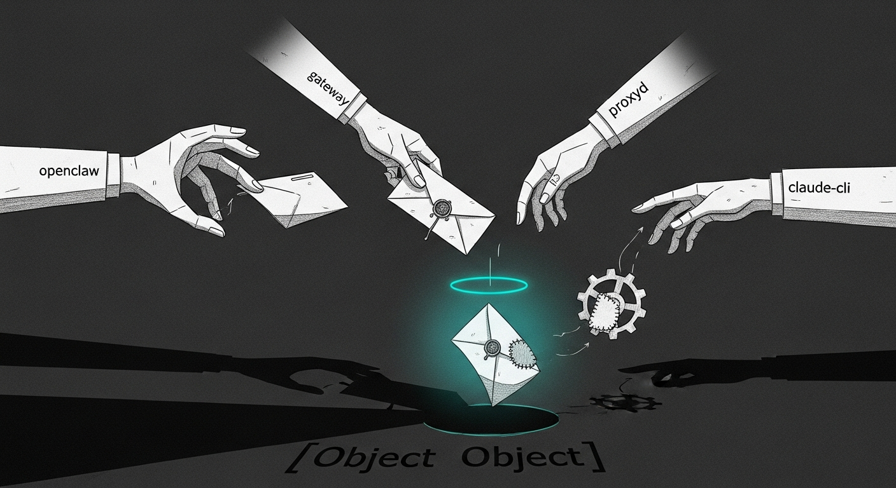

import { Aside } from "@astrojs/starlight/components";



Bert texted Yoda good morning. Yoda replied that the message was
corrupted. It arrived, the model explained gently, as `[object Object]`
— what had Bert meant to send? The message was fine. Somewhere across
six hops between Signal and a Claude subprocess, a stray template
literal had rendered an operator's words into JavaScript's default noise,
and the model — ever helpful — described the noise back to him.

Yoda is the Haus assistant Bert texts on Signal at his fictional-block
demo number (real number redacted; pretend it is `+15555550100`). The
[chain from operator to LLM and back](/architecture/yoda-chat/) is
openclaw, then a yoda-chat consumer, then the openclaw gateway, then
the council-tiered proxyd,
then claude-max-api-proxy, then the Claude CLI subprocess, then back
out through signal-cli. Six hops, three independent silent-failure
classes, one bug that masked another for ten hours. The fix needed
three layers, and we kept all three — because each one fails
differently.

<Aside type="note" title="Apple-like + military-grade">
Every layer here shipped because a previous attempt failed at the
boundary it owned. Read top-to-bottom for the chronology, or skip to
"Layer 3" for the actual root-cause fix.
</Aside>

## The symptom

Every text Bert sent came back as one of three patterns, depending on
which layer you were blaming that hour:

1. **Silence.** The default openclaw harness emits `NO_REPLY` for any
   message that doesn't need a tool call. Signal showed nothing back.
2. **A canned acknowledgement.** Once a wrapper trapped `NO_REPLY` and
   substituted a warm canned text, the reply landed but felt scripted
   (`ack`, `present`, `received`).
3. **The model insisting your message was corrupted.** "Your message
   came through as `[object Object]` — what did you mean to send?"
   Even though `finalPromptText` in the JSON dump showed the operator
   text intact.

Three symptoms, three culprits, and for ten hours the loud one hid the
real one. Here is the order we peeled them.

## Layer 1 (retired) — patch openclaw's silent-reply rewrite array

openclaw 2026.5.24 shipped a `silentReplyRewrite` feature that
substituted a canned text for any agent reply of `NO_REPLY`. The
default canned texts were robotic (`Standing by.`, `Nothing to add
right now.`). The first attempt patched that dist file with warm
franglais entries.

This approach died when openclaw was pinned to 2026.5.20 — that
version doesn't have the rewrite feature at all. The patch was
writing to a file that no longer existed. Lesson: editing a vendor's
`node_modules/<pkg>/dist/` works until the next pin or update rewrites
the path it lives at. **Retired 2026-05-24** — the `heal-yoda-warmth`
recipe is gone from `r2d2/recipes.yaml`; the patch script lives at
`~/.sanctum/scripts/yoda-warmth-patch.sh.retired-*` for reference.

## Layer 2 — a wrapper in our own repo

If a vendor path can vanish under a pin, own the boundary yourself.
`yoda_chat/agent.py` (in our repo at
`sanctum/yoda-chat/yoda_chat/agent.py`) now owns delivery. It calls
openclaw with `--json` and no `--deliver`, parses the agent's reply,
substitutes a warm canned text via `warmth.pick_warm()` if the reply
is `NO_REPLY` or empty, and sends the final text via the signal-cli
JSON-RPC `send` method itself.

The wrapper is version-agnostic — it only uses openclaw's public
`--json` flag and signal-cli's documented JSON-RPC API. Any openclaw
pin, bump, or downgrade leaves it intact. The R2D2 recipe
`heal-yoda-warmth-wrapper` redeploys `warmth.py` + `agent.py` from
the repo if the VM copy ever goes missing.

| Path | Purpose |
|---|---|
| `sanctum/yoda-chat/yoda_chat/warmth.py` | `WARM_TEXTS` array + `pick_warm(seed)` deterministic picker + `is_silent_reply(text)` |
| `sanctum/yoda-chat/yoda_chat/agent.py` | `dispatch_signal_reply()` — owns the openclaw call, the parse, the substitution, the signal-cli send |
| `sanctum/yoda-chat/tests/test_warmth.py` | 7 unit tests — determinism, distribution, silent-reply detection |

This layer worked. But the reply still felt scripted, because it was —
Bert wanted real LLM-generated answers, not a warm shrug. The canned
path should be the Zeroth Rule floor, not the everyday case. Which is
how we finally admitted the `NO_REPLY` itself was the symptom, not the
disease. That led to Layer 3.

## Layer 3 — the actual root cause

Even with Layer 2 in place, every Yoda turn returned `NO_REPLY` from
openclaw, so the canned text fired every time. Direct openclaw calls
that bypassed Layer 2 still returned `Your message came through as
[object Object]`. The bug had to be upstream of openclaw.

A sub-agent walked the request path one hop at a time and found it in
`~/Library/pnpm/global/5/node_modules/claude-max-api-proxy/dist/adapter/openai-to-cli.js`,
function `messagesToPrompt()`. The function used template literals on
`msg.content` directly. openclaw sends content in OpenAI multimodal
form — an array of `{type:"text", text:"..."}` blocks. JavaScript
stringifies an array of objects via the default `toString()` to the
literal `[object Object]`. The Claude CLI subprocess received that
string, and the LLM dutifully described the corruption it was handed.
The model was never confused. It was reading exactly what we sent it.

**Fix**: add a `flattenContent()` helper that returns the joined text
of the array blocks, then use it in all three role branches (system,
user, assistant). Marker `// content-flatten patch v1` for
idempotence and R2D2 detection.

| Layer | Path | Trigger |
|---|---|---|
| Patch script | `sanctum/scripts/patch-claude-max-proxy-content-flatten.sh` | Manual / on-demand |
| Reapply LaunchAgent | `sanctum/launchagents/com.sanctum.claude-max-proxy-content-flatten.plist` | Daily 04:13 + RunAtLoad |
| R2D2 heal recipe | `sanctum/scripts/r2d2/heal-claude-max-proxy-content-flatten.sh` + `recipes.yaml` | Marker missing on R2D2 poll, 1h cooldown, severity high |

## Verifying

Three independent probes, easiest first. The first two never touch
Signal; the third sends a real text to the operator, so run it when
Bert is expecting one.

```bash
# 1. Marker present in the proxy adapter?
grep -c '// content-flatten patch v1' \
  ~/Library/pnpm/global/5/node_modules/claude-max-api-proxy/dist/adapter/openai-to-cli.js
# → 2

# 2. API probe at the proxy (skips openclaw + signal-cli)
curl -s -X POST http://127.0.0.1:3456/v1/chat/completions \
  -H "Content-Type: application/json" \
  -d '{"model":"opus","messages":[{"role":"user","content":[{"type":"text","text":"what is 2+2?"}]}]}' \
  | python3 -c 'import json,sys; print(json.load(sys.stdin)["choices"][0]["message"]["content"])'
# → 4   (or similar; the proof is the absence of "[object Object]")

# 3. End-to-end honor probe (sends one real Signal message to operator)
~/.sanctum/scripts/yoda-honor-probe.sh --timeout 120 --message "morning probe"
# → PASS, delivered=True, was_warmed=False, text=<a real LLM reply>
```

## What the wrapper is for, now

With Layer 3 in place, most operator texts get real LLM replies and the
wrapper's `pick_warm()` rarely fires. That is the point: the wrapper is
the floor, not the room. When the LLM genuinely has nothing to say — no
tool grounded, no opinion — the Zeroth Rule (`never silent to Bert`)
still needs to emit something. `LAST_RESORT_TEXTS` is a 3-entry array,
sized to be the absolute minimum — three warm sentences that only exist
so that a good morning is never met with nothing at all. Everything
operator-facing rides the same doctrine: the
[msg-bus](/operations/2026-05-24-msg-bus-shipped/) can drop a hop, but
never a reply.

## Related

- [Yoda chat plumbing](/architecture/yoda-chat/) — the full six-hop
  chain this page debugs, hop by hop.
- [Msg-bus shipped](/operations/2026-05-24-msg-bus-shipped/) — the
  message bus that delivers operator-facing alerts via iMessage primary.
- Memory: `claude_max_proxy_object_object_2026_05_24.md` (in the
  Claude_Code repo) — the post-mortem, including the four dead ends
  burned before the proxy-side fix landed.
