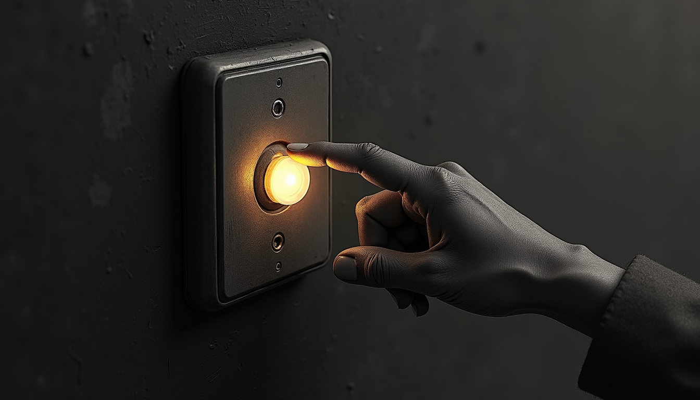

import { Aside, Steps } from '@astrojs/starlight/components';

Supper is on the table, or bedtime negotiations have collapsed, and every screen needs to stop **now**. That is what the big button at the bottom of the Home screen (Accueil) is for. One tap, two choices, done — and the block cleans up after itself.

## Pause the screens

<Steps>

1. Open the app and tap **Pause** — the big button at the bottom of the Home screen. You cannot miss it; that is the point.

2. Choose **who**. Both kids, or just Alex, or just Sam. Blocking one child never touches the other's screens, and it can never touch a parent's device — those are simply not on the list.

   

3. Choose **how long**. A duration is always required: 30 minutes, an hour, or *jusqu'au réveil* — until the child's next wake time, which is the longest option there is. There is deliberately no "forever".

4. Confirm. The app blocks every screen that child uses — phone, PC, console, the shared TV — and asks the network box to verify each one. A card only says *bloqué* once the box has confirmed it, not before.

</Steps>

That is the whole job. When the time is up, the block releases itself and the app makes a note that it did — no reminder needed from you.

## What "held until" means

Open any device while a block is active and you will see the hold spelled out: what is blocked, who blocked it, since when, and exactly when it ends.

The rule, in one sentence: **a manual block expires on its own at the child's next wake time by default — nothing blocks forever.** If you picked 30 minutes, it ends in 30 minutes; if you picked *jusqu'au réveil*, the morning unblocks it. Either way there is no invisible switch left flipped, and no console still mysteriously dead three days later because somebody forgot.

Changed your mind early? Tap **Reprendre** (resume) on the same card and the pause lifts right away.

<Aside type="tip">
Screenshots in this guide show the French phone view, because that is what the haus runs. If you have switched to English in Settings (Réglages), the buttons read Pause, Until wake, and Resume — same places, same taps.
</Aside>

<Aside type="note">
If a screen still looks alive right after you tap Pause, give it a few seconds — the app is waiting for the network box to confirm before it claims victory. A card that stays red instead tells you, in plain words, which device did not comply — the Troubleshooting page in this guide covers what to do next.
</Aside>

The button pauses the screens. Explaining *why* to the people holding them remains, regrettably, a parent-level feature.
