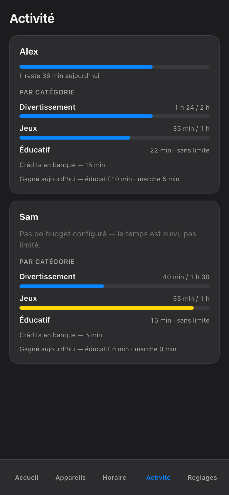

import { Aside, Steps } from '@astrojs/starlight/components';

Most parental-control products give each *device* a limit. The phone gets two hours, the console gets two hours, the PC gets two hours — and a determined child quietly banks six. A budget here works the other way around: **one daily budget per child, counted across all their devices together**. Phone, console, PC, TV — one pool. When it is spent, it is spent everywhere. No commercial product we know of does this, which is exactly why it is the centre of this app.

## One child, one number

Open **Budget** from a child's card and you get a single bar for the day. It does not care *where* the minutes went — forty on the console and twenty on the phone read the same as sixty on either one. The child can move between screens freely; the total is what the total is.

This closes the oldest loophole in the haus: "I finished my time on the tablet, so now I'm on the TV." With a per-child budget there is no *now* — it is all the same time.

## How the counting works

The budget is not an app on the child's screen keeping a diary, and it does not depend on the child's device telling the truth about itself. **The haus network meters real activity, by category, as it happens.** Traffic from the child's devices is observed at the network, sorted into categories of activity, and summed into their one daily pool.

Three consequences worth knowing:

- **It cannot be uninstalled.** There is nothing on the device to delete or disable — the counting happens on the network the device is using.
- **It counts what actually happened.** Not screen-on time, not "the app was open in the background" — observed network activity, grouped by category, so the daily report tells you what the time actually *was*, not just how long it lasted.
- **It follows the child.** A new device on the network gets attributed to its owner, and its minutes flow into the same pool as everything else they use.

<Aside type="note">
Quiet devices can look quiet honestly: a console sitting idle on the menu generates almost nothing, so it costs almost nothing. The meter is measuring activity, not possession.
</Aside>

## Shadow versus armed — the honest part

Every budget is in one of two modes, and the screen always tells you which:

<Steps>

1. **Shadow (ombre).** The budget is being *measured and shown, but not enforced*. The bar fills, the daily report is real, and when the pool runs out — nothing turns off. Shadow is the log-only rehearsal: you watch a normal week go by and learn what the honest numbers are before any rule bites.

2. **Armed (armé).** The same budget, now enforced. When the pool is spent, the network stops carrying that child's screen traffic, and the block is confirmed by the Firewalla — the box that runs the haus network — before the app shows it as done. This is the same [closed-loop verification](/architecture/screen-time/) that backs every stop in the haus: if a device did not actually comply, the card goes **red** and says so. It never shows a fake green.

</Steps>

We say this plainly because vague is worse: **if your budget is still in shadow, it is not limiting anything yet.** It is easy to set a budget, see the bar, and believe the job is done. Check the label. Shadow means *watching*; armed means *acting*. Arming is a deliberate step you take once the shadow numbers have convinced you the budget is fair — and fair budgets get argued about a great deal less.

<Aside type="tip">
Run a new budget in shadow for a week first. The number you *think* is right and the number the meter reports are rarely the same, and it is much easier to arm a budget the child has already seen measured honestly.
</Aside>

## When the budget runs out

An armed budget that hits zero behaves like every other stop in this app: visibly, and with an exit.

- **Every hold shows its owner and its expiry.** The child's screen — and yours — says what is limiting the device, who set it, and when it ends. Nothing here blocks forever, and nothing blocks anonymously.
- **You can still say yes.** The [**Plus de temps** (More time)](/parents-guide/more-time/) screen grants a quick override — capped at 120 minutes, hard stop — or a credit that genuinely adds minutes to today's pool. An override lifts the limit for a little while; a credit makes the budget bigger and lets the normal rules do the rest.
- **Tomorrow resets it.** The budget is daily. A spent Tuesday does not mortgage Wednesday.

And if you ever reach past the budget entirely — a manual [**Block Now**](/parents-guide/block-now/), say — the same haus rules apply: it expires at the next wake by default, and any pause you set names who set it and how long it lasts, with *jusqu'au réveil* (until wake-up) as the maximum.

The screenshots show the French phone view, as the haus runs it; in English the screen reads Budget, with everything in the same places. The budget does not negotiate, which — you may notice around 21:40 — is precisely what makes it the calmest member of the family.
