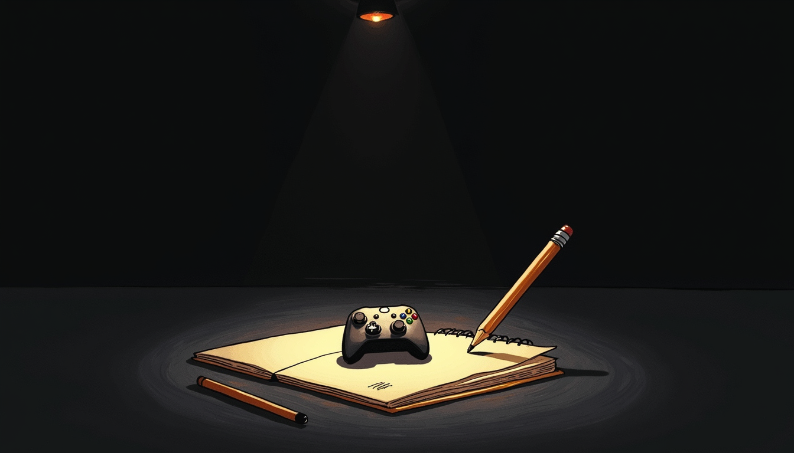
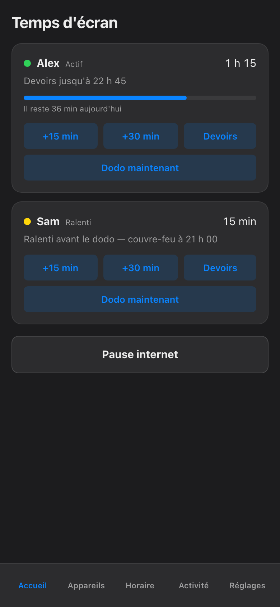

import { Aside, Steps } from '@astrojs/starlight/components';

The assignment and the distraction live on the same slab of glass. That is the whole problem.

It is 18:30. The math sheet is due tomorrow, and the tablet that holds the assignment also holds the game, the group chat, and three unfinished episodes. Taking the internet away entirely does not work — the homework is *on* the internet. Homework mode (Devoirs) is the middle path: it quiets the distracting parts of the network and leaves the useful parts alone. It is a scalpel, not a hammer. That distinction is the whole feature.

## Start it

<Steps>

1. Open the app to the Home screen (Accueil). Each child has a card with their name on it.

2. On the child's card, tap **Devoirs**. Like every pause in this app, it applies to one named child — starting homework mode for Alex changes nothing for Sam.

3. That is it. The card now reads *Devoirs jusqu'à* followed by an end time — by default, **120 minutes** from now. No timer to set. No checklist. The default is two hours because that is what a school evening usually is.

   

</Steps>

The block applies on every device the child uses — phone, PC, console, the shared TV — and each one is confirmed by the network box before the app claims it is in effect. If a device does not comply, its card turns red and says so plainly. The app never shows a green it has not verified. This is the same closed-loop honesty that runs under [every pause in the haus](/architecture/screen-time/): a claim nobody checked is not enforcement.

## What gets blocked — and what does not

Homework mode blocks by **category**, at the network, not by app-by-app whack-a-mole:

| Category | During homework mode |
|---|---|
| Gaming | Blocked — consoles, PC games, game launchers |
| Social | Blocked — feeds, DMs, the infinite scroll |
| Streaming | Blocked — shows, videos, background "just listening" |
| Everything else | Open — school portals, research, documents, email |

So the child can reach the class portal, look up the Battle of the Plains of Abraham, and submit the assignment. Meanwhile the console lobby is quiet and the feed will not load. The excuse "I need my phone for school" stays true, and stops being a loophole.

## Stop it — or let it stop itself

You have three honest exits:

- **Let it run out.** After the 120 minutes, homework mode ends on its own and the categories come back. Nothing in this app blocks forever. Homework mode is no exception.
- **End it early.** Homework finished in forty minutes? It happens. Tap **Devoirs** again on the same card and the hold lifts right away.
- **Let bedtime take over.** If the end time lands past the child's bedtime, the normal evening rules simply pick up where homework mode leaves off — finishing homework at 21:59 has never unlocked a console at 22:00. That handoff is [the bedtime rules](/parents-guide/bedtime-now/) and [the evening schedule](/parents-guide/schedules-and-holidays/), not a gap.

While it runs, the hold is spelled out on every affected device: what is limited, which parent started it, and exactly when it ends. The child can read it. So can the other parent. No mystery blocks, no "the internet is broken again" — the same plain-text honesty as the [big pause button](/parents-guide/block-now/), aimed at three categories instead of the whole slab.

<Aside type="tip">
Screenshots show the French phone view, because that is what the haus runs. In English the button reads Homework in the same spot on the card — same tap, same 120 minutes.
</Aside>

<Aside type="note">
Homework mode is a pause on distractions, not a judgment on how the two hours get used. If the notebook stays closed and the child stares at the ceiling instead, the app has no opinion — that negotiation, like most of the important ones, still happens at the kitchen table.
</Aside>

Two hours of quiet network, delivered in one tap. Whether the math sheet actually gets done remains, as ever, between the child and the pencil.
