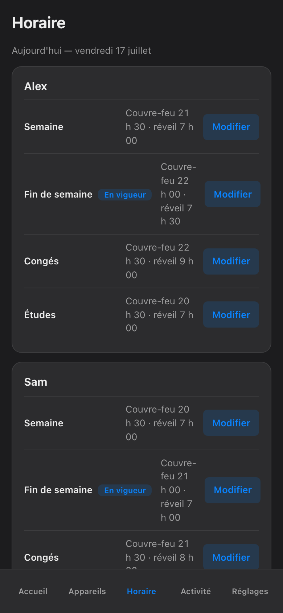

import { Aside, Steps } from '@astrojs/starlight/components';

The Sanctum schedule is enforced at the network: when the evening ends, the haus cuts the connection and Firewalla confirms it. But an iPhone is not only a haus-network device. It has cellular data, downloaded videos, offline games — things a network rule cannot reach once the Wi-Fi is gone.

That is what a **mirror** is for. You copy the same times into Apple's own Screen Time **Downtime**, on the device itself. The network enforces from outside; iOS enforces from inside; both agree on the hour. Nothing here replaces the Sanctum schedule — this is the second lock on the same door.

## What you are copying

Before touching the iPhone, open the Sanctum app and look at the schedule for the child. Note two things per layer: when the evening ends on a **school night**, and when it ends on a **weekend**. Those are the times you will type into iOS.

## Set up Downtime to match

These steps assume your family uses Family Sharing, so you do this from **your** iPhone, not the child's. They are current as of iOS 26; older versions differ mostly in wording.

<Steps>

1. On your iPhone, open **Réglages** (Settings) and tap **Famille** (Family). Choose the child — say, Alex.

2. Tap **Temps d'écran** (Screen Time). If it has never been set up for this child, follow the prompts to turn it on and choose a Screen Time passcode that only you know — not the phone's unlock code, and not a birthday.

3. Tap **Temps d'arrêt** (Downtime).

4. Turn on **Programmé** (Scheduled).

5. Tap **Personnaliser les jours** (Customize Days) rather than "every day". Enter the Sanctum times: school nights get the *Semaine* end time until the morning wake time; Saturday and Sunday get the *Fin de semaine* times.

6. Go back one screen and check **Toujours autorisées** (Always Allowed). Make sure **Téléphone** and **Messages** stay on the list, so Alex can always call or text you — Downtime should stop the scrolling, never the reaching-you.

7. Repeat for each Apple device the child uses — Sam's iPad follows the same steps under Sam's name.

</Steps>

That is the whole mirror. There is no pairing, no account linking, no app to install on the child's phone. You typed the same hours in two places; that is all a mirror is.

<Aside type="caution" title="iCloud Private Relay defeats network-level filtering">
On the child's device, check **Réglages → [child's name] → iCloud → Relais privé** (Private Relay). While it is on, browsing is routed through Apple's relays, so the haus network cannot see or filter it — Sanctum's network-level rules simply do not apply to that traffic. Turn it off on children's devices. The Downtime mirror you just set still holds either way, because it lives on the device, not the network.
</Aside>

## What the mirror does not change

The Sanctum side keeps working exactly as before. Manual blocks still expire at next wake by default; nothing blocks forever; every hold still shows its owner and expiry; blocks are still Firewalla-confirmed — red on failure, never a fake green. The iOS mirror is a second, independent enforcement for the hours when the network cannot reach the phone. If the two ever disagree, the stricter one wins in practice, because each enforces on its own.

## Sanctum surveille ce miroir

A hand-made copy drifts. You will move bedtime for exam week, add a holiday layer for the relâche, and the iPhone's Downtime will quietly still say the old hours. You do not have to remember this — Sanctum does. The app knows what the haus schedule says, and when that schedule changes, it flags this mirror as **stale** in the app — a plain marker telling you the iOS copy no longer matches. Update Downtime with the new times, and the flag clears. The mirror stays a mirror instead of slowly becoming a souvenir.

---

*Two clocks that agree are just two clocks — Sanctum's job is to tell you the night one of them starts lying.*
