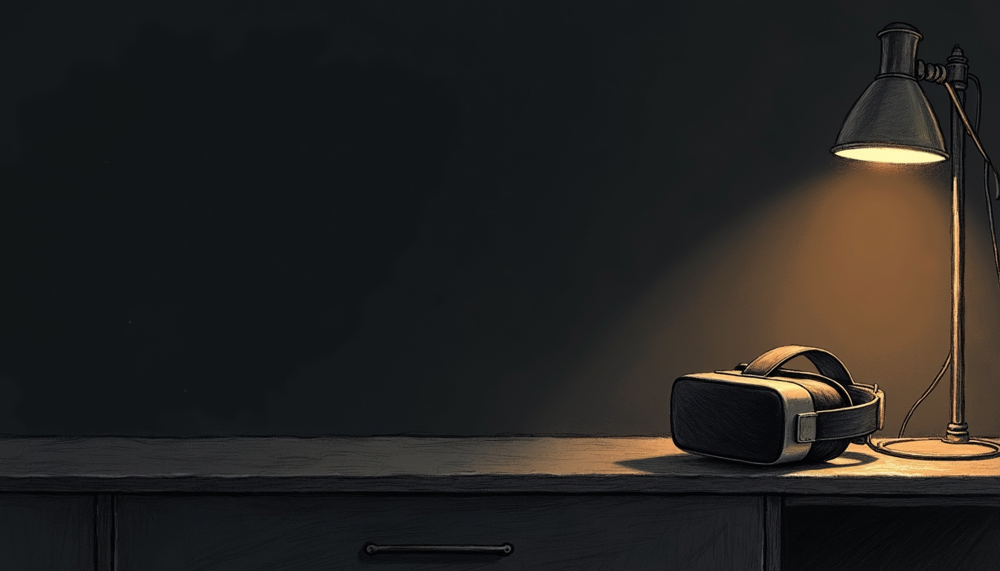

import { Aside, Steps } from '@astrojs/starlight/components';

Cut the Wi-Fi at bedtime and a Quest does not go dark. It goes quiet. [The Sanctum schedule](/parents-guide/schedules-and-holidays/) is enforced at the network: when the evening ends, the haus cuts the connection and Firewalla confirms it. A headset with no internet loses multiplayer and social apps. That much works. But the downloaded games are already on the device, and a child can play them in airplane-mode silence long after the router stopped mattering.

That gap is what a **mirror** closes. You copy the same times into Meta's own **Family Center**, and the headset itself refuses to run past bedtime. The network enforces from outside. The headset enforces from inside. Both agree on the hour, so neither has to be perfect. Nothing here replaces the Sanctum schedule — this is the second lock on the same door.

## What you are copying

Start with the truth, not the headset. Open the Sanctum app and look at the schedule for the child. Note two things per layer: when the evening ends on a **school night**, and when it ends on a **weekend**. Those two times are the whole payload. You will type them into Meta's app in a minute.

## Set up the Family Center bedtime

This happens on your phone, not the child's. Open the **Meta Horizon** app, signed in with your own Meta account. The wording below matches the current app. Meta renames things often, but the path stays recognizable.

<Steps>

1. In the Meta Horizon app, open the menu and tap **Centre familial** (Family Center).

2. If the child is not listed yet, add them. Alex's account must be linked to yours as a supervised account — the app walks you through sending the invitation, and Alex accepts it in the headset. Do this once, when you have a quiet moment: the linking needs both your phone and the headset in hand.

3. Tap Alex's profile, then **Temps d'écran** (Screen time).

4. Set the **schedule** so headset use ends at the Sanctum times you noted: the *Semaine* end time on school nights, the *Fin de semaine* time on Saturday and Sunday. If the app offers a daily time limit as well, check the Sanctum app first. [Budgets](/parents-guide/budgets/) meter daytime use at the network, but they only enforce once you have **armed** them. While your budgets are still in shadow (observe-only) mode, Meta's daily limit is the only daytime cap the headset has — set it. Once the budget is armed, you can leave Meta's limit off.

5. While you are in Family Center, confirm that **app purchases and installs require your approval**. You will see why in the next section.

6. Repeat for each headset in the haus — Sam's Quest follows the same steps under Sam's name.

</Steps>

That is the whole bedtime mirror. Same hours, two places. That is all a mirror is.

## Close the PC Link side-doors

A Quest has a second way to play. It can stream games from a PC. **Quest Link** (a cable), **Air Link** (over Wi-Fi), and apps like Steam Link or Virtual Desktop all turn the headset into a screen for a computer in the next room. Clever. Also inconvenient, for us.

Here is the catch. That stream is **local traffic**, headset to PC, inside the haus. A bedtime that cuts the Quest's internet does not cut a stream that never leaves the living room. This is the one honest gap in network enforcement. So you close it on the devices instead:

<Steps>

1. In the headset, open **Paramètres → Système → Quest Link** and turn off **Air Link**. The cable version still exists, but it needs a physical PC and a physical cable in the same room, so it is easy to notice when it is in use.

2. In Family Center, keep **install approvals** on, as set above. Steam Link and Virtual Desktop are ordinary store apps — with approvals on, they cannot appear on the headset without you tapping yes.

3. In the Sanctum app, make sure the **gaming PC is assigned to the same child**. Budgets and schedules are per-child across all their devices, so the PC follows the same bedtime — and a PC that is off the network at 21:30 has nothing to stream.

</Steps>

<Aside type="caution" title="The Family Center schedule still holds">
Even if a side-door were open, the Family Center bedtime you set above lives on the headset itself and does not care where the pixels come from. The steps here are about not relying on a single lock — the same reason the mirror exists at all.
</Aside>

## What the mirror does not change

The Sanctum side keeps working exactly as before. [Manual blocks](/parents-guide/block-now/) still expire at next wake by default; nothing blocks forever; every hold still shows its owner and expiry; a pause still asks who and for how long, up to *jusqu'au réveil*; and blocks are still Firewalla-confirmed — red on failure, never a fake green. The Meta mirror is a second, independent enforcement for the hours when the network cannot reach the headset. It does not phone home to Sanctum. It does not need to. If the two ever disagree, the stricter one wins in practice, because each enforces on its own.

## Sanctum surveille ce miroir

A hand-made copy drifts. That is what hand-made copies do. You will move bedtime for exam week, add a holiday layer for the relâche, and the Quest's Family Center schedule will quietly still say the old hours. You do not have to remember this. Sanctum does. The app knows what the haus schedule says, and when that schedule changes, it flags this mirror as **stale** — a plain marker telling you the Meta copy no longer matches. Update Family Center with the new times, and the flag clears. The mirror stays a mirror instead of slowly becoming a souvenir.
