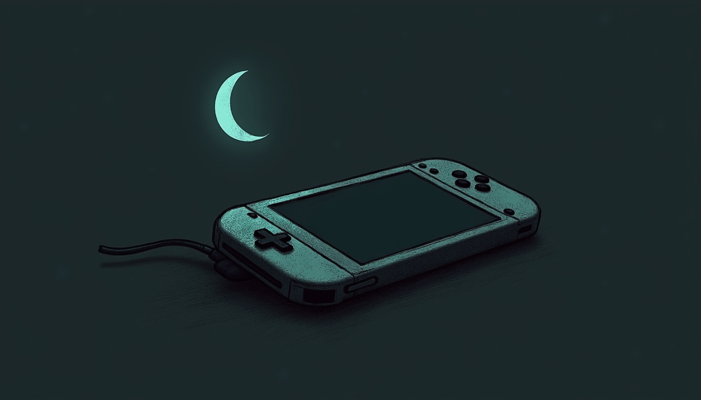

import { Aside, Steps } from '@astrojs/starlight/components';

Cut the Wi-Fi at bedtime and a Switch simply shrugs. A downloaded game in handheld mode needs no network at all, and it will run happily under the covers at 23:40 long after the haus has gone dark.

Everywhere else, the [Sanctum schedule](/parents-guide/schedules-and-holidays/) is enforced at the network: when the evening ends, the haus cuts the connection and Firewalla confirms it — red on failure, never a fake green. The Switch does not care. It never asked the router for permission.

That is what a **mirror** is for. You copy the same hours into Nintendo's own **Contrôle parental Nintendo Switch** app, so the console stops itself when the evening ends. The network enforces from outside; the console enforces from inside; both agree on the hour. Nothing here replaces the schedule. This is the second lock on the same door.

## What you are copying

Start on our side, not Nintendo's. Open the Sanctum app and look at the schedule for the child. Note two things: when the evening ends on a **school night**, and when it ends on a **weekend**. Those are the two times you will type into Nintendo's app. That is the whole payload.

## Link the console once

You do this from your own phone, with your own Nintendo account — not the child's. Do it once, in a quiet moment when you have both the phone and the console in hand.

<Steps>

1. Install the **Contrôle parental Nintendo Switch** app (Nintendo Switch Parental Controls) on your phone and sign in with your Nintendo account.

2. On the console, open **Paramètres de la console → Contrôle parental** and choose to link with a smartphone. The console asks for the registration code the app shows you. Type it in; the two are now paired.

3. Note that Nintendo's limits are **per console, not per child**. If Alex and Sam share one Switch, they share one limit. Sanctum keeps their budgets separate at the network; the console mirror is one clock for whoever is holding it.

</Steps>

## Set the times — and turn Suspend Software on

Nintendo renames menu items now and then, but the path stays recognizable.

<Steps>

1. In the app, open **Réglages de la console → Temps de jeu** (Play Time Limit).

2. Set the **daily limit** and the **bedtime hour** for each day of the week: the *Semaine* end time on school nights, the *Fin de semaine* time on Saturday and Sunday. If you use [Sanctum budgets](/parents-guide/budgets/) for daytime, remember they meter at the network, per child, by category — and they stay in shadow (observe-only) mode until you arm them. While a budget is still in shadow, Nintendo's daily limit is the only daytime cap this console has.

3. Turn **Suspendre le logiciel** (Suspend Software) **ON**. This switch is the whole mirror. With it off, reaching the limit only puts a small notification in the corner of the screen, and play continues past it. With it on, the console freezes the game on the spot when time is up.

4. Keep the **PIN** yours. The suspended screen offers "enter the PIN to keep playing" — Nintendo's built-in override, and it has no cap. [Sanctum's *More Time* flow](/parents-guide/more-time/) is capped at 120 minutes and logged; a whispered PIN is capped at nothing and logged nowhere. When more time is genuinely deserved, grant it in the Sanctum app and type the PIN yourself.

</Steps>

<Aside type="caution" title="Suspend, not delete">
Suspendre le logiciel halts the game where it stands; nothing is erased. Entering the PIN resumes exactly where it stopped, so turning it on puts no saved progress at risk.
</Aside>

## What the mirror does not change

Our side keeps working exactly as before. Manual blocks still expire at next wake by default; nothing blocks forever; a pause still asks who and for how long, up to *jusqu'au réveil*; every hold still shows its owner and expiry; and blocks are still Firewalla-confirmed. The Nintendo mirror is a second, independent enforcement for the hours when the network cannot reach a handheld running offline. The two never negotiate. If they ever disagree, the stricter one wins in practice, because each enforces on its own.

## Sanctum surveille ce miroir

A hand-made copy drifts. You will push bedtime later for the holidays, add a layer for the relâche, and the Switch will quietly keep the old hours. That is not a failure of discipline. It is just what copies do. You do not have to remember it — we do. When the haus schedule changes, the app flags this mirror as **stale**: a plain marker telling you the Nintendo copy no longer matches. Update the times in the Contrôle parental app, and the flag clears. The mirror stays a mirror instead of slowly becoming a souvenir.
