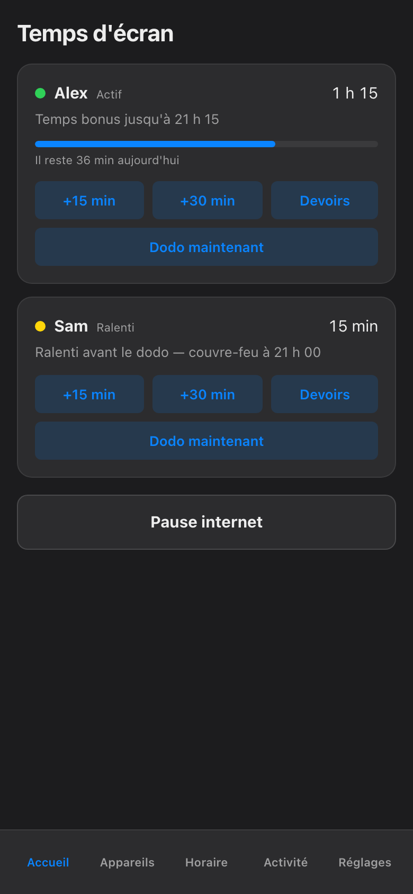

import { Aside, Steps } from '@astrojs/starlight/components';

Sometimes the answer is yes. The movie has twenty minutes left, homework got finished without a single reminder, the cousins are over and the tournament is tied. The **Plus de temps** (More time) screen gives you two different ways to say yes, and it matters which one you pick.

## Override or credit — which one?

|                | Override (+15 / +30)                          | Credit                                         |
| -------------- | --------------------------------------------- | ---------------------------------------------- |
| What it does   | Lifts the limit *right now*, temporarily      | Adds minutes to the child's budget for the day |
| Best for       | "The movie ends in twenty minutes"            | Earned time — a chore done, a promise kept     |
| How it ends    | Expires on its own when the minutes run out   | Spent like any other budget minutes            |
| The ceiling    | 120 minutes, hard cap                         | Whatever preset you choose                     |

An **override** is the impulse tool: it says *ignore the limit for a little while* and then puts everything back the way it was. A **credit** is the planned tool: it makes today's budget genuinely bigger, and the normal budget rules do the rest.

## Grant an override

<Steps>

1. From the Home screen (Accueil), open the child's card and tap **Plus de temps**.

2. Tap **+15** or **+30**. Tap again to stack them — the screen shows the running total, so +30 and then +15 reads as 45 minutes.

   

3. Confirm. The extra time starts immediately on every screen that child uses, and it counts itself down — when it hits zero, the regular limits are simply back in charge. Nothing for you to remember to undo.

</Steps>

**The 120-minute cap.** Overrides top out at two hours, full stop. Once the running total reaches 120 minutes the buttons stop adding, and no amount of determined tapping gets past it. This is deliberate: an override is a *little while*, not a new policy. If you find yourself wanting more than two hours, that is what a credit — or an edited schedule — is for.

## Grant a credit

Below the override buttons sit the credit presets — fixed amounts you can drop into the day's budget in one tap. Pick one, confirm, and the child's budget for today grows by that much.

Two things make credits behave well:

- **Credits follow the child, not the device.** Budgets are counted per child, across every device they use, so minutes granted from the couch are just as spendable on the PC, the console, or the TV. There is no "but I earned it on the Switch" loophole in either direction.
- **Credits play by budget rules.** The budget meters real network activity by category, so a credit extends the same honest count the budget already keeps — it does not open a side door around it.

<Aside type="note">
If a budget is still in shadow mode — logging what it *would* enforce, but not yet armed — a credit changes the numbers in the log and nothing else. You will see the effect in the daily report, but no screen turns on or off because of it. Arm the budget first if you want credits to actually bite.
</Aside>

## What the child sees

Extra time is visible, not mysterious. The child's card shows the granted minutes counting down, and — same rule as every hold in this app — anything currently limiting a screen shows who set it and exactly when it ends. A child who asks "how long do I have?" can be told to read the screen, which is a small but genuine quality-of-life feature at 21:45.

<Aside type="tip">
If a screen stays blocked for a few seconds right after you grant time, that is the app waiting for the network box to confirm the change before showing it. It would rather be briefly slow than optimistically wrong — a card never turns green on hope alone, and it turns red and tells you if a device did not comply.
</Aside>

The screenshots here show the French phone view, as the haus runs it; in English the same screen reads More time, with the identical buttons in the identical places.

The app can grant the minutes. Making "last episode" actually mean *last* is still resolved at couch level.
