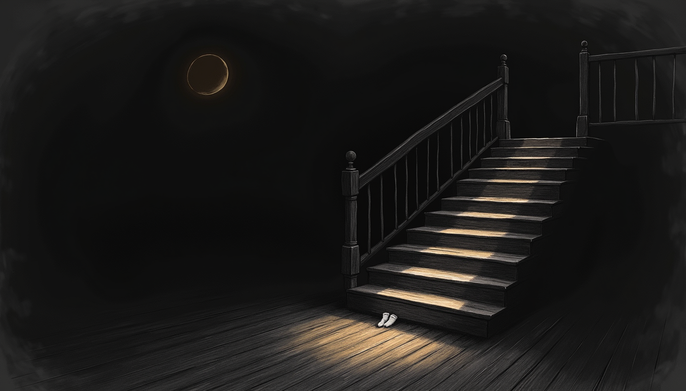
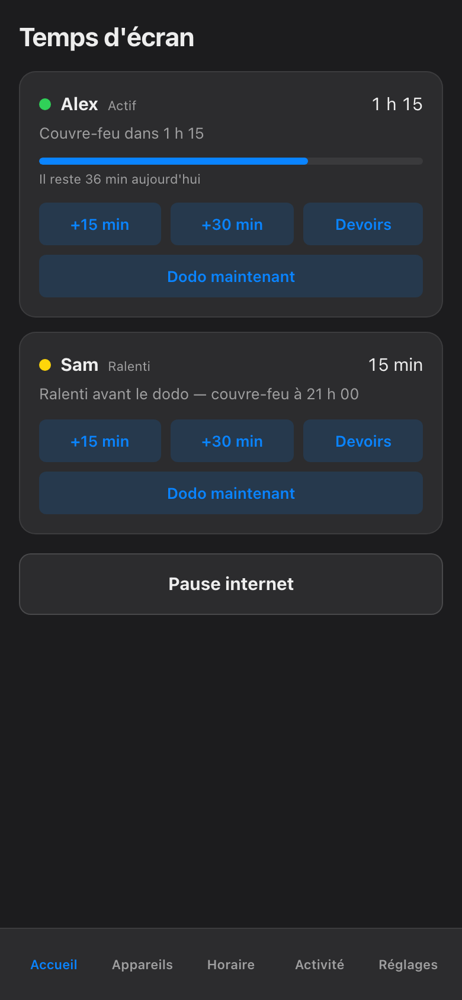
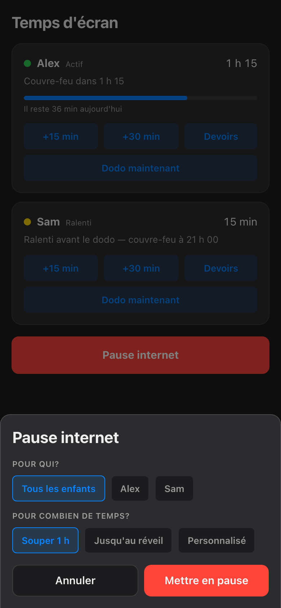

import { Aside, Steps } from '@astrojs/starlight/components';

*Aussi disponible en anglais : [Bedtime Now](/parents-guide/bedtime-now/).*

Il est 22 h 05. L'argument du couvre-feu est perdu — ou techniquement gagné, juste pas respecté. **Dodo maintenant**, c'est le bouton pour ce moment-là exact : y finit la soirée drette-là au lieu d'attendre que l'horaire se décide.

## Un enfant : Dodo maintenant

Chaque carte d'enfant su'l'écran Accueil a son propre bouton **Dodo maintenant**, juste en dessous de la rangée +15 / +30 / Devoirs.

Tape dessus pis la nuit de c't'enfant-là commence astheure. C'est une pause comme les autres — chaque pause a besoin d'un *qui* pis d'un *combien de temps* — mais ce bouton-là répond aux deux questions pour toé : le qui, c'est l'enfant de la carte, pis le combien de temps, c'est **jusqu'au réveil**, son prochain réveil, le plus long qu'un block peut être. Chaque écran que c't'enfant-là utilise — téléphone, PC, console, la TV commune — tombe en même temps. La soirée de l'autre enfant est pas touchée, pis les appareils des parents sont jamais dans la liste, pantoute.

## Toute la cabane d'un coup

Quand c'est le dodo de tout le monde, oublie les boutons par carte pis prends le gros bouton **Pause internet** en bas du même écran.

<Steps>

1. Tape **Pause internet**.

2. En dessous de **Pour qui?**, choisis **Tous les enfants**.

3. En dessous de **Pour combien de temps?**, choisis **Jusqu'au réveil**. Une durée, c'est toujours obligatoire — *Souper 1 h* pis *Personnalisé* sont les autres options, pis y'a exprès pas de « pour toujours ».

4. Tape **Mettre en pause**.

</Steps>

Chaque enfant est relâché à son propre réveil, faque le p'tit qui se lève de bonne heure est pas pris en otage par celui qui fait la grasse matinée.

## Qu'est-ce que les écrans des enfants font pour vrai

Bon à savoir avant que la première protestation se rende à ta porte de chambre. Le block est appliqué au réseau, pas en fouillant dans l'appareil, faque :

- **L'écran vire pas noir.** Rien se ferme, rien s'efface, pas de sauvegarde de jeu perdue. L'appareil est correct ; c'est juste l'internet qui a arrêté de y répondre.
- **Les affaires en ligne arrêtent.** Les streams gèlent, les parties en ligne retombent dans leurs menus, les pages chargent pus. Toute ce qui a besoin du réseau, c'est fini pour à soir.
- **L'app peut te dire pourquoi.** Ouvre la carte de l'appareil pendant qu'un block est actif pis le hold est écrit au complet : qu'est-ce qui est bloqué, qui l'a bloqué, pis exactement quand ça finit. Chaque hold montre son propriétaire pis son expiration — pas de panne mystère, pis pas de débat « le Wi-Fi est brisé ».
- **Confirmé, pas supposé.** Une carte dit *bloqué* juste quand la boîte réseau a confirmé le block su'c't'appareil-là. Si un appareil suit pas, sa carte vire rouge pis le dit en mots clairs — jamais de faux vert.

<Aside type="note">
Si une carte reste non confirmée deux-trois secondes après ta tape, l'app attend juste la boîte réseau avant de crier victoire. Une carte qui reste rouge nomme l'appareil qui a pas suivi — la page Troubleshooting du guide couvre la suite.
</Aside>

## Pis le matin

Rien à te rappeler, rien à défaire. Un block manuel expire tu-seul au prochain réveil de l'enfant par défaut — **rien bloque pour toujours.** Le matin débloque les écrans de la même manière qu'y débloque l'enfant.

Si queque chose peut vraiment pas attendre — un fichier de devoirs resté dans le cloud, un appel obligé — un override peut percer un trou temporaire dans la pause. Ça vit su'a page More Time pis c'est cappé à 120 minutes, faque l'exception d'à soir peut pas devenir tranquillement la règle de demain.

Le bouton s'occupe des écrans. Le verre d'eau, le deuxième verre d'eau, pis l'intérêt soudain pour la philosophie à l'heure du dodo restent hors scope.
