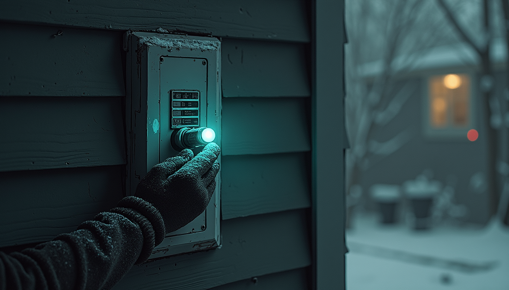
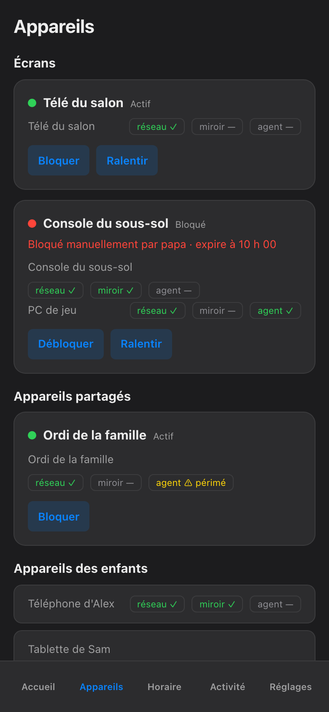

import { Aside, Steps } from '@astrojs/starlight/components';

*Aussi disponible en anglais : [Block Now](/parents-guide/block-now/).*

Le souper est su'a table. Ou ben les négociations de dodo viennent de s'effondrer. Peu importe : chaque écran doit arrêter **là, tout de suite**. C'est pour ça que le gros bouton en bas de l'écran Accueil existe. Une tape, deux choix, fini — pis le block fait son propre ménage après.

## Mets les écrans su'pause

<Steps>

1. Ouvre l'app pis tape **Pause** — le gros bouton en bas de l'écran Accueil. Tu peux pas le manquer ; c'est faite exprès.

2. Choisis **qui**. Les deux enfants, ou juste Alex, ou juste Sam. Bloquer un enfant touche jamais aux écrans de l'autre, pis ça peut jamais toucher à l'appareil d'un parent — y sont juste pas dans la liste, pantoute.

   

3. Choisis **combien de temps**. Une durée, c'est toujours obligatoire : 30 minutes, une heure, ou *jusqu'au réveil* — le prochain réveil de l'enfant, pis c'est l'option la plus longue qui existe. Y'a exprès pas de « pour toujours ».

4. Confirme. L'app bloque chaque écran que c't'enfant-là utilise — téléphone, PC, console, la TV commune — pis demande à la boîte réseau de vérifier chacun. Une carte dit *bloqué* juste quand la boîte l'a confirmé, pas avant.

</Steps>

C'est toute la job. Quand le temps est fini, le block se lève tu-seul pis l'app prend ça en note. T'as rien à te rappeler.

## « Retenu jusqu'à » — ça veut dire quoi

Ouvre n'importe quel appareil pendant qu'un block est actif pis tu vas voir le hold écrit noir sur blanc : qu'est-ce qui est bloqué, qui l'a bloqué, depuis quand, pis exactement quand ça finit.

La règle, en une phrase : **un block manuel expire tu-seul au prochain réveil de l'enfant par défaut — rien bloque pour toujours.** T'as pris 30 minutes ? Ça finit dans 30 minutes. T'as pris *jusqu'au réveil* ? Le matin le débloque. Dans les deux cas, y'a pas de switch invisible restée flippée, pis pas de console encore morte trois jours plus tard parce que quelqu'un a oublié.

C'est le genre de veille qui se fait tu-seule. Demande à Tommy. Le chat-fantôme qui garde la cabane faisait sa ronde à l'aube pis au crépuscule sans que personne y demande, pis le matin arrivait pareil, chaque fois. Le block marche de même : le réveil de l'enfant, c'est le même matin qui lève la pause.

T'as changé d'idée avant la fin ? Tape **Reprendre** su'a même carte pis la pause se lève drette-là. Pour mettre juste le dodo su'pause, c'est [Dodo drette-là](/parents-guide/qc/bedtime-now/) — même idée, autre bouton.

<Aside type="tip">
Les captures d'écran du guide montrent la vue téléphone en français, parce que c'est ça que la cabane roule. Si t'as switché en anglais dans les Réglages, les boutons disent Pause, Until wake pis Resume — mêmes places, mêmes tapes.
</Aside>

<Aside type="note">
Si un écran a l'air encore vivant juste après ta tape su'Pause, donne-y deux-trois secondes — l'app attend que la boîte réseau confirme avant de crier victoire. Une carte qui reste rouge, elle, te dit en mots clairs quel appareil a pas suivi — la page [Troubleshooting](/parents-guide/troubleshooting/) du guide couvre la suite.
</Aside>

Le bouton met les écrans su'pause. Expliquer *pourquoi* au monde qui les tient, ça reste, malheureusement, une feature de niveau parent.
