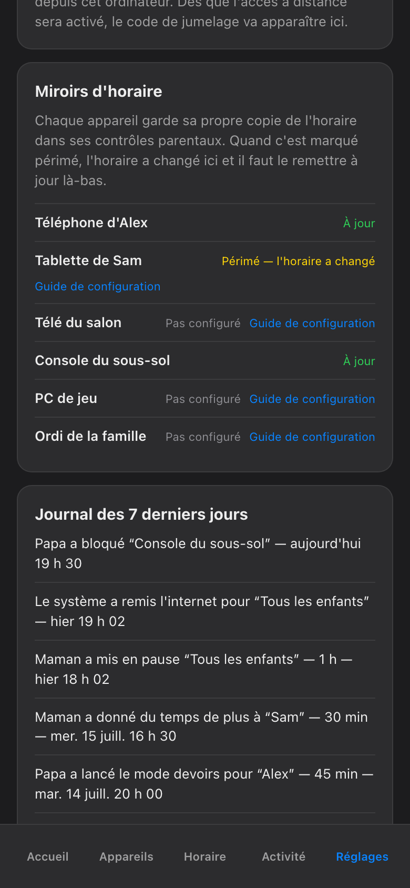

import { Aside, Steps } from '@astrojs/starlight/components';

It is 22:05. Someone is calling from upstairs that *ça bloque encore*, and you would like to know why — without becoming a network engineer tonight. Good news first: this system is built so that when it fails, it fails cheap. The worst case, in every failure mode it has, is that the kids get some extra screen time. Nothing ever fails in the direction of more blocking, and nothing can cost anyone sleep. Keep that in mind while you read; it lowers the stakes of every red card considerably.

## Start with the held-until badge

Almost every "why is this still blocked?" has a one-line answer already written on the screen. Every hold in the haus shows its owner and its expiry — who set it, and exactly when it ends.

<Steps>

1. Open the device that is blocked — tap its card on the Home screen (Accueil).

2. Read **who**. *Bloqué par* a parent, by the bedtime schedule, or by homework mode. If it says a parent and you did not do it, ask the other parent before suspecting the software.

3. Read **until when**. Every hold has an end. A manual block expires at the child's next wake time by default — nothing blocks forever, so a badge with no expiry does not exist.

</Steps>

If the badge explains it, you are done — the block will release itself on schedule. If the screen is blocked and there is *no* badge, or the badge disagrees with reality, keep going.

## Check the coverage view

The coverage view, in Settings (Réglages), lists every screen the haus knows about and whether it can currently enforce on it. It is the honest map: a device that is not in coverage cannot be blocked, no matter what any other screen suggests, and a device shown with a gap is one the network box cannot see right now.

Two classics live here:

- **The device that will not block** is often just off the haus network — on cellular data, or on a neighbour's Wi-Fi. Coverage will show it as unreachable rather than pretending.
- **The device that seems blocked for no reason** may simply be offline. A tablet with a dead battery looks a lot like a blocked tablet from the sofa.

## Red means red — never fake green

Every block is confirmed by the network box before the app claims it. A card only turns *bloqué* once that confirmation has come back; if it does not, the card goes **red** and names the device. The app never shows a fake green.

So a red card is not the system lying — it is the system refusing to lie. When you see one:

<Steps>

1. Give it a few seconds. Confirmation is a round trip, and slow is not the same as failed.

2. Check coverage for that device. Off-network is the usual suspect.

3. Check the box itself — is it powered, are its lights normal? If the box is down, everything below it turns red at once, which is your answer.

</Steps>

## What a drift alarm means

A drift alarm means the engine compared what it asked for with what the box is actually enforcing, and found a difference — a rule that should exist and does not, or one left behind past its expiry. It always tries to repair the difference itself first; you only see the alarm when it could not.

Translate it as: *"I noticed, I tried, I need a hand."* It does not mean the kids saw something they should not have — it means the safety net caught a mismatch before you had to. Most drift alarms clear the moment the box is back on its feet.

## The wake-verify promise

Every morning, at each child's wake time, the system verifies its own bookkeeping: manual blocks expire at next wake by default, and wake-verify confirms that they actually did. If any hold somehow survived the night — a crashed app, a box that rebooted at 03:00 — the morning pass releases it and writes a note in the audit trail saying so.

This is the promise that bounds every problem on this page. Whatever went wrong at 22:05, no forgotten pause outlives the morning. You never need to stay up to un-stick anything.

## The box, or the engine?

There are two moving parts: the **box** (the network layer that enforces) and the **engine** (the part that decides). When something is off, check the cheap layer first — which is usually neither: it is the app on your phone showing stale state. Pull to refresh before suspecting anything.

Then:

| Suspect the **box** when… | Suspect the **engine** when… |
| --- | --- |
| Cards go red at confirmation | Badges are missing or clearly stale |
| A drift alarm mentions rules on the box | A schedule did not fire at its usual time |
| A "blocked" device still has internet | The audit trail stops updating |
| Coverage shows sudden gaps on devices that were fine yesterday | Coverage looks normal but nothing new gets applied |

Box problems announce themselves loudly — everything reddens together, and a power cycle of the box usually ends the discussion. Engine problems are quieter and show up as staleness; the audit trail is your best witness, because it records every hold, release, and verification with a timestamp.

## Things that look like bugs but are not

- **"The budget never blocked anything."** [Budgets](/parents-guide/budgets/) are per-child across all devices, metered at the network by category — and they run in shadow (log-only) mode until you arm them. A budget you have not armed will observe forever and block nothing. That is the design, not a fault.
- **"More time ended too soon."** [Overrides](/parents-guide/more-time/) cap at 120 minutes. The timer did not cheat; it hit the ceiling.
- **"It is blocked and I never chose an end."** You did — a [pause](/parents-guide/block-now/) always requires a who and a duration, and the longest duration is *jusqu'au réveil*. The end you chose is on the badge.

<Aside type="note">
If none of this resolves it, note what the badge, coverage, and audit trail each say — those three answers are exactly what makes the fix quick, whoever ends up doing it. And remember the floor under all of it: worst case, the screens unblock early. The kids lose nothing. You lose nothing but a little patience.
</Aside>

Worst case, the kids win twenty extra minutes off a glitch — and they will quietly consider that the system working exactly as intended.
