import { Aside, Tabs, TabItem } from '@astrojs/starlight/components';



This page documents the command-line tools used to manage, monitor, and maintain a Sanctum instance. Every command here has been typed in anger at least once during a production incident. They work.

---

## Gateway Management

The OpenClaw gateway is the core agent runtime — the brain stem of the whole operation. Always use the `openclaw` CLI to manage it. Never use raw `launchctl` commands for the gateway.

<Aside type="danger">
Seriously. Raw `launchctl` skips state cleanup and port lock management. Use `openclaw gateway start/stop`. This is not a suggestion. This is the voice of experience, and experience has scars.
</Aside>

### Start the Gateway

```bash
openclaw gateway start
```

Loads the gateway LaunchAgent and starts the agent runtime on the configured port (default `1977`).

### Stop the Gateway

```bash
openclaw gateway stop
```

Gracefully shuts down the gateway, cleans up state files and port locks, then unloads the LaunchAgent.

<Aside type="caution">
On the VM, use systemd instead:

```bash
systemctl --user restart openclaw-gateway.service
```
</Aside>

### Restart Pattern

```bash
# Mac
openclaw gateway stop
openclaw gateway start

# VM
systemctl --user restart openclaw-gateway.service
```

A convenience script is also available:

```bash
~/.sanctum/scripts/gateway-restart.sh
```

---

## Agent Commands

### Send a Message to an Agent

```bash
openclaw agent --agent <agent_name> --message "<message>"
```

| Flag | Description |
|------|-------------|
| `--agent` | Agent identifier: `main` (Yoda), `windu`, `quigon`, `cilghal`, `mundi`, or `jocasta` |
| `--message` | The message to deliver to the agent |

```bash
# Send a message to the main agent (Yoda)
openclaw agent --agent main --message "Run the evening briefing"

# Send a message to the security agent
openclaw agent --agent windu --message "Generate the weekly security report"
```

Yes, you're sending text messages to named AI agents running on a Mac Mini. This is your life now.

### Cross-Node Agent Messaging

For sending messages between Mac and VM agents, use the council bridge SSH pattern:

<Tabs>
<TabItem label="Mac to VM">
```bash
ssh ubuntu@10.10.10.10 \
  '/home/ubuntu/.npm-global/bin/openclaw agent --agent main --message "Hello from Jocasta"'
```
</TabItem>
<TabItem label="VM to Mac">
```bash
ssh neo@10.10.10.1 \
  'PATH=/Users/neo/.local/share/fnm/node-versions/v22.22.0/installation/bin:/opt/homebrew/bin:$PATH \
   openclaw agent --agent main --message "Hello from Yoda"'
```
</TabItem>
</Tabs>

<Aside type="note">
The VM-to-Mac path requires a PATH prefix because `fnm`-managed Node.js is not in the default SSH `PATH`. This is the kind of thing that takes two hours to debug and two seconds to fix. The PATH prefix is the two-second fix.
</Aside>

---

## launchctl Patterns

macOS uses `launchctl` to manage LaunchAgents and LaunchDaemons. Sanctum uses the modern `bootstrap`/`bootout` subcommands, because Apple deprecated the old `load`/`unload` commands and then kept them working anyway, which is the most Apple thing imaginable.

### Load a LaunchAgent

```bash
launchctl bootstrap gui/$(id -u) ~/Library/LaunchAgents/<label>.plist
```

```bash
# Example: load the watchdog
launchctl bootstrap gui/$(id -u) ~/Library/LaunchAgents/com.sanctum.watchdog.plist
```

### Unload a LaunchAgent

```bash
launchctl bootout gui/$(id -u) ~/Library/LaunchAgents/<label>.plist
```

```bash
# Example: unload the watchdog
launchctl bootout gui/$(id -u) ~/Library/LaunchAgents/com.sanctum.watchdog.plist
```

### Check Agent Status

```bash
launchctl print gui/$(id -u)/<label>
```

```bash
# Example: check if the council MLX server is running
launchctl print gui/$(id -u)/com.sanctum.idle-mlx
```

### Load a LaunchDaemon

LaunchDaemons require `sudo` and use the `system` domain:

```bash
sudo launchctl bootstrap system /Library/LaunchDaemons/<label>.plist
sudo launchctl bootout system /Library/LaunchDaemons/<label>.plist
```

---

## generate-plists.sh

Renders LaunchAgent plist files from templates using values from `instance.yaml` and the macOS Keychain. The bridge between your clean YAML config and the XML format that Apple chose specifically to test human patience.

```bash
~/.sanctum/generate-plists.sh [--dry-run]
```

| Flag | Description |
|------|-------------|
| `--dry-run` | Show what would be generated without writing any files |

### What It Does

1. Reads templates from `~/.sanctum/templates/launchagents/`
2. Checks each template's corresponding service `enabled` flag in `instance.yaml`
3. Skips disabled services
4. Expands `{{PLACEHOLDER}}` tokens with config values
5. Retrieves secrets from the macOS Keychain using the configured `keychain_account`
6. Writes rendered plists to `~/Library/LaunchAgents/` (or `/Library/LaunchDaemons/`)

```bash
# Preview changes
~/.sanctum/generate-plists.sh --dry-run

# Generate and install
~/.sanctum/generate-plists.sh
```

<Aside type="tip">
Always `--dry-run` first. Trust, but verify. Especially when the output is XML that macOS will silently reject if you look at it wrong.
</Aside>

---

## run-all.sh (Test Suite)

Runs the full Sanctum test suite to verify all services, connections, and configurations.

```bash
~/.sanctum/run-all.sh
```

The test suite checks:

- All enabled LaunchAgents are loaded and running
- Gateway is responsive on the configured port
- VM is reachable via SSH
- Bridge interface has the correct IP
- All enabled services respond on their configured ports
- Firewalla bridge can authenticate
- Home Assistant is accessible
- Cloudflare tunnel is connected
- Tailscale is connected and peers are reachable
- Node connectivity (LAN and Tailscale)

Output uses color-coded pass/fail indicators. A summary count is printed at the end.

```
[PASS] Gateway responding on port 1977
[PASS] VM reachable at 10.10.10.10
[PASS] Home Assistant at port 8123
[FAIL] Kiwix server not responding on port 8888
---
Results: 15/16 passed
```

That one Kiwix failure? The external drive isn't plugged in. It's always the external drive.

---

## watchdog.sh

The watchdog runs every 600 seconds via the `com.sanctum.watchdog` LaunchAgent. It monitors all enabled services and attempts auto-healing via `service-doctor`. It's the night shift security guard of your infrastructure — mostly bored, occasionally essential.

```bash
~/.sanctum/watchdog.sh
```

### Behavior

1. Iterates through all services with `enabled: true` in `instance.yaml`
2. Checks each service's health (port check, process check, or custom probe)
3. If a service is unhealthy, invokes `service-doctor` to attempt recovery
4. Logs all results to `~/.sanctum/logs/watchdog.log`
5. Sends a notification via `sanctum_notify` if any service required healing

### Manual Run

Run the watchdog manually to check current health:

```bash
~/.sanctum/watchdog.sh
```

---

## sanctum-backup.sh

Creates a backup of the Sanctum configuration and critical state files.

```bash
~/.sanctum/sanctum-backup.sh [--destination <path>]
```

| Flag | Description |
|------|-------------|
| `--destination` | Override the default backup directory (from `paths.backups` in config) |

### What Gets Backed Up

| Item | Description |
|------|-------------|
| `instance.yaml` | Central configuration |
| `templates/` | LaunchAgent plist templates |
| `lib/` | Shell and Python libraries |
| Agent configs | OpenClaw/DenchClaw configuration |
| HA config | Home Assistant `configuration.yaml` and automations |
| VM state | Key VM configuration files (via SSH) |
| Keychain exports | Metadata only (not the actual secrets) |

```bash
# Default backup to configured path
~/.sanctum/sanctum-backup.sh

# Backup to a specific location
~/.sanctum/sanctum-backup.sh --destination /Volumes/External/sanctum-backup
```

Backups are timestamped and stored as compressed archives:

```
~/.sanctum/backups/sanctum-backup-2026-03-19T120000.tar.gz
```

---

## sanctum-restore.sh

Restore a Sanctum instance from a backup archive. The undo button for your entire haus infrastructure.

```bash
~/.sanctum/sanctum-restore.sh <backup_file>
```

| Argument | Description |
|----------|-------------|
| `backup_file` | Path to a `.tar.gz` backup archive |

```bash
~/.sanctum/sanctum-restore.sh ~/.sanctum/backups/sanctum-backup-2026-03-19T120000.tar.gz
```

### Restore Process

1. Validates the backup archive integrity
2. Extracts to a temporary directory for review
3. Shows a diff of what would change
4. Prompts for confirmation before overwriting
5. Restores configuration files
6. Re-runs `generate-plists.sh` to regenerate LaunchAgents
7. Optionally restarts affected services

<Aside type="caution">
Restore does not automatically reload LaunchAgents. After a restore, you should either reboot or manually reload affected services via `launchctl`. The restore script puts everything in place. Getting macOS to acknowledge the new files is a separate negotiation.
</Aside>

---

## Quick Reference

| Command | Purpose |
|---------|---------|
| `openclaw gateway start` | Start the Mac gateway |
| `openclaw gateway stop` | Stop the Mac gateway |
| `openclaw agent --agent main --message "..."` | Send a message to an agent |
| `~/.sanctum/generate-plists.sh` | Regenerate all LaunchAgent plists |
| `~/.sanctum/generate-plists.sh --dry-run` | Preview plist generation |
| `~/.sanctum/run-all.sh` | Run the full test suite |
| `~/.sanctum/watchdog.sh` | Run the health watchdog manually |
| `~/.sanctum/sanctum-backup.sh` | Create a configuration backup |
| `~/.sanctum/sanctum-restore.sh <file>` | Restore from a backup |
| `launchctl bootstrap gui/$(id -u) <plist>` | Load a LaunchAgent |
| `launchctl bootout gui/$(id -u) <plist>` | Unload a LaunchAgent |
| `launchctl print gui/$(id -u)/<label>` | Check agent status |
| `systemctl --user restart openclaw-gateway` | Restart VM gateway |
