import { Aside, Tabs, TabItem } from '@astrojs/starlight/components';



The central configuration file for a Sanctum instance lives at `~/.sanctum/instance.yaml`. Every instance-specific value is defined here — services, networking, paths, family members, node topology, and secrets references.

One file. Everything your haus knows about itself is in this file. The name, the network layout, which services run, who lives there. If this file is wrong, everything downstream is wrong. If this file is right, everything downstream has a fighting chance.

A JSON cache is auto-regenerated at `~/.sanctum/.instance.json` whenever the YAML changes, via `lib/yaml2json.py`.

<Aside type="note">
Yes, the YAML is converted to JSON through a Python script so that Bash can read it. YAML to Python to JSON to Bash. The Rube Goldberg machine of config access — but it works on every read in under 50ms, and that's more than most microservices can claim.
</Aside>

## Minimal Example

The absolute minimum to get Sanctum to acknowledge your existence:

```yaml
instance:
  slug: manoir-nepveu
  name: Manoir Nepveu
  timezone: America/Montreal

users:
  mac: bert
  vm: ubuntu

network:
  vm_ip: 10.10.10.10
  mac_bridge_ip: 10.10.10.1
  bridge_interface: bridge100
  vm_ssh_alias: openclaw
  lan_ip: 192.168.1.10
```

---

## instance

Top-level identity for this Sanctum deployment. Who you are. Where you are. When you are.

| Key | Type | Required | Description |
|-----|------|----------|-------------|
| `slug` | `string` | Yes | URL-safe identifier used in hostnames, paths, and DNS. Example: `manoir-nepveu` |
| `name` | `string` | Yes | Human-readable display name. Example: `Manoir Nepveu` |
| `timezone` | `string` | Yes | IANA timezone for scheduling and logs. Example: `America/Montreal` |

```yaml
instance:
  slug: manoir-nepveu
  name: Manoir Nepveu
  timezone: America/Montreal
```

<Aside type="tip">
The slug shows up everywhere — DNS records, file paths, tunnel names, dashboard URLs. Choose it once, choose it well. Renaming later is possible but tedious in the way that only infrastructure renames can be.
</Aside>

---

## users

OS-level usernames on the Mac host and the VM. Unglamorous but load-bearing — every SSH command, every file path, every LaunchAgent plist has one of these baked in. Get them wrong and nothing errors cleanly; things just silently don't work, which is worse.

| Key | Type | Required | Description |
|-----|------|----------|-------------|
| `mac` | `string` | Yes | macOS username on the host machine |
| `vm` | `string` | Yes | Linux username inside the VM |

```yaml
users:
  mac: bert
  vm: ubuntu
```

---

## network

The plumbing. Nobody admires plumbing until it breaks, and then it's the only thing anyone can talk about. This section defines how the Mac, the VM, and the LAN find each other — a tiny private internet inside your haus, inside your actual internet.

| Key | Type | Required | Description |
|-----|------|----------|-------------|
| `vm_ip` | `string` | Yes | Static IP of the VM on the host-only network |
| `mac_bridge_ip` | `string` | Yes | Mac-side IP on the bridge interface |
| `bridge_interface` | `string` | Yes | macOS bridge interface name (e.g., `bridge100`) |
| `vm_ssh_alias` | `string` | Yes | SSH config alias for the VM (e.g., `openclaw`) |
| `lan_ip` | `string` | Yes | Mac Mini IP on the local network |

```yaml
network:
  vm_ip: 10.10.10.10
  mac_bridge_ip: 10.10.10.1
  bridge_interface: bridge100
  vm_ssh_alias: openclaw
  lan_ip: 192.168.1.10
```

---

## paths

Where things live on disk. Every backup script, every log rotation, every skill loader reads from this section. Think of it as the haus's filing cabinet — except the filing cabinet is also load-bearing, so don't move it.

| Key | Type | Required | Description |
|-----|------|----------|-------------|
| `openclaw_config` | `string` | Yes | Agent config directory. Default: `~/.openclaw` |
| `openclaw_skills` | `string` | Yes | Shared skills repo checkout |
| `logs` | `string` | Yes | Centralized log directory |
| `projects` | `string` | Yes | Projects root (Mac side) |
| `backups` | `string` | Yes | Backup destination directory |

```yaml
paths:
  openclaw_config: /Users/bert/.openclaw
  openclaw_skills: /Users/bert/Projects/openclaw-skills
  logs: /Users/bert/.sanctum/logs
  projects: /Users/bert/Projects
  backups: /Users/bert/.sanctum/backups
```

<Aside type="caution">
Use absolute paths. Tilde expansion works in the shell library but not in all contexts. The safest path is the one that doesn't require interpretation.
</Aside>

---

## services

Here's where it gets real. Every service your haus runs — the agent gateway, the voice engine, the home automation hub, the offline library — each one gets an `enabled` boolean and, if it listens on a port, a `port` key. Flip the boolean, regenerate plists, and the service appears or vanishes. Configuration as incantation.

The `enabled` flag controls whether `generate-plists.sh` renders and loads the corresponding LaunchAgent. A disabled service isn't just stopped — it's unloaded. It doesn't exist until you say it does.

### Service Table

| Service | Key | Default Port(s) | Description |
|---------|-----|-----------------|-------------|
| Gateway | `gateway` | `1977` | OpenClaw/DenchClaw agent gateway |
| Home Assistant | `home_assistant` | `8123` | Home automation hub (Docker) |
| Dashboard | `dashboard` | `1111`, `1111` | Command center web UI |
| Firewalla Bridge | `firewalla` | `1984` | Firewalla P2P bridge |
| VM | `vm` | — | UTM virtual machine |
| Voice Agent | `voice_agent` | — | Yoda voice interaction agent |
| XTTS | `xtts` | — | Text-to-speech server |
| MLX Server | `mlx_server` | — | Council MLX model server |
| Cloudflare Tunnel | `cloudflare` | — | Cloudflare Zero Trust tunnel |
| iCloud Filer | `icloud_filer` | — | Automatic iCloud filing daemon |
| Health Center | `health_center` | — | Health monitoring dashboard |
| Tailscale | `tailscale` | — | Mesh VPN |
| LM Studio | `lmstudio` | `1234` | Local LLM inference server |
| Watchdog | `watchdog` | — | Service health monitoring |
| Kiwix | `kiwix` | `8888` | Offline library server |
| Signal Bridge | `signal_bridge` | — | Signal messaging bridge |
| Sanctum Proxy | `proxy` | `4040` | LLM routing proxy |

Seventeen services. On a Mac Mini. Under a desk. In Quebec. Running a household.

### Full Example

```yaml
services:
  gateway:
    enabled: true
    port: 1977

  home_assistant:
    enabled: true
    port: 8123

  dashboard:
    enabled: true
    port: 1111
    dev_port: 1111

  firewalla:
    enabled: true
    port: 1984

  vm:
    enabled: true

  voice_agent:
    enabled: true

  xtts:
    enabled: true

  mlx_server:
    enabled: true

  cloudflare:
    enabled: true

  icloud_filer:
    enabled: true

  health_center:
    enabled: true

  tailscale:
    enabled: true

  lmstudio:
    enabled: true
    port: 1234

  watchdog:
    enabled: true

  kiwix:
    enabled: true
    port: 8888

  signal_bridge:
    enabled: false

  proxy:
    enabled: true
    port: 4040
```

### Checking Service Status

From the shell library:

```bash
source ~/.sanctum/lib/config.sh

if sanctum_enabled services.gateway; then
  echo "Gateway is enabled on port $(sanctum_get services.gateway.port)"
fi
```

From TypeScript:

```typescript
import { isEnabled, get } from './lib/config';

if (isEnabled('services.gateway')) {
  const port = get('services.gateway.port');
}
```

---

## secrets

The only section of this file that's about what *isn't* here. Sanctum never stores secrets in `instance.yaml` directly — the config tells you *where* secrets live, not *what* they are. A treasure map that says "the chest is buried under the oak tree" without ever containing the treasure. Three secret stores, three levels of paranoia, all of them justified.

| Key | Type | Description |
|-----|------|-------------|
| `keychain_account` | `string` | macOS Keychain account name for stored tokens |
| `onepassword_vault` | `string` | 1Password vault name for credentials |
| `sops_file` | `string` | Path to SOPS-encrypted secrets file on the VM |

```yaml
secrets:
  keychain_account: sanctum
  onepassword_vault: Sanctum
  sops_file: /home/ubuntu/.openclaw/secrets.enc.yaml
```

---

## home_assistant

Where the smart home meets reality. This section doesn't configure Home Assistant itself — that's `configuration.yaml`'s job. This section tells Sanctum what HA needs to know about the physical world: which speakers exist, which cameras are watching, which thermostat controls which zone. The kind of inventory you never think to write down until the third time you troubleshoot from memory.

| Key | Type | Description |
|-----|------|-------------|
| `sonos_speakers` | `list` | Sonos speaker IPs and room names (used by the native Sonos Bridge on port 18421) |
| `cameras` | `list` | Camera integration entries |
| `hvac` | `map` | HVAC zone definitions |

```yaml
home_assistant:
  sonos_speakers:
    - 192.168.1.101
    - 192.168.1.102
    - 192.168.1.103
    - 192.168.1.104
    - 192.168.1.105
    - 192.168.1.106
    - 192.168.1.107
    - 192.168.1.108
    - 192.168.1.109
    - 192.168.1.110

  cameras:
    - name: front_door
      type: blink

  hvac:
    main_floor:
      type: ecobee
```

<Aside type="note">
The Sonos speakers use DHCP reservations for stable IPs, referenced by the native Sonos Bridge (port 18421) for its room-to-IP mapping. The bridge also discovers speakers via mDNS, so a stale IP won't break playback -- it just confuses the logs until the next discovery cycle.
</Aside>

---

## family

Your haus should know who lives in it. This section defines family members for agent personalization and access control — who gets greeted by name, who can ask the agents for things, who the system considers a stranger. It's a short list with outsized consequences.

| Key | Type | Description |
|-----|------|-------------|
| `members` | `list` | List of family member objects |
| `members[].name` | `string` | Display name |
| `members[].role` | `string` | Role within the household |

```yaml
family:
  members:
    - name: Bertrand
      role: admin
    - name: Partner
      role: member
```

---

## nodes

Multi-site node topology. Each node represents a physical location running Sanctum infrastructure. Because one haus wasn't enough — you needed a distributed system. The hub runs everything; satellites run what they can; mobile devices check in when they feel like it. It's federation for people who own property in more than one postal code.

| Key | Type | Description |
|-----|------|-------------|
| `<node_id>` | `map` | Node identifier (e.g., `manoir`, `chalet`) |
| `.type` | `string` | Node type: `hub`, `satellite`, `mobile`, or `sensor` |
| `.host` | `string` | LAN hostname or IP |
| `.tailscale_ip` | `string` | Tailscale mesh IP |
| `.tailscale_name` | `string` | Tailscale device name |
| `.user` | `string` | SSH username on this node |
| `.services` | `map` | Per-node service overrides (enabled flags) |

```yaml
nodes:
  manoir:
    type: hub
    host: 192.168.1.10
    tailscale_ip: 100.112.178.25
    tailscale_name: berts-mac-mini-m4-pro
    user: bert
    services:
      gateway:
        enabled: true
      home_assistant:
        enabled: true
      vm:
        enabled: true

  chalet:
    type: satellite
    host: chalet.local
    tailscale_ip: 100.112.203.32
    tailscale_name: berts-mac-mini-chalet
    user: bert
    services:
      gateway:
        enabled: true
      home_assistant:
        enabled: true
      vm:
        enabled: false
```

### Node Types

| Type | Description |
|------|-------------|
| `hub` | Primary site with full infrastructure (VM, all services) |
| `satellite` | Secondary site with reduced stack (no VM, lighter services) |
| `mobile` | Laptop or portable device |
| `sensor` | Headless monitoring device |

The satellite knows it's not the hub. It doesn't try to be. It runs what it needs, phones haus over Tailscale, and keeps the lights on when the internet goes out. Self-aware infrastructure is underrated.

---

## Example Config File

An annotated example is available at `~/.sanctum/instance.yaml.example` and can be used as a starting point for new instances.

---

## JSON Cache

The YAML config is automatically converted to a flat JSON cache at `~/.sanctum/.instance.json`. This cache is used by the shell and TypeScript libraries for fast key lookups. If you edit `instance.yaml` manually, regenerate the cache:

```bash
python3 ~/.sanctum/lib/yaml2json.py
```

<Aside type="tip">
You usually don't need to run this manually. The config libraries detect stale caches by comparing modification timestamps. But if things are acting strange and you've just edited the YAML, this is a good reflex — like washing your hands before surgery.
</Aside>
