import { Aside } from '@astrojs/starlight/components';



The TypeScript config module at `command-center/lib/config.ts` provides typed access to the Sanctum instance configuration. It reads from the same `~/.sanctum/instance.yaml` file as the shell library and is used by the command center dashboard and any Node.js tooling.

Same YAML. Same config. Same haus. But now with type safety, because if your haus is going to be managed by code, that code should at least know the difference between a string and a number. The shell library makes no such promises.

## Import

```typescript
import {
  get,
  getConfig,
  isEnabled,
  expand,
  slug,
  name,
  vmSsh,
  whoami,
  isNode,
  myNodeType,
  nodeGet,
  nodeSsh,
  nodeSshTs,
  nodeVmSsh,
  getNodes,
  getNodesByType,
  isNodeOnline,
  isNodeServiceEnabled,
  nodeService,
  nodeHub,
  getSatellites,
} from './lib/config';
```

<Aside type="note">
That's twenty-one named exports for reading config about a haus. There was a time when houses just had a thermostat and a doorbell. We've come so far. Whether the direction is forward is left as an exercise for the reader.
</Aside>

---

## Config Access

### get()

Read any value from the instance config by dot-notation path.

```typescript
function get(keyPath: string): string | undefined
```

| Parameter | Type | Description |
|-----------|------|-------------|
| `keyPath` | `string` | Dot-delimited path into the config |

```typescript
const port = get('services.gateway.port');
// "1977"

const vmIp = get('network.vm_ip');
// "10.10.10.10"

const tz = get('instance.timezone');
// "America/Montreal"
```

---

### getConfig()

Return the entire parsed configuration object. The whole thing. Every detail your haus knows about itself, in one typed object.

```typescript
function getConfig(): SanctumConfig
```

```typescript
const config = getConfig();
console.log(config.instance.name);
// "Manoir Nepveu"
```

---

### isEnabled()

Check whether a config path evaluates to `true`.

```typescript
function isEnabled(keyPath: string): boolean
```

```typescript
if (isEnabled('services.gateway.enabled')) {
  console.log('Gateway is active');
}

if (isEnabled('services.signal_bridge.enabled')) {
  // ...
}
```

---

### expand()

Expand `{{PLACEHOLDER}}` tokens in a template string using config values. The same template engine as the shell side, but in TypeScript, where the curly braces feel more at haus.

```typescript
function expand(template: string): string
```

```typescript
const result = expand('SSH to {{network.vm_ip}} as {{users.vm}}');
// "SSH to 10.10.10.10 as ubuntu"
```

---

## Identity

### slug()

Return the instance slug.

```typescript
function slug(): string
```

```typescript
slug();
// "manoir-nepveu"
```

---

### name()

Return the human-readable instance name.

```typescript
function name(): string
```

```typescript
name();
// "Manoir Nepveu"
```

---

### vmSsh()

Return the SSH alias for the VM connection.

```typescript
function vmSsh(): string
```

```typescript
vmSsh();
// "openclaw"
```

---

### whoami()

Return the current node identity (read from `~/.sanctum/.node_id`).

```typescript
function whoami(): string
```

```typescript
whoami();
// "manoir"
```

---

### isNode()

Check if the current machine matches a given node identifier.

```typescript
function isNode(nodeId: string): boolean
```

```typescript
if (isNode('manoir')) {
  console.log('Running on the hub');
}
```

---

### myNodeType()

Return the node type of the current machine.

```typescript
function myNodeType(): 'hub' | 'satellite' | 'mobile' | 'sensor'
```

```typescript
myNodeType();
// "hub"
```

A union type for the kinds of places your haus exists. The type system doesn't judge. It just wants to know.

---

## Node Topology

### nodeGet()

Read a config value for a specific node.

```typescript
function nodeGet(nodeId: string, keyPath: string): string | undefined
```

| Parameter | Type | Description |
|-----------|------|-------------|
| `nodeId` | `string` | Node identifier (e.g., `"manoir"`, `"chalet"`) |
| `keyPath` | `string` | Dot-delimited path within the node config |

```typescript
nodeGet('manoir', 'tailscale_ip');
// "100.112.178.25"

nodeGet('chalet', 'type');
// "satellite"

nodeGet('manoir', 'host');
// "192.168.1.10"
```

---

### getNodes()

Return all node IDs defined in the config.

```typescript
function getNodes(): string[]
```

```typescript
getNodes();
// ["manoir", "chalet"]
```

---

### getNodesByType()

Return node IDs filtered by type.

```typescript
function getNodesByType(type: string): string[]
```

```typescript
getNodesByType('hub');
// ["manoir"]

getNodesByType('satellite');
// ["chalet"]
```

---

### getSatellites()

Convenience function to return all satellite node IDs.

```typescript
function getSatellites(): string[]
```

```typescript
getSatellites();
// ["chalet"]
```

---

### nodeHub()

Return the node ID of the hub node.

```typescript
function nodeHub(): string
```

```typescript
nodeHub();
// "manoir"
```

---

### isNodeOnline()

Check if a node is reachable (async, uses ping/Tailscale check).

```typescript
async function isNodeOnline(nodeId: string): Promise<boolean>
```

```typescript
const online = await isNodeOnline('chalet');
if (online) {
  console.log('Chalet is reachable');
}
```

<Aside type="caution">
This is async because it does a real network check. Don't `await` it in a render loop unless you enjoy watching your dashboard freeze while it pings a cabin in the woods.
</Aside>

---

### nodeSsh()

Return the SSH connection string for a node over LAN.

```typescript
function nodeSsh(nodeId: string): string
```

```typescript
nodeSsh('manoir');
// "bert@192.168.1.10"
```

---

### nodeSshTs()

Return the SSH connection string for a node over Tailscale.

```typescript
function nodeSshTs(nodeId: string): string
```

```typescript
nodeSshTs('chalet');
// "bert@100.112.203.32"
```

---

### nodeVmSsh()

Return the SSH connection string for the VM on a specific node.

```typescript
function nodeVmSsh(nodeId: string): string
```

```typescript
nodeVmSsh('manoir');
// "ubuntu@10.10.10.10"
```

---

## Node Services

### isNodeServiceEnabled()

Check if a service is enabled on a specific node.

```typescript
function isNodeServiceEnabled(nodeId: string, service: string): boolean
```

```typescript
isNodeServiceEnabled('manoir', 'gateway');
// true

isNodeServiceEnabled('chalet', 'vm');
// false
```

---

### nodeService()

Get a service config value for a node.

```typescript
function nodeService(nodeId: string, service: string, key: string): string | undefined
```

```typescript
nodeService('manoir', 'gateway', 'port');
// "1977"
```

---

## Dashboard Integration

The command center dashboard serves the instance config (with secrets excluded) at the `/api/config` endpoint:

```typescript
// server/index.ts
import { getConfig, slug } from '../lib/config';

app.get('/api/config', (req, res) => {
  const config = getConfig();
  // Strip secrets section before serving
  const { secrets, ...safeConfig } = config;
  res.json(safeConfig);
});
```

Both `vite.config.ts` and `server/index.ts` read ports, paths, and SSH targets from the config module rather than using hardcoded values:

```typescript
// vite.config.ts
import { get } from './lib/config';

export default defineConfig({
  server: {
    port: Number(get('services.dashboard.dev_port')) || 1111,
  },
});
```

<Aside type="tip">
The `|| 1111` fallback means the dashboard will start even if the config is missing the dev port. Defensive coding for a config file that controls your haus. Belt, suspenders, and a third thing holding up your pants that hasn't been invented yet.
</Aside>
